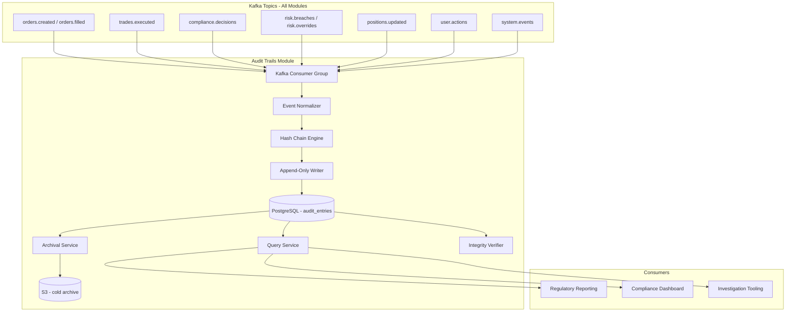

# Audit Trails Module

## Context & Problem

Hedge funds operate under strict regulatory oversight. SEC Rule 17a-4, MiFID II, and Dodd-Frank all require firms to maintain complete, immutable records of trading activity, compliance decisions, risk overrides, and user actions. Regulators can (and do) request the full history of any trade, decision, or system action — and the firm must produce it.

Beyond compliance, an immutable audit trail is critical for internal investigations. When a P&L break occurs, when a rogue trade is suspected, or when a risk limit override needs justification, the audit trail is the single source of truth for "who did what, when, and why."

This module is a **terminal consumer** — it ingests events from every other module in the system and writes them to an append-only, tamper-evident store. It never publishes events. It never modifies or deletes records. It exists solely to observe and record.

The core challenge is not writing audit entries (that is straightforward). The challenge is guaranteeing **immutability** (entries cannot be altered after the fact), **tamper evidence** (any alteration is detectable), **queryability** (regulators want temporal slices, not raw event dumps), and **retention** (7 years of data must be accessible, not just archived).

## Domain Concepts

| Concept | Definition |
|---|---|
| **Audit Entry** | A single immutable record of an action: who did it, what was done, when, to what entity, and why |
| **Hash Chain** | A cryptographic chain where each entry's hash includes the previous entry's hash — any tampering breaks the chain |
| **Actor** | The human or system that performed the action (user ID, service name, or system process) |
| **Action** | The verb: `order.created`, `compliance.approved`, `risk.override`, `position.adjusted` |
| **Entity** | The domain object affected: order, portfolio, position, compliance rule |
| **Correlation ID** | Links related audit entries across modules (e.g., all entries for a single order lifecycle) |
| **Retention Policy** | How long entries are retained before archival — 7 years for SEC, configurable per regulation |
| **Temporal Query** | A query bounded by time: "all actions on portfolio X between 2025-01-01 and 2025-06-30" |

## Architecture



## Design Decisions

### Append-Only PostgreSQL Table

The audit store uses a single PostgreSQL table with no `UPDATE` or `DELETE` operations ever executed against it. The application-level writer only issues `INSERT` statements. Database-level protection is enforced via a trigger that rejects any `UPDATE` or `DELETE` on the table, and the application role has only `INSERT` and `SELECT` grants — never `UPDATE` or `DELETE`.

Why not a dedicated event store like EventStoreDB? PostgreSQL is already in the stack, the query patterns (temporal range queries, filtering by entity/actor) are well-served by B-tree indexes, and the operational burden of another database is not justified for this use case. If write throughput exceeds what PostgreSQL can handle (unlikely for a single-desk fund), the archival service offloads old data to cold storage.

### Hash Chain for Tamper Evidence

Each audit entry includes a SHA-256 hash computed over the entry's content concatenated with the previous entry's hash. This creates a chain where modifying any historical entry invalidates every subsequent hash. A periodic verification job walks the chain and alerts if any break is detected.

This is not blockchain — there is no distributed consensus, no proof of work. It is a simple hash chain stored in a trusted database, sufficient to detect tampering by insiders or compromised processes. For regulatory purposes, this plus database-level protections (WAL archiving, restricted access) meets the bar.

### Terminal Consumer — No Events Published

The audit module consumes events from every other module but publishes nothing. This is deliberate: the audit trail is a read-only record, not an active participant in business flows. Publishing events from the audit module would create circular dependencies and violate its role as a passive observer.

### Event Normalization

Events arrive in different schemas from different modules. The normalizer extracts a common envelope (actor, action, entity, timestamp, correlation ID) and stores the original event payload as-is in a JSONB column. This means the audit trail does not lose fidelity — the full original event is preserved — but queries can filter on normalized fields.

### Retention and Archival

Active data stays in PostgreSQL for fast queries. Data older than 1 year is archived to S3 in Parquet format (columnar, compressed, queryable via Athena). The archival service runs nightly, copies completed months to S3, and updates an archival index. The original rows remain in PostgreSQL until the 2-year mark, after which they are moved to a partitioned cold table. Full 7-year retention is achieved via S3 lifecycle policies.

## Interface Contract

```python
# interface.py — what the module exposes

from typing import Protocol
from datetime import datetime
from uuid import UUID

from pydantic import BaseModel, ConfigDict, Field


class AuditEntry(BaseModel):
    """A single audit record as returned by queries."""
    model_config = ConfigDict(frozen=True)

    entry_id: int
    event_id: UUID
    action: str
    actor_id: str
    actor_type: str          # "user", "system", "service"
    entity_type: str         # "order", "portfolio", "position", "compliance_rule"
    entity_id: str
    correlation_id: str | None = None
    payload: dict            # original event payload, unmodified
    metadata: dict | None = None
    hash: str                # SHA-256 hash chain value
    previous_hash: str       # hash of the preceding entry
    created_at: datetime


class AuditQueryParams(BaseModel):
    model_config = ConfigDict(frozen=True)

    entity_type: str | None = None
    entity_id: str | None = None
    actor_id: str | None = None
    action: str | None = None
    correlation_id: str | None = None
    start_time: datetime | None = None
    end_time: datetime | None = None
    limit: int = Field(default=100, le=1000)
    offset: int = Field(default=0, ge=0)


class AuditQueryResult(BaseModel):
    model_config = ConfigDict(frozen=True)

    entries: list[AuditEntry]
    total_count: int
    has_more: bool


class IntegrityCheckResult(BaseModel):
    model_config = ConfigDict(frozen=True)

    checked_range: tuple[int, int]   # (first_entry_id, last_entry_id)
    total_checked: int
    is_valid: bool
    first_broken_entry_id: int | None = None
    checked_at: datetime


class AuditReader(Protocol):
    """Read interface for querying audit entries."""
    async def query(self, params: AuditQueryParams) -> AuditQueryResult: ...
    async def get_entry(self, entry_id: int) -> AuditEntry | None: ...
    async def get_entity_history(
        self, entity_type: str, entity_id: str,
        start: datetime | None = None, end: datetime | None = None,
    ) -> list[AuditEntry]: ...
    async def verify_integrity(
        self, start_entry_id: int | None = None, end_entry_id: int | None = None,
    ) -> IntegrityCheckResult: ...
```

## Code Skeleton

### Hash Chain Engine

```python
# hash_chain.py

import hashlib
import json
from datetime import datetime
from decimal import Decimal
from uuid import UUID


class _AuditEncoder(json.JSONEncoder):
    """JSON encoder that handles Decimal, datetime, UUID for deterministic hashing."""

    def default(self, obj: object) -> object:
        if isinstance(obj, Decimal):
            return str(obj)
        if isinstance(obj, datetime):
            return obj.isoformat()
        if isinstance(obj, UUID):
            return str(obj)
        return super().default(obj)


def compute_entry_hash(
    action: str,
    actor_id: str,
    entity_type: str,
    entity_id: str,
    payload: dict,
    created_at: datetime,
    previous_hash: str,
) -> str:
    """Compute SHA-256 hash for an audit entry, chaining to the previous entry.

    The hash covers all content fields plus the previous hash, making the chain
    tamper-evident: modifying any historical entry invalidates all subsequent hashes.

    Field ordering is deterministic (sort_keys=True) to ensure the same content
    always produces the same hash regardless of dict insertion order.
    """
    content = json.dumps(
        {
            "action": action,
            "actor_id": actor_id,
            "entity_type": entity_type,
            "entity_id": entity_id,
            "payload": payload,
            "created_at": created_at.isoformat(),
            "previous_hash": previous_hash,
        },
        sort_keys=True,
        cls=_AuditEncoder,
    )
    return hashlib.sha256(content.encode("utf-8")).hexdigest()


def verify_chain(entries: list[dict]) -> tuple[bool, int | None]:
    """Verify the integrity of a sequence of audit entries.

    Args:
        entries: List of audit entry dicts, ordered by entry_id ascending.
                 Each must have: action, actor_id, entity_type, entity_id,
                 payload, created_at, hash, previous_hash.

    Returns:
        (is_valid, first_broken_entry_id): True if chain is intact.
        If broken, returns the entry_id of the first entry with a bad hash.
    """
    for i, entry in enumerate(entries):
        expected_hash = compute_entry_hash(
            action=entry["action"],
            actor_id=entry["actor_id"],
            entity_type=entry["entity_type"],
            entity_id=entry["entity_id"],
            payload=entry["payload"],
            created_at=entry["created_at"],
            previous_hash=entry["previous_hash"],
        )
        if expected_hash != entry["hash"]:
            return False, entry["entry_id"]

        # Verify chain linkage: this entry's previous_hash must match
        # the preceding entry's hash (except for the very first entry)
        if i > 0 and entry["previous_hash"] != entries[i - 1]["hash"]:
            return False, entry["entry_id"]

    return True, None


# Genesis hash — the "previous hash" for the very first audit entry
GENESIS_HASH = hashlib.sha256(b"audit-trail-genesis").hexdigest()
```

### Event Normalizer

```python
# normalizer.py

"""
Normalizes events from different modules into a common audit envelope.

Each module publishes events with different schemas. The normalizer extracts
the common fields (actor, action, entity) and preserves the full original
payload for forensic queries.
"""

from dataclasses import dataclass
from datetime import datetime


@dataclass(frozen=True)
class NormalizedAuditEvent:
    action: str
    actor_id: str
    actor_type: str
    entity_type: str
    entity_id: str
    correlation_id: str | None
    payload: dict
    metadata: dict | None
    timestamp: datetime


# Mapping from event_type to extraction rules
_EXTRACTION_RULES: dict[str, dict] = {
    "order.created": {
        "entity_type": "order",
        "entity_id_field": "order_id",
        "actor_id_field": "created_by",
        "actor_type": "user",
        "correlation_field": "order_id",
    },
    "order.filled": {
        "entity_type": "order",
        "entity_id_field": "order_id",
        "actor_id_field": None,  # system-generated
        "actor_type": "system",
        "correlation_field": "order_id",
    },
    "trade.executed": {
        "entity_type": "trade",
        "entity_id_field": "trade_id",
        "actor_id_field": None,
        "actor_type": "system",
        "correlation_field": "order_id",
    },
    "compliance.approved": {
        "entity_type": "compliance_decision",
        "entity_id_field": "decision_id",
        "actor_id_field": "reviewer_id",
        "actor_type": "user",
        "correlation_field": "order_id",
    },
    "compliance.rejected": {
        "entity_type": "compliance_decision",
        "entity_id_field": "decision_id",
        "actor_id_field": "reviewer_id",
        "actor_type": "user",
        "correlation_field": "order_id",
    },
    "risk.breach": {
        "entity_type": "risk_breach",
        "entity_id_field": "breach_id",
        "actor_id_field": None,
        "actor_type": "system",
        "correlation_field": "portfolio_id",
    },
    "risk.override": {
        "entity_type": "risk_override",
        "entity_id_field": "override_id",
        "actor_id_field": "approved_by",
        "actor_type": "user",
        "correlation_field": "portfolio_id",
    },
    "position.updated": {
        "entity_type": "position",
        "entity_id_field": "position_id",
        "actor_id_field": None,
        "actor_type": "system",
        "correlation_field": "portfolio_id",
    },
}


def normalize_event(event_type: str, payload: dict) -> NormalizedAuditEvent:
    """Extract common audit fields from a domain event.

    Falls back to generic extraction if no specific rule is defined,
    ensuring unknown event types are still captured.
    """
    rule = _EXTRACTION_RULES.get(event_type)

    if rule is not None:
        actor_id_field = rule["actor_id_field"]
        actor_id = payload.get(actor_id_field, "system") if actor_id_field else "system"
        correlation_field = rule["correlation_field"]
        correlation_id = str(payload.get(correlation_field)) if correlation_field else None

        return NormalizedAuditEvent(
            action=event_type,
            actor_id=actor_id,
            actor_type=rule["actor_type"],
            entity_type=rule["entity_type"],
            entity_id=str(payload[rule["entity_id_field"]]),
            correlation_id=correlation_id,
            payload=payload,
            metadata=payload.get("metadata"),
            timestamp=_parse_timestamp(payload),
        )

    # Fallback for unknown event types — still record them
    return NormalizedAuditEvent(
        action=event_type,
        actor_id=payload.get("user_id", payload.get("actor_id", "unknown")),
        actor_type=payload.get("actor_type", "unknown"),
        entity_type=event_type.split(".")[0] if "." in event_type else "unknown",
        entity_id=str(payload.get("id", payload.get("entity_id", "unknown"))),
        correlation_id=payload.get("correlation_id"),
        payload=payload,
        metadata=payload.get("metadata"),
        timestamp=_parse_timestamp(payload),
    )


def _parse_timestamp(payload: dict) -> datetime:
    ts = payload.get("timestamp") or payload.get("executed_at") or payload.get("created_at")
    if isinstance(ts, str):
        return datetime.fromisoformat(ts)
    if isinstance(ts, datetime):
        return ts
    return datetime.utcnow()
```

### Audit Writer Service

```python
# service.py

from datetime import datetime, timezone
from uuid import uuid4

import structlog
from sqlalchemy import text
from sqlalchemy.ext.asyncio import AsyncSession

from .hash_chain import compute_entry_hash, GENESIS_HASH
from .normalizer import NormalizedAuditEvent

logger = structlog.get_logger()


class AuditWriter:
    """Appends normalized events to the audit store with hash chain integrity."""

    def __init__(self, session_factory: "Callable[[], AsyncSession]") -> None:
        self._session_factory = session_factory
        self._last_hash: str | None = None

    async def initialize(self) -> None:
        """Load the last hash from the database on startup."""
        async with self._session_factory() as session:
            result = await session.execute(
                text(
                    "SELECT hash FROM audit.audit_entries "
                    "ORDER BY entry_id DESC LIMIT 1"
                )
            )
            row = result.fetchone()
            self._last_hash = row[0] if row else GENESIS_HASH
            logger.info("audit_writer_initialized", last_hash=self._last_hash[:16] + "...")

    async def append(self, event: NormalizedAuditEvent) -> int:
        """Append a single audit entry. Returns the entry_id."""
        previous_hash = self._last_hash or GENESIS_HASH

        entry_hash = compute_entry_hash(
            action=event.action,
            actor_id=event.actor_id,
            entity_type=event.entity_type,
            entity_id=event.entity_id,
            payload=event.payload,
            created_at=event.timestamp,
            previous_hash=previous_hash,
        )

        async with self._session_factory() as session:
            result = await session.execute(
                text("""
                    INSERT INTO audit.audit_entries (
                        event_id, action, actor_id, actor_type,
                        entity_type, entity_id, correlation_id,
                        payload, metadata, hash, previous_hash, created_at
                    ) VALUES (
                        :event_id, :action, :actor_id, :actor_type,
                        :entity_type, :entity_id, :correlation_id,
                        :payload::jsonb, :metadata::jsonb, :hash, :previous_hash, :created_at
                    ) RETURNING entry_id
                """),
                {
                    "event_id": str(uuid4()),
                    "action": event.action,
                    "actor_id": event.actor_id,
                    "actor_type": event.actor_type,
                    "entity_type": event.entity_type,
                    "entity_id": event.entity_id,
                    "correlation_id": event.correlation_id,
                    "payload": _to_json(event.payload),
                    "metadata": _to_json(event.metadata) if event.metadata else None,
                    "hash": entry_hash,
                    "previous_hash": previous_hash,
                    "created_at": event.timestamp,
                },
            )
            entry_id = result.scalar_one()
            await session.commit()

        self._last_hash = entry_hash

        logger.debug(
            "audit_entry_appended",
            entry_id=entry_id,
            action=event.action,
            entity=f"{event.entity_type}:{event.entity_id}",
        )
        return entry_id


def _to_json(data: dict | None) -> str | None:
    if data is None:
        return None
    import json
    from .hash_chain import _AuditEncoder
    return json.dumps(data, cls=_AuditEncoder)
```

### Kafka Consumer

```python
# consumer.py

"""
Kafka consumer that subscribes to all module topics and feeds events
into the audit writer. Uses a dedicated consumer group with manual
offset commits — an event is only committed after it has been
successfully written to the audit store.
"""

import json
from typing import Sequence

import structlog
from aiokafka import AIOKafkaConsumer  # aiokafka==0.10.0

from .normalizer import normalize_event
from .service import AuditWriter

logger = structlog.get_logger()

# All topics the audit trail consumes from
AUDIT_TOPICS: Sequence[str] = (
    "orders.created",
    "orders.filled",
    "trades.executed",
    "compliance.decisions",
    "risk.breaches",
    "risk.overrides",
    "positions.updated",
    "user.actions",
    "system.events",
)


class AuditConsumer:
    """Consumes events from all modules and writes them to the audit store."""

    def __init__(
        self,
        bootstrap_servers: str,
        writer: AuditWriter,
        consumer_group: str = "audit-trail-consumer",
    ) -> None:
        self._bootstrap_servers = bootstrap_servers
        self._writer = writer
        self._consumer_group = consumer_group
        self._consumer: AIOKafkaConsumer | None = None

    async def start(self) -> None:
        self._consumer = AIOKafkaConsumer(
            *AUDIT_TOPICS,
            bootstrap_servers=self._bootstrap_servers,
            group_id=self._consumer_group,
            enable_auto_commit=False,  # manual commit after successful write
            auto_offset_reset="earliest",  # never miss an event
            value_deserializer=lambda v: json.loads(v.decode("utf-8")),
        )
        await self._consumer.start()
        await self._writer.initialize()
        logger.info("audit_consumer_started", topics=list(AUDIT_TOPICS))

        try:
            async for message in self._consumer:
                await self._process_message(message)
        finally:
            await self._consumer.stop()

    async def _process_message(self, message) -> None:
        """Process a single Kafka message: normalize, write, commit."""
        try:
            payload = message.value
            event_type = payload.get("event_type", "unknown")

            normalized = normalize_event(event_type, payload)
            entry_id = await self._writer.append(normalized)

            # Commit offset only after successful write
            await self._consumer.commit()

            logger.debug(
                "audit_event_processed",
                topic=message.topic,
                event_type=event_type,
                entry_id=entry_id,
                offset=message.offset,
            )
        except Exception:
            logger.exception(
                "audit_event_processing_failed",
                topic=message.topic,
                offset=message.offset,
                partition=message.partition,
            )
            # Do NOT commit — message will be redelivered.
            # After repeated failures, it will hit the consumer lag alert threshold.
```

### Integrity Verifier

```python
# verifier.py

"""
Periodic job that walks the hash chain and verifies integrity.
Runs on a configurable schedule (default: hourly for recent entries,
daily for the full chain).
"""

from datetime import datetime, timezone

import structlog
from sqlalchemy import text
from sqlalchemy.ext.asyncio import AsyncSession

from .hash_chain import compute_entry_hash, verify_chain

logger = structlog.get_logger()


class IntegrityVerifier:
    """Verifies the audit trail hash chain has not been tampered with."""

    def __init__(
        self,
        session_factory: "Callable[[], AsyncSession]",
        alert_publisher: "AlertPublisher",
        batch_size: int = 10_000,
    ) -> None:
        self._session_factory = session_factory
        self._alert_publisher = alert_publisher
        self._batch_size = batch_size

    async def verify_range(
        self, start_id: int | None = None, end_id: int | None = None,
    ) -> "IntegrityCheckResult":
        """Verify the hash chain for a range of entries.

        If start_id is None, starts from the beginning.
        If end_id is None, goes to the latest entry.
        """
        async with self._session_factory() as session:
            # Determine range bounds
            if start_id is None:
                result = await session.execute(
                    text("SELECT MIN(entry_id) FROM audit.audit_entries")
                )
                start_id = result.scalar() or 0

            if end_id is None:
                result = await session.execute(
                    text("SELECT MAX(entry_id) FROM audit.audit_entries")
                )
                end_id = result.scalar() or 0

            total_checked = 0
            current_start = start_id

            while current_start <= end_id:
                current_end = min(current_start + self._batch_size - 1, end_id)
                result = await session.execute(
                    text("""
                        SELECT entry_id, action, actor_id, entity_type,
                               entity_id, payload, created_at, hash, previous_hash
                        FROM audit.audit_entries
                        WHERE entry_id BETWEEN :start AND :end
                        ORDER BY entry_id ASC
                    """),
                    {"start": current_start, "end": current_end},
                )
                rows = result.fetchall()
                entries = [
                    {
                        "entry_id": r.entry_id,
                        "action": r.action,
                        "actor_id": r.actor_id,
                        "entity_type": r.entity_type,
                        "entity_id": r.entity_id,
                        "payload": r.payload,
                        "created_at": r.created_at,
                        "hash": r.hash,
                        "previous_hash": r.previous_hash,
                    }
                    for r in rows
                ]

                is_valid, broken_id = verify_chain(entries)
                total_checked += len(entries)

                if not is_valid:
                    logger.critical(
                        "audit_chain_integrity_broken",
                        broken_entry_id=broken_id,
                        batch_start=current_start,
                    )
                    await self._alert_publisher.send_critical_alert(
                        alert_type="audit.integrity_violation",
                        message=f"Hash chain broken at entry_id={broken_id}",
                        metadata={
                            "broken_entry_id": broken_id,
                            "checked_range": [start_id, current_end],
                        },
                    )
                    return IntegrityCheckResult(
                        checked_range=(start_id, current_end),
                        total_checked=total_checked,
                        is_valid=False,
                        first_broken_entry_id=broken_id,
                        checked_at=datetime.now(timezone.utc),
                    )

                current_start = current_end + 1

        logger.info(
            "audit_chain_integrity_verified",
            range=(start_id, end_id),
            total_checked=total_checked,
        )
        return IntegrityCheckResult(
            checked_range=(start_id, end_id),
            total_checked=total_checked,
            is_valid=True,
            first_broken_entry_id=None,
            checked_at=datetime.now(timezone.utc),
        )
```

### Query Service

```python
# query.py

from datetime import datetime

import structlog
from sqlalchemy import text
from sqlalchemy.ext.asyncio import AsyncSession

from .interface import AuditEntry, AuditQueryParams, AuditQueryResult

logger = structlog.get_logger()


class AuditQueryService:
    """Provides temporal and entity-based queries over the audit store."""

    def __init__(self, session_factory: "Callable[[], AsyncSession]") -> None:
        self._session_factory = session_factory

    async def query(self, params: AuditQueryParams) -> AuditQueryResult:
        """Execute a filtered, paginated query against the audit store."""
        conditions: list[str] = []
        bind_params: dict = {}

        if params.entity_type:
            conditions.append("entity_type = :entity_type")
            bind_params["entity_type"] = params.entity_type

        if params.entity_id:
            conditions.append("entity_id = :entity_id")
            bind_params["entity_id"] = params.entity_id

        if params.actor_id:
            conditions.append("actor_id = :actor_id")
            bind_params["actor_id"] = params.actor_id

        if params.action:
            conditions.append("action = :action")
            bind_params["action"] = params.action

        if params.correlation_id:
            conditions.append("correlation_id = :correlation_id")
            bind_params["correlation_id"] = params.correlation_id

        if params.start_time:
            conditions.append("created_at >= :start_time")
            bind_params["start_time"] = params.start_time

        if params.end_time:
            conditions.append("created_at <= :end_time")
            bind_params["end_time"] = params.end_time

        where_clause = " AND ".join(conditions) if conditions else "TRUE"

        # Count total matches
        async with self._session_factory() as session:
            count_result = await session.execute(
                text(f"SELECT COUNT(*) FROM audit.audit_entries WHERE {where_clause}"),
                bind_params,
            )
            total_count = count_result.scalar()

            # Fetch page
            bind_params["limit"] = params.limit
            bind_params["offset"] = params.offset

            result = await session.execute(
                text(f"""
                    SELECT entry_id, event_id, action, actor_id, actor_type,
                           entity_type, entity_id, correlation_id,
                           payload, metadata, hash, previous_hash, created_at
                    FROM audit.audit_entries
                    WHERE {where_clause}
                    ORDER BY created_at DESC, entry_id DESC
                    LIMIT :limit OFFSET :offset
                """),
                bind_params,
            )
            rows = result.fetchall()

        entries = [
            AuditEntry(
                entry_id=r.entry_id,
                event_id=r.event_id,
                action=r.action,
                actor_id=r.actor_id,
                actor_type=r.actor_type,
                entity_type=r.entity_type,
                entity_id=r.entity_id,
                correlation_id=r.correlation_id,
                payload=r.payload,
                metadata=r.metadata,
                hash=r.hash,
                previous_hash=r.previous_hash,
                created_at=r.created_at,
            )
            for r in rows
        ]

        return AuditQueryResult(
            entries=entries,
            total_count=total_count,
            has_more=(params.offset + params.limit) < total_count,
        )

    async def get_entity_history(
        self, entity_type: str, entity_id: str,
        start: datetime | None = None, end: datetime | None = None,
    ) -> list[AuditEntry]:
        """Get the full audit history for a specific entity, optionally bounded by time."""
        params = AuditQueryParams(
            entity_type=entity_type,
            entity_id=entity_id,
            start_time=start,
            end_time=end,
            limit=1000,
        )
        result = await self.query(params)
        return result.entries
```

## Data Model

```sql
-- Audit Trail schema — append-only with hash chain

CREATE SCHEMA IF NOT EXISTS audit;

-- Main audit entries table — append-only, never updated or deleted
CREATE TABLE audit.audit_entries (
    entry_id        BIGINT GENERATED ALWAYS AS IDENTITY PRIMARY KEY,
    event_id        UUID            NOT NULL UNIQUE,
    action          VARCHAR(128)    NOT NULL,
    actor_id        VARCHAR(128)    NOT NULL,
    actor_type      VARCHAR(16)     NOT NULL CHECK (actor_type IN ('user', 'system', 'service')),
    entity_type     VARCHAR(64)     NOT NULL,
    entity_id       VARCHAR(256)    NOT NULL,
    correlation_id  VARCHAR(256),
    payload         JSONB           NOT NULL,
    metadata        JSONB,
    hash            CHAR(64)        NOT NULL,   -- SHA-256 hex digest
    previous_hash   CHAR(64)        NOT NULL,   -- hash of preceding entry
    created_at      TIMESTAMPTZ     NOT NULL
) PARTITION BY RANGE (created_at);

-- Partitions: one per month for efficient archival and queries
CREATE TABLE audit.audit_entries_2025_01 PARTITION OF audit.audit_entries
    FOR VALUES FROM ('2025-01-01') TO ('2025-02-01');
CREATE TABLE audit.audit_entries_2025_02 PARTITION OF audit.audit_entries
    FOR VALUES FROM ('2025-02-01') TO ('2025-03-01');
-- ... generate partitions programmatically for 7+ years

-- Indexes for common query patterns
CREATE INDEX idx_audit_entity ON audit.audit_entries (entity_type, entity_id, created_at DESC);
CREATE INDEX idx_audit_actor ON audit.audit_entries (actor_id, created_at DESC);
CREATE INDEX idx_audit_action ON audit.audit_entries (action, created_at DESC);
CREATE INDEX idx_audit_correlation ON audit.audit_entries (correlation_id, created_at DESC)
    WHERE correlation_id IS NOT NULL;
CREATE INDEX idx_audit_created_at ON audit.audit_entries (created_at DESC);

-- GIN index on payload for ad-hoc JSONB queries during investigations
CREATE INDEX idx_audit_payload ON audit.audit_entries USING GIN (payload jsonb_path_ops);

-- Prevent updates and deletes at the database level
CREATE OR REPLACE FUNCTION audit.prevent_modification()
RETURNS TRIGGER AS $$
BEGIN
    RAISE EXCEPTION 'Audit entries cannot be modified or deleted. Table is append-only.';
    RETURN NULL;
END;
$$ LANGUAGE plpgsql;

CREATE TRIGGER trg_prevent_update
    BEFORE UPDATE ON audit.audit_entries
    FOR EACH ROW EXECUTE FUNCTION audit.prevent_modification();

CREATE TRIGGER trg_prevent_delete
    BEFORE DELETE ON audit.audit_entries
    FOR EACH ROW EXECUTE FUNCTION audit.prevent_modification();

-- Role permissions: the application role can only INSERT and SELECT
-- GRANT INSERT, SELECT ON audit.audit_entries TO audit_app_role;
-- REVOKE UPDATE, DELETE ON audit.audit_entries FROM audit_app_role;

-- Archival tracking table
CREATE TABLE audit.archival_log (
    id              BIGINT GENERATED ALWAYS AS IDENTITY PRIMARY KEY,
    partition_name  VARCHAR(64)     NOT NULL,
    month           DATE            NOT NULL,
    entry_count     BIGINT          NOT NULL,
    s3_path         VARCHAR(512)    NOT NULL,
    archived_at     TIMESTAMPTZ     NOT NULL DEFAULT now(),
    checksum        CHAR(64)        NOT NULL  -- SHA-256 of archived data
);
```

## Kafka Events Published

| Topic | Key | Event Type | Published? |
|---|---|---|---|
| *(none)* | — | — | **No.** The audit module is a terminal consumer. It does not publish any events. |

### Events Consumed

| Topic | Event Types | Source Module |
|---|---|---|
| `orders.created` | `order.created` | Order Management |
| `orders.filled` | `order.filled` | Order Management |
| `trades.executed` | `trade.executed` | Order Management |
| `compliance.decisions` | `compliance.approved`, `compliance.rejected` | Compliance |
| `risk.breaches` | `risk.breach` | Risk |
| `risk.overrides` | `risk.override` | Risk |
| `positions.updated` | `position.updated` | Positions |
| `user.actions` | `user.*` | All modules (user-initiated actions) |
| `system.events` | `system.*` | Infrastructure (deploys, config changes) |

## Patterns Used

| Pattern | Document |
|---|---|
| Event-driven architecture (consume all events) | [Event-Driven Architecture](../../principles/event-driven-architecture.md) |
| Append-only event store | [CQRS & Event Sourcing](../../principles/cqrs-event-sourcing.md) |
| Schema evolution for long-lived data | [Event Schema Evolution](../../patterns/messaging/event-schema-evolution.md) |
| Dead letter queue for failed processing | [Dead Letter Queues](../../patterns/messaging/dead-letter-queues.md) |
| Kafka consumer group with manual commits | [Kafka Topology](../../patterns/messaging/kafka-topology.md) |
| Structured logging for operational visibility | [Structured Logging](../../patterns/observability/structured-logging.md) |
| Data retention and archival | [Batch vs Streaming](../../patterns/data-processing/batch-vs-streaming.md) |
| Repository pattern for query isolation | [SQLAlchemy Repository](../../patterns/data-access/sqlalchemy-repository.md) |

## Failure Modes

| Failure | Cause | Impact | Mitigation |
|---|---|---|---|
| Kafka consumer lag | Audit writer slower than event production rate | Delayed audit entries — not a compliance violation unless gap grows to hours | Monitor consumer lag metric; scale partitions and consumers; batch inserts |
| Database write failure | PostgreSQL down, connection pool exhausted | Events not persisted — redelivered on recovery because offsets are not committed | Manual offset commit only after successful write; Kafka retains events per retention policy |
| Hash chain broken by direct DB access | DBA or compromised process modifies a row | Tamper evidence compromised for the modified range | Hourly integrity verification job; critical alert on chain break; database role restrictions prevent casual access |
| Duplicate event from Kafka | At-least-once delivery, consumer restart | Duplicate audit entry with different entry_id but same event_id | `event_id` UNIQUE constraint rejects duplicates; consumer retries naturally |
| Event schema change from upstream module | Module deploys new event version | Normalizer cannot extract fields, falls back to generic extraction | Fallback extraction for unknown schemas; payload always stored in full; alert on normalization failures |
| Partition not created for current month | Operational oversight | Inserts fail with "no partition for value" | Automated partition creation job runs 3 months ahead; alert if upcoming partition is missing |
| S3 archival failure | Network issue, S3 outage | Old data not archived but still in PostgreSQL — no data loss | Retry with backoff; archival log tracks what has been archived; data stays in PostgreSQL until confirmed |
| Cold storage query latency | Regulator requests 5-year-old data | Athena query on Parquet is slower than PostgreSQL (seconds vs milliseconds) | Pre-warm common regulatory queries; maintain index of archived ranges for targeted scans |

## Performance Profile

| Metric | Target |
|---|---|
| Event → audit entry written | < 100ms (p99) |
| Kafka consumer throughput | > 5,000 events/sec |
| Temporal query (single entity, 1 month range) | < 50ms |
| Temporal query (single entity, 1 year range) | < 500ms |
| Full-text payload search (JSONB GIN) | < 2s |
| Hash chain verification (10,000 entries) | < 5s |
| Archival job (1 month of data to S3) | < 30 minutes |
| Storage per entry (average) | ~2 KB (payload-dependent) |

## Dependencies

```
audit-trails
  ├── depends on: nothing (terminal consumer — no outbound dependencies)
  ├── consumes: orders.*, trades.*, compliance.*, risk.*, positions.*, user.*, system.*
  ├── publishes: nothing
  ├── storage: PostgreSQL (hot), S3 + Parquet (cold archive)
  └── consumed by: regulatory reporting, compliance dashboard, investigation tooling
```

## Related Documents

- [Order Management](order-management.md) — primary source of trade lifecycle events consumed by the audit trail
- [Market Data Ingestion](market-data-ingestion.md) — price events optionally captured for trade reconstruction
- [Security Master](security-master.md) — instrument reference data for enriching audit queries
- [Event-Driven Architecture](../../principles/event-driven-architecture.md) — the audit trail is the canonical example of a terminal event consumer
- [CQRS & Event Sourcing](../../principles/cqrs-event-sourcing.md) — append-only storage and temporal queries share principles with event sourcing
- [Contract-First Design](../../principles/contract-first-design.md) — event schema contracts ensure the audit trail can parse events reliably
- [Bounded Contexts](../../principles/bounded-contexts.md) — the audit trail sits outside all bounded contexts as a cross-cutting concern
