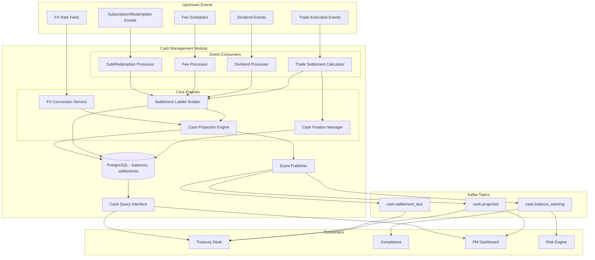

# Cash Management Module

## Context & Problem

Cash is the lifeblood of a hedge fund's operations, yet it is often the last thing to be properly modeled. When a PM buys $10M of stock on Monday, the cash doesn't leave the account until Wednesday (T+2 settlement). In between, the fund might sell $5M of bonds settling Thursday (T+1 for US Treasuries). The cash balance reported right now is not the cash balance tomorrow or next week.

Without a dedicated cash management module, the fund operates with an imprecise view of its liquidity. This leads to: failed settlements (insufficient cash when a trade settles), unnecessary borrowing costs, uninvested cash drag, and — in multi-currency portfolios — FX exposure that nobody is tracking.

This module tracks current cash positions across currencies, builds a settlement ladder showing expected cash inflows and outflows, and projects future cash balances so the PM and treasury desk can make informed decisions about liquidity.

## Domain Concepts

| Concept | Definition |
|---|---|
| **Cash Position** | The current cash balance in a specific currency for a specific account |
| **Settlement** | The actual transfer of cash and securities completing a trade — typically T+1 or T+2 after trade date |
| **Settlement Ladder** | A day-by-day schedule of expected cash inflows (sells settling) and outflows (buys settling) |
| **Settlement Date** | The date on which a trade's cash obligation must be met |
| **Cash Projection** | A forward-looking estimate of cash balances incorporating known settlements, expected dividends, fees, and other flows |
| **Cash Flow** | Any movement of cash: trade settlement, dividend, management fee, margin call, subscription, redemption |
| **Unsettled Trade** | A trade that has been executed but not yet settled — creates a future cash obligation |
| **FX Exposure** | Risk arising from holding cash in non-base currencies |

## Architecture



## Design Decisions

### Consume Trade Events, Not Trade Data

This module does not query the OMS for trade details. Instead, it consumes `trade.executed` events from Kafka. This ensures the cash module reacts in real-time to new trades and decouples it from the OMS's availability. The settlement date is calculated from the trade date and the instrument's settlement convention.

### Multi-Currency with Base Currency Aggregation

Cash positions are tracked in their native currency. For reporting and projection purposes, all positions are also converted to the fund's base currency (typically USD) using the latest FX rates. This means the module always stores the native amount and the FX rate used for conversion — never just the converted amount, which would lose information.

### Settlement Convention Registry

Different instruments settle on different schedules. US equities are T+1 (since May 2024), European equities are T+2, US Treasuries are T+1, FX spot is T+2, futures settle daily via variation margin. The module maintains an extensible settlement convention registry that maps `(asset_class, market)` pairs to settlement rules. Adding a new asset class means adding entries to the registry — no code changes to the settlement calculator or ladder builder.

## Interface Contract

```python
# interface.py

from typing import Protocol
from datetime import date, datetime
from decimal import Decimal
from uuid import UUID
from enum import StrEnum

from pydantic import BaseModel, ConfigDict


class CashFlowType(StrEnum):
    TRADE_BUY = "trade_buy"
    TRADE_SELL = "trade_sell"
    DIVIDEND = "dividend"
    COUPON = "coupon"                    # fixed income coupon payments
    MANAGEMENT_FEE = "management_fee"
    PERFORMANCE_FEE = "performance_fee"
    SUBSCRIPTION = "subscription"
    REDEMPTION = "redemption"
    MARGIN_CALL = "margin_call"          # futures/swaps variation margin
    MARGIN_RETURN = "margin_return"
    FX_SETTLEMENT = "fx_settlement"
    INTEREST = "interest"
    SWAP_RESET = "swap_reset"            # periodic swap leg payment
    OPTION_PREMIUM = "option_premium"    # premium paid/received on option trade
    OPTION_EXERCISE = "option_exercise"  # cash on exercise/assignment
    CAPITAL_CALL = "capital_call"        # private fund capital calls
    DISTRIBUTION = "distribution"        # private fund distributions
    OTHER = "other"


class SettlementStatus(StrEnum):
    PENDING = "pending"
    SETTLED = "settled"
    FAILED = "failed"
    CANCELLED = "cancelled"


class CashPosition(BaseModel):
    model_config = ConfigDict(frozen=True)

    account_id: UUID
    currency: str               # ISO 4217: "USD", "EUR", "GBP", "JPY"
    balance: Decimal             # current settled balance
    unsettled_amount: Decimal    # net of pending settlements
    projected_balance: Decimal   # balance + unsettled (what it will be after all settlements)
    as_of: datetime


class CashPositionSummary(BaseModel):
    model_config = ConfigDict(frozen=True)

    account_id: UUID
    base_currency: str
    total_balance_base: Decimal         # all currencies converted to base
    total_unsettled_base: Decimal
    total_projected_base: Decimal
    positions: list[CashPosition]
    fx_rates_as_of: datetime


class SettlementEntry(BaseModel):
    model_config = ConfigDict(frozen=True)

    id: UUID
    account_id: UUID
    trade_id: UUID | None = None
    flow_type: CashFlowType
    currency: str
    amount: Decimal              # positive = inflow, negative = outflow
    trade_date: date
    settlement_date: date
    status: SettlementStatus
    instrument_id: str | None = None
    counterparty: str | None = None
    description: str | None = None


class SettlementLadderDay(BaseModel):
    model_config = ConfigDict(frozen=True)

    date: date
    currency: str
    inflows: Decimal
    outflows: Decimal
    net: Decimal
    opening_balance: Decimal
    closing_balance: Decimal
    entries: list[SettlementEntry]


class SettlementLadder(BaseModel):
    model_config = ConfigDict(frozen=True)

    account_id: UUID
    currency: str
    as_of_date: date
    days: list[SettlementLadderDay]


class CashProjection(BaseModel):
    model_config = ConfigDict(frozen=True)

    account_id: UUID
    base_currency: str
    projection_date: date
    projected_balance: Decimal
    confidence: str              # "known" (settled), "expected" (pending), "estimated" (scheduled fees)


class CashReader(Protocol):
    """Read interface exposed to other modules."""

    async def get_cash_positions(self, account_id: UUID) -> CashPositionSummary: ...

    async def get_settlement_ladder(
        self, account_id: UUID, currency: str, days_forward: int = 10,
    ) -> SettlementLadder: ...

    async def get_cash_projection(
        self, account_id: UUID, horizon_days: int = 30,
    ) -> list[CashProjection]: ...

    async def get_pending_settlements(
        self, account_id: UUID, settlement_date: date | None = None,
    ) -> list[SettlementEntry]: ...
```

## Code Skeleton

### Settlement Convention

```python
# settlement.py

from datetime import date, timedelta
from enum import StrEnum

import structlog

logger = structlog.get_logger()


class SettlementConvention(StrEnum):
    T_PLUS_0 = "T+0"
    T_PLUS_1 = "T+1"
    T_PLUS_2 = "T+2"
    T_PLUS_3 = "T+3"


# Settlement conventions by instrument type and market.
# US equities moved to T+1 in May 2024; European equities remain T+2.
SETTLEMENT_RULES: dict[tuple[str, str], SettlementConvention] = {
    # Equities
    ("equity", "US"): SettlementConvention.T_PLUS_1,
    ("equity", "CA"): SettlementConvention.T_PLUS_1,
    ("equity", "EU"): SettlementConvention.T_PLUS_2,
    ("equity", "GB"): SettlementConvention.T_PLUS_1,
    ("equity", "JP"): SettlementConvention.T_PLUS_2,
    ("etf", "US"): SettlementConvention.T_PLUS_1,
    ("etf", "EU"): SettlementConvention.T_PLUS_2,
    # Fixed Income
    ("fixed_income", "US"): SettlementConvention.T_PLUS_1,   # US Treasuries
    ("fixed_income", "EU"): SettlementConvention.T_PLUS_2,
    ("fixed_income", "GB"): SettlementConvention.T_PLUS_1,
    # FX
    ("fx_spot", "*"): SettlementConvention.T_PLUS_2,
    ("fx_forward", "*"): SettlementConvention.T_PLUS_2,       # or per-contract maturity date
    # Listed Derivatives
    ("option", "US"): SettlementConvention.T_PLUS_1,
    ("option", "EU"): SettlementConvention.T_PLUS_1,
    ("future", "*"): SettlementConvention.T_PLUS_0,           # daily margin settlement
    # OTC Derivatives
    ("swap", "*"): SettlementConvention.T_PLUS_2,             # per reset schedule in practice
    # Adding a new asset class: add entries here. No changes to the settlement
    # calculator or ladder builder — they consume this registry.
}


def get_settlement_convention(
    asset_class: str,
    market: str,
) -> SettlementConvention:
    """Look up the settlement convention for an instrument type and market."""
    key = (asset_class.lower(), market.upper())
    convention = SETTLEMENT_RULES.get(key)
    if convention is None:
        # Try wildcard market
        convention = SETTLEMENT_RULES.get((asset_class.lower(), "*"))
    if convention is None:
        logger.warning(
            "unknown_settlement_convention",
            asset_class=asset_class,
            market=market,
            defaulting_to="T+2",
        )
        return SettlementConvention.T_PLUS_2  # conservative default
    return convention


def calculate_settlement_date(
    trade_date: date,
    convention: SettlementConvention,
    holidays: set[date] | None = None,
) -> date:
    """
    Calculate settlement date from trade date, skipping weekends and holidays.

    Args:
        trade_date: the date the trade was executed
        convention: T+0, T+1, T+2, etc.
        holidays: set of non-trading dates to skip
    """
    days_to_add = int(convention.value.split("+")[1])
    holidays = holidays or set()

    current = trade_date
    business_days_added = 0

    while business_days_added < days_to_add:
        current += timedelta(days=1)
        # Skip weekends (Saturday=5, Sunday=6) and holidays
        if current.weekday() < 5 and current not in holidays:
            business_days_added += 1

    return current
```

### Trade Settlement Calculator

```python
# consumers/trade_consumer.py

from datetime import date, datetime
from decimal import Decimal
from uuid import UUID, uuid4

import structlog

logger = structlog.get_logger()


class TradeSettlementCalculator:
    """
    Consumes trade.executed events and creates settlement entries.

    A buy creates a cash outflow on settlement date.
    A sell creates a cash inflow on settlement date.
    """

    def __init__(
        self,
        repository: SettlementRepository,
        security_master: SecurityMasterReader,
    ) -> None:
        self._repository = repository
        self._security_master = security_master

    async def process_trade(self, event: dict) -> SettlementEntry:
        """
        Process a trade.executed event into a settlement obligation.

        Expected event structure:
            trade_id: UUID
            account_id: UUID
            instrument_id: str
            side: "buy" | "sell"
            quantity: Decimal
            price: Decimal
            currency: str
            trade_date: date
            counterparty: str
        """
        trade_id = UUID(event["trade_id"])
        account_id = UUID(event["account_id"])
        instrument_id = event["instrument_id"]
        side = event["side"]
        quantity = Decimal(str(event["quantity"]))
        price = Decimal(str(event["price"]))
        currency = event["currency"]
        trade_date = date.fromisoformat(event["trade_date"])

        # Calculate gross cash amount
        gross_amount = quantity * price

        # Buy = cash outflow (negative), sell = cash inflow (positive)
        cash_amount = -gross_amount if side == "buy" else gross_amount

        # Determine settlement date from instrument metadata
        instrument = await self._security_master.resolve(instrument_id)
        convention = get_settlement_convention(
            asset_class=instrument.asset_class,
            market=instrument.country,
        )
        settlement_date = calculate_settlement_date(trade_date, convention)

        flow_type = CashFlowType.TRADE_BUY if side == "buy" else CashFlowType.TRADE_SELL

        entry = SettlementEntry(
            id=uuid4(),
            account_id=account_id,
            trade_id=trade_id,
            flow_type=flow_type,
            currency=currency,
            amount=cash_amount,
            trade_date=trade_date,
            settlement_date=settlement_date,
            status=SettlementStatus.PENDING,
            instrument_id=instrument_id,
            counterparty=event.get("counterparty"),
            description=f"{side.upper()} {quantity} {instrument_id} @ {price}",
        )

        await self._repository.insert_settlement(entry)

        logger.info(
            "settlement_created",
            trade_id=str(trade_id),
            instrument=instrument_id,
            side=side,
            amount=str(cash_amount),
            currency=currency,
            trade_date=trade_date.isoformat(),
            settlement_date=settlement_date.isoformat(),
            convention=convention.value,
        )

        return entry
```

### Settlement Ladder Builder

```python
# engines/ladder.py

from datetime import date, timedelta
from decimal import Decimal
from uuid import UUID

import structlog

logger = structlog.get_logger()


class SettlementLadderBuilder:
    """
    Builds a day-by-day settlement ladder showing expected cash movements.

    The ladder starts from the current settled balance and projects forward,
    adding known inflows and outflows on each settlement date.
    """

    def __init__(self, repository: SettlementRepository) -> None:
        self._repository = repository

    async def build_ladder(
        self,
        account_id: UUID,
        currency: str,
        as_of_date: date,
        days_forward: int = 10,
    ) -> dict:
        """
        Build a settlement ladder from as_of_date looking forward.

        Returns:
            SettlementLadder as dict.
        """
        # Current settled balance
        current_balance = await self._repository.get_settled_balance(
            account_id, currency,
        )

        # All pending settlements within the window
        end_date = as_of_date + timedelta(days=days_forward + 5)  # buffer for weekends
        pending = await self._repository.get_pending_settlements(
            account_id, currency, as_of_date, end_date,
        )

        # Group by settlement date
        by_date: dict[date, list] = {}
        for entry in pending:
            by_date.setdefault(entry.settlement_date, []).append(entry)

        # Build ladder day by day (business days only)
        days = []
        running_balance = current_balance
        current = as_of_date
        business_days_built = 0

        while business_days_built < days_forward:
            current += timedelta(days=1)
            if current.weekday() >= 5:  # skip weekends
                continue

            entries = by_date.get(current, [])
            inflows = sum(e.amount for e in entries if e.amount > 0)
            outflows = sum(e.amount for e in entries if e.amount < 0)
            net = inflows + outflows

            opening = running_balance
            closing = running_balance + net
            running_balance = closing

            days.append({
                "date": current,
                "currency": currency,
                "inflows": inflows,
                "outflows": outflows,
                "net": net,
                "opening_balance": opening,
                "closing_balance": closing,
                "entries": entries,
            })

            business_days_built += 1

        logger.info(
            "settlement_ladder_built",
            account_id=str(account_id),
            currency=currency,
            days=len(days),
            ending_balance=str(running_balance),
        )

        return {
            "account_id": account_id,
            "currency": currency,
            "as_of_date": as_of_date,
            "days": days,
        }
```

### Cash Projection Engine

```python
# engines/projection.py

from datetime import date, timedelta
from decimal import Decimal
from uuid import UUID

import structlog

logger = structlog.get_logger()


class CashProjectionEngine:
    """
    Projects future cash balances by combining:
    1. Current settled balance (known)
    2. Pending trade settlements (expected)
    3. Scheduled recurring flows — fees, dividends, subscriptions (estimated)

    Each projection day is tagged with a confidence level:
    - "known": settled cash, no uncertainty
    - "expected": pending settlements (high confidence, barring fails)
    - "estimated": scheduled fees and projected dividends (lower confidence)
    """

    def __init__(
        self,
        settlement_repository: SettlementRepository,
        scheduled_flow_repository: ScheduledFlowRepository,
        fx_service: FxConversionService,
    ) -> None:
        self._settlements = settlement_repository
        self._scheduled = scheduled_flow_repository
        self._fx = fx_service

    async def project(
        self,
        account_id: UUID,
        base_currency: str,
        as_of_date: date,
        horizon_days: int = 30,
    ) -> list[dict]:
        """
        Project cash balances forward for each day in the horizon.

        Returns a list of CashProjection dicts, one per day.
        """
        # Gather all cash positions across currencies
        positions = await self._settlements.get_all_currency_balances(account_id)

        # Convert to base currency
        total_balance = Decimal("0")
        for pos in positions:
            rate = await self._fx.get_rate(pos["currency"], base_currency)
            total_balance += pos["balance"] * rate

        # Gather pending settlements across all currencies
        end_date = as_of_date + timedelta(days=horizon_days + 10)
        pending = await self._settlements.get_pending_settlements_all_currencies(
            account_id, as_of_date, end_date,
        )

        # Gather scheduled flows (fees, expected dividends)
        scheduled = await self._scheduled.get_scheduled_flows(
            account_id, as_of_date, end_date,
        )

        # Group all flows by date
        flows_by_date: dict[date, list[dict]] = {}
        for entry in pending:
            d = entry.settlement_date
            rate = await self._fx.get_rate(entry.currency, base_currency)
            flows_by_date.setdefault(d, []).append({
                "amount_base": entry.amount * rate,
                "confidence": "expected",
            })

        for flow in scheduled:
            d = flow["expected_date"]
            rate = await self._fx.get_rate(flow["currency"], base_currency)
            flows_by_date.setdefault(d, []).append({
                "amount_base": Decimal(str(flow["amount"])) * rate,
                "confidence": "estimated",
            })

        # Build daily projections
        projections = []
        running = total_balance
        current = as_of_date

        for _ in range(horizon_days):
            current += timedelta(days=1)
            if current.weekday() >= 5:
                continue

            day_flows = flows_by_date.get(current, [])
            day_net = sum(f["amount_base"] for f in day_flows)
            running += day_net

            # Confidence is the lowest confidence of any flow on this day
            if not day_flows:
                confidence = "known"
            elif any(f["confidence"] == "estimated" for f in day_flows):
                confidence = "estimated"
            else:
                confidence = "expected"

            projections.append({
                "account_id": account_id,
                "base_currency": base_currency,
                "projection_date": current,
                "projected_balance": running,
                "confidence": confidence,
            })

        # Check for negative projected balances (cash shortfall warning)
        shortfalls = [p for p in projections if p["projected_balance"] < 0]
        if shortfalls:
            logger.warning(
                "cash_shortfall_projected",
                account_id=str(account_id),
                first_shortfall_date=shortfalls[0]["projection_date"].isoformat(),
                shortfall_amount=str(shortfalls[0]["projected_balance"]),
            )

        return projections
```

### Cash Position Manager

```python
# service.py

from datetime import date, datetime
from decimal import Decimal
from uuid import UUID

import structlog

logger = structlog.get_logger()


class CashPositionManager:
    """
    Maintains current cash balances and publishes cash events.

    Settlement processing: when a settlement date arrives, the manager
    moves the entry from "pending" to "settled" and updates the cash balance.
    """

    def __init__(
        self,
        repository: CashBalanceRepository,
        settlement_repository: SettlementRepository,
        fx_service: FxConversionService,
        publisher: EventPublisher,
    ) -> None:
        self._balances = repository
        self._settlements = settlement_repository
        self._fx = fx_service
        self._publisher = publisher

    async def process_settlements_for_date(
        self, account_id: UUID, settlement_date: date,
    ) -> list[SettlementEntry]:
        """
        Process all pending settlements for a given date.
        Updates cash balances and marks settlements as settled.
        """
        pending = await self._settlements.get_pending_for_date(
            account_id, settlement_date,
        )

        settled = []
        for entry in pending:
            # Update cash balance
            await self._balances.adjust_balance(
                account_id=account_id,
                currency=entry.currency,
                amount=entry.amount,
                reference=f"settlement:{entry.id}",
            )

            # Mark as settled
            await self._settlements.update_status(
                entry.id, SettlementStatus.SETTLED,
            )

            settled.append(entry)

            logger.info(
                "settlement_processed",
                settlement_id=str(entry.id),
                account_id=str(account_id),
                currency=entry.currency,
                amount=str(entry.amount),
            )

        # Publish updated projection
        if settled:
            await self._publish_cash_projection(account_id)

        return settled

    async def get_position_summary(
        self, account_id: UUID, base_currency: str = "USD",
    ) -> dict:
        """Get current cash positions across all currencies with base currency totals."""
        balances = await self._balances.get_all_balances(account_id)
        pending = await self._settlements.get_all_pending(account_id)

        positions = []
        total_balance = Decimal("0")
        total_unsettled = Decimal("0")

        for bal in balances:
            currency = bal["currency"]
            settled = bal["balance"]

            # Sum pending settlements for this currency
            unsettled = sum(
                e.amount for e in pending if e.currency == currency
            )
            projected = settled + unsettled

            rate = await self._fx.get_rate(currency, base_currency)
            total_balance += settled * rate
            total_unsettled += unsettled * rate

            positions.append({
                "account_id": account_id,
                "currency": currency,
                "balance": settled,
                "unsettled_amount": unsettled,
                "projected_balance": projected,
                "as_of": datetime.utcnow(),
            })

        return {
            "account_id": account_id,
            "base_currency": base_currency,
            "total_balance_base": total_balance,
            "total_unsettled_base": total_unsettled,
            "total_projected_base": total_balance + total_unsettled,
            "positions": positions,
            "fx_rates_as_of": datetime.utcnow(),
        }

    async def _publish_cash_projection(self, account_id: UUID) -> None:
        summary = await self.get_position_summary(account_id)

        await self._publisher.publish(
            topic="cash.projected",
            key=str(account_id),
            event={
                "event_type": "cash.position_updated",
                "event_id": f"cash-{account_id}-{datetime.utcnow().isoformat()}",
                "timestamp": datetime.utcnow().isoformat(),
                "data": {
                    "account_id": str(account_id),
                    "total_balance_base": str(summary["total_balance_base"]),
                    "total_projected_base": str(summary["total_projected_base"]),
                    "base_currency": summary["base_currency"],
                    "n_currencies": len(summary["positions"]),
                },
            },
        )

        # Warn if projected balance is below threshold
        if summary["total_projected_base"] < Decimal("0"):
            await self._publisher.publish(
                topic="cash.balance_warning",
                key=str(account_id),
                event={
                    "event_type": "cash.shortfall_warning",
                    "timestamp": datetime.utcnow().isoformat(),
                    "data": {
                        "account_id": str(account_id),
                        "projected_balance": str(summary["total_projected_base"]),
                        "base_currency": summary["base_currency"],
                    },
                },
            )
```

## Data Model

```sql
CREATE SCHEMA IF NOT EXISTS cash;

-- Current cash balances per account per currency
CREATE TABLE cash.balances (
    id              UUID PRIMARY KEY DEFAULT gen_random_uuid(),
    account_id      UUID NOT NULL,
    currency        VARCHAR(3) NOT NULL,
    balance         NUMERIC(18,2) NOT NULL DEFAULT 0,
    updated_at      TIMESTAMPTZ NOT NULL DEFAULT NOW(),
    UNIQUE (account_id, currency)
);

CREATE INDEX ix_balances_account ON cash.balances (account_id);

-- Balance adjustment journal — every change to a balance is recorded
CREATE TABLE cash.balance_journal (
    id              UUID PRIMARY KEY DEFAULT gen_random_uuid(),
    account_id      UUID NOT NULL,
    currency        VARCHAR(3) NOT NULL,
    amount          NUMERIC(18,2) NOT NULL,
    balance_after   NUMERIC(18,2) NOT NULL,
    reference       VARCHAR(255) NOT NULL,       -- "settlement:<uuid>", "manual:reason"
    created_at      TIMESTAMPTZ NOT NULL DEFAULT NOW()
);

CREATE INDEX ix_journal_account_date ON cash.balance_journal (account_id, created_at DESC);

-- Settlement entries — pending and settled trade obligations
CREATE TABLE cash.settlements (
    id              UUID PRIMARY KEY DEFAULT gen_random_uuid(),
    account_id      UUID NOT NULL,
    trade_id        UUID,
    flow_type       VARCHAR(32) NOT NULL,
    currency        VARCHAR(3) NOT NULL,
    amount          NUMERIC(18,2) NOT NULL,      -- positive = inflow, negative = outflow
    trade_date      DATE NOT NULL,
    settlement_date DATE NOT NULL,
    status          VARCHAR(16) NOT NULL DEFAULT 'pending',
    instrument_id   VARCHAR(32),
    counterparty    VARCHAR(128),
    description     TEXT,
    created_at      TIMESTAMPTZ NOT NULL DEFAULT NOW(),
    settled_at      TIMESTAMPTZ
);

CREATE INDEX ix_settlements_account_date ON cash.settlements (account_id, settlement_date);
CREATE INDEX ix_settlements_status ON cash.settlements (status) WHERE status = 'pending';
CREATE INDEX ix_settlements_trade ON cash.settlements (trade_id);

-- Scheduled recurring cash flows (fees, expected dividends)
CREATE TABLE cash.scheduled_flows (
    id              UUID PRIMARY KEY DEFAULT gen_random_uuid(),
    account_id      UUID NOT NULL,
    flow_type       VARCHAR(32) NOT NULL,
    currency        VARCHAR(3) NOT NULL,
    amount          NUMERIC(18,2) NOT NULL,
    expected_date   DATE NOT NULL,
    recurrence      VARCHAR(16),                 -- 'monthly', 'quarterly', 'annual', NULL for one-time
    description     TEXT,
    is_active       BOOLEAN NOT NULL DEFAULT TRUE,
    created_at      TIMESTAMPTZ NOT NULL DEFAULT NOW()
);

CREATE INDEX ix_scheduled_account_date ON cash.scheduled_flows (account_id, expected_date)
    WHERE is_active = TRUE;

-- Cash projections (cached daily for fast reads)
CREATE TABLE cash.projections (
    id              UUID PRIMARY KEY DEFAULT gen_random_uuid(),
    account_id      UUID NOT NULL,
    base_currency   VARCHAR(3) NOT NULL,
    projection_date DATE NOT NULL,
    projected_balance NUMERIC(18,2) NOT NULL,
    confidence      VARCHAR(16) NOT NULL,        -- 'known', 'expected', 'estimated'
    calculated_at   TIMESTAMPTZ NOT NULL DEFAULT NOW(),
    UNIQUE (account_id, base_currency, projection_date, calculated_at)
);

CREATE INDEX ix_projections_account ON cash.projections (account_id, projection_date);
```

## Kafka Events Published

| Topic | Key | Event | Consumers |
|---|---|---|---|
| `cash.projected` | `account_id` | `cash.position_updated` — current and projected balances across currencies | Treasury Desk, PM Dashboard |
| `cash.settlement_due` | `account_id` | `cash.settlement_due` — settlements due for processing today | Treasury Desk, Operations |
| `cash.balance_warning` | `account_id` | `cash.shortfall_warning` — projected balance goes negative | Compliance, Risk, Treasury |

## Patterns Used

| Pattern | Document |
|---|---|
| Module interface via Protocol | [Module Interfaces](../../patterns/modularity/module-interfaces.md) |
| Event-driven settlement processing | [Event-Driven Architecture](../../principles/event-driven-architecture.md) |
| Repository pattern for balance persistence | [SQLAlchemy Repository](../../patterns/data-access/sqlalchemy-repository.md) |
| Balance journal for auditability | [CQRS & Event Sourcing](../../principles/cqrs-event-sourcing.md) |
| Idempotent settlement processing | [Idempotency](../../patterns/resilience/idempotency.md) |
| Dead letter queue for failed settlement events | [Dead Letter Queues](../../patterns/messaging/dead-letter-queues.md) |
| Structured logging for operations audit | [Structured Logging](../../patterns/observability/structured-logging.md) |
| Schema validation on trade events | [Data Quality Validation](../../patterns/data-processing/data-quality-validation.md) |

## Failure Modes

| Failure | Cause | Impact | Mitigation |
|---|---|---|---|
| Missed trade event | Kafka consumer lag, topic misconfiguration | Settlement not created, cash projection wrong, potential settlement failure | Consumer lag monitoring; daily reconciliation against OMS trade blotter |
| Duplicate trade event | Kafka at-least-once delivery | Double settlement entry, overstated cash outflow | Idempotent processing keyed on trade_id; unique constraint on (trade_id) in settlements table |
| Stale FX rates | FX feed delayed or unavailable | Multi-currency aggregation uses wrong rates, misleading base currency totals | Use last known rate with staleness flag; alert if rates older than 1 hour during market hours |
| Settlement fail | Counterparty fails to deliver securities or cash | Cash balance doesn't change as expected, projection drift | Monitor for settlements not confirmed by custodian by T+1 after settlement date; escalate to operations |
| Holiday calendar mismatch | Incorrect holiday data for a market | Settlement date calculated wrong, cash projected for wrong day | Use authoritative holiday calendars (e.g., from Bloomberg or exchange); validate annually |
| Negative projected balance undetected | Projection engine not triggered after large trade | Fund discovers cash shortfall too late to arrange funding | Trigger projection recalculation on every trade event; real-time balance warning events |

## Performance Profile

| Metric | Target |
|---|---|
| Trade event → settlement entry created | < 200ms |
| Cash position query (single account, all currencies) | < 10ms |
| Settlement ladder build (10 days forward) | < 50ms |
| Cash projection (30 days forward, 5 currencies) | < 200ms |
| Daily settlement batch processing (500 settlements) | < 5 seconds |
| Balance journal append | < 5ms |

## Dependencies

```
cash-management
  ├── depends on: trade execution events (Kafka: trade.executed)
  ├── depends on: security-master (settlement conventions, instrument metadata)
  ├── depends on: market-data-ingestion (FX rates for currency conversion)
  ├── depends on: shared kernel (types, events)
  ├── publishes: cash.projected, cash.settlement_due, cash.balance_warning
  └── consumed by: treasury desk, compliance, PM dashboard, risk-engine
```

## Related Documents

- [Market Data Ingestion](market-data-ingestion.md) — provides FX rates for multi-currency conversion
- [Security Master](security-master.md) — provides instrument metadata for settlement convention lookup
- [Risk Engine](risk-engine.md) — consumes cash shortfall warnings to adjust liquidity risk assessment
- [Performance Attribution](performance-attribution.md) — cash drag (uninvested cash) shows up in attribution as a return detractor
- [System Overview — Multi-Asset Strategy](overview.md#multi-asset-class-strategy) — settlement conventions per asset class
