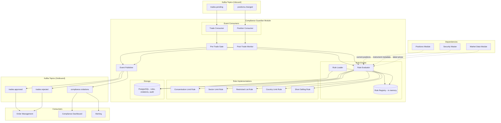

# Compliance Guardian Module

## Context & Problem

Regulatory violations cost hedge funds millions in fines, reputational damage, and forced position liquidation. Most funds solve compliance with two separate systems: a pre-trade check that gates orders before execution, and a post-trade monitor that scans positions periodically. The problem is that these two systems apply different rule implementations. A rule that blocks a trade pre-trade may not fire the same way post-trade, or vice versa. When rules drift, violations slip through.

This module uses a single rule engine for both pre-trade and post-trade compliance. The same rule definition, the same evaluation logic, the same thresholds — applied at two different trigger points. Pre-trade: a pending trade arrives, the engine evaluates the hypothetical post-trade portfolio against all rules, and either approves or rejects. Post-trade: position changes arrive, the engine evaluates the actual portfolio against the same rules and flags violations for remediation.

Rules are data-driven. They live in the database, not in code. Adding a new rule or adjusting a threshold is a configuration change, not a deployment. This matters because compliance requirements change frequently — new regulations, new fund mandates, new restricted lists — and the compliance team must be able to update rules without engineering involvement.

## Domain Concepts

| Concept | Definition |
|---|---|
| **Rule** | A compliance constraint with a type, parameters, and severity — stored in the database |
| **Rule Evaluation** | Applying a rule to a portfolio state and producing a pass/fail result with details |
| **Pre-Trade Check** | Evaluating rules against the hypothetical portfolio that would exist after a pending trade |
| **Post-Trade Monitor** | Evaluating rules against the actual current portfolio to detect drift and violations |
| **Violation** | A rule evaluation that failed — includes the rule, the offending position(s), and severity |
| **Restricted List** | A set of instruments that cannot be traded (regulatory, insider, or fund mandate) |
| **Breach** | A violation that exceeds a hard limit (vs. a warning that approaches a soft limit) |
| **Remediation** | The corrective action for a violation: reduce position, notify PM, escalate to compliance officer |

## Architecture



## Design Decisions

### Single Rule Set, Two Trigger Points

The rule engine does not know whether it is being called pre-trade or post-trade. It receives a portfolio state (positions + instrument metadata) and evaluates every active rule. The pre-trade gate constructs a hypothetical portfolio by applying the pending trade to current positions, then calls the engine. The post-trade monitor passes the actual current portfolio. Same engine, same rules, same code path.

### Rules as Data, Not Code

Each rule type has a code implementation (the evaluation logic), but the rule parameters (thresholds, scopes, severity) are stored in the database. The `ConcentrationLimitRule` implementation knows how to calculate position weight and compare it to a limit. Whether the limit is 5% or 10%, which portfolios it applies to, and whether it is a hard breach or soft warning — that is all configuration.

### Rule Evaluation Returns Rich Results

A rule evaluation does not just return pass/fail. It returns the current value, the limit, how close the portfolio is to the limit (headroom), and what positions are contributing. This gives the PM and compliance officer actionable information, not just a red flag.

## Interface Contract

```python
# interface.py

from typing import Protocol
from datetime import datetime
from decimal import Decimal
from enum import StrEnum
from uuid import UUID

from pydantic import BaseModel, ConfigDict


class RuleType(StrEnum):
    CONCENTRATION_LIMIT = "concentration_limit"
    SECTOR_LIMIT = "sector_limit"
    COUNTRY_LIMIT = "country_limit"
    RESTRICTED_LIST = "restricted_list"
    SHORT_SELLING = "short_selling"


class Severity(StrEnum):
    WARNING = "warning"     # approaching limit, PM notified
    BREACH = "breach"       # hard limit exceeded, action required
    BLOCK = "block"         # pre-trade: reject the trade


class RuleDefinition(BaseModel):
    model_config = ConfigDict(frozen=True)

    id: UUID
    rule_type: RuleType
    name: str                               # "Max Single Name Concentration"
    description: str
    severity: Severity
    parameters: dict[str, str]              # rule-type-specific params, e.g. {"limit_pct": "5.0"}
    portfolio_ids: list[UUID] | None = None  # None = applies to all portfolios
    is_active: bool = True
    created_at: datetime
    updated_at: datetime


class EvaluationResult(BaseModel):
    model_config = ConfigDict(frozen=True)

    rule_id: UUID
    rule_type: RuleType
    rule_name: str
    passed: bool
    severity: Severity
    current_value: Decimal                  # e.g., current concentration %
    limit_value: Decimal                    # e.g., max allowed %
    headroom: Decimal                       # limit - current (negative = breached)
    offending_instruments: list[str]        # instrument_ids that trigger the violation
    details: str                            # human-readable explanation


class TradeRequest(BaseModel):
    model_config = ConfigDict(frozen=True)

    trade_id: UUID
    portfolio_id: UUID
    instrument_id: str
    side: str                               # "buy" or "sell"
    quantity: Decimal
    estimated_price: Decimal


class ComplianceDecision(BaseModel):
    model_config = ConfigDict(frozen=True)

    trade_id: UUID
    approved: bool
    results: list[EvaluationResult]         # all rule evaluations, pass and fail
    decided_at: datetime


class Violation(BaseModel):
    model_config = ConfigDict(frozen=True)

    id: UUID
    portfolio_id: UUID
    rule_id: UUID
    rule_type: RuleType
    severity: Severity
    current_value: Decimal
    limit_value: Decimal
    offending_instruments: list[str]
    details: str
    detected_at: datetime
    resolved_at: datetime | None = None


class ComplianceChecker(Protocol):
    """Pre-trade compliance gate."""

    async def check_trade(self, trade: TradeRequest) -> ComplianceDecision:
        """Evaluate a pending trade against all active rules."""
        ...


class ComplianceMonitor(Protocol):
    """Post-trade continuous monitoring."""

    async def evaluate_portfolio(self, portfolio_id: UUID) -> list[EvaluationResult]:
        """Evaluate all active rules against current portfolio state."""
        ...

    async def get_active_violations(self, portfolio_id: UUID) -> list[Violation]:
        """Get all unresolved violations for a portfolio."""
        ...
```

## Code Skeleton

### Rule Engine Core

```python
# engine.py

from abc import ABC, abstractmethod
from datetime import datetime, timezone
from decimal import Decimal
from uuid import UUID

import structlog

from .interface import EvaluationResult, RuleDefinition, RuleType, Severity

logger = structlog.get_logger()


class PortfolioState:
    """Snapshot of portfolio for rule evaluation. Works for both actual and hypothetical."""

    def __init__(
        self,
        portfolio_id: UUID,
        positions: dict[str, "PositionInfo"],   # instrument_id → position info
        total_nav: Decimal,
    ) -> None:
        self.portfolio_id = portfolio_id
        self.positions = positions
        self.total_nav = total_nav


class PositionInfo:
    """Position with enriched instrument metadata."""
    __slots__ = (
        "instrument_id", "quantity", "market_value", "weight",
        "sector", "country", "currency", "instrument_type", "is_short",
    )

    def __init__(
        self,
        instrument_id: str,
        quantity: Decimal,
        market_value: Decimal,
        weight: Decimal,
        sector: str | None,
        country: str | None,
        currency: str | None,
        instrument_type: str | None,
    ) -> None:
        self.instrument_id = instrument_id
        self.quantity = quantity
        self.market_value = market_value
        self.weight = weight
        self.sector = sector
        self.country = country
        self.currency = currency
        self.instrument_type = instrument_type
        self.is_short = quantity < 0


class RuleEvaluator(ABC):
    """Base class for rule evaluation logic. One subclass per RuleType."""

    @abstractmethod
    def evaluate(
        self, rule: RuleDefinition, state: PortfolioState,
    ) -> EvaluationResult: ...


class ConcentrationLimitEvaluator(RuleEvaluator):
    """Check that no single position exceeds a % of NAV."""

    def evaluate(
        self, rule: RuleDefinition, state: PortfolioState,
    ) -> EvaluationResult:
        limit_pct = Decimal(rule.parameters["limit_pct"])
        limit_decimal = limit_pct / Decimal("100")

        worst_instrument = ""
        worst_weight = Decimal("0")
        offending = []

        for inst_id, pos in state.positions.items():
            if abs(pos.weight) > worst_weight:
                worst_weight = abs(pos.weight)
                worst_instrument = inst_id
            if abs(pos.weight) > limit_decimal:
                offending.append(inst_id)

        passed = len(offending) == 0
        headroom = limit_decimal - worst_weight

        return EvaluationResult(
            rule_id=rule.id,
            rule_type=rule.rule_type,
            rule_name=rule.name,
            passed=passed,
            severity=rule.severity,
            current_value=worst_weight * Decimal("100"),
            limit_value=limit_pct,
            headroom=headroom * Decimal("100"),
            offending_instruments=offending,
            details=(
                f"Largest position: {worst_instrument} at {worst_weight:.2%} "
                f"(limit: {limit_pct}%)"
            ),
        )


class SectorLimitEvaluator(RuleEvaluator):
    """Check that no single sector exceeds a % of NAV."""

    def evaluate(
        self, rule: RuleDefinition, state: PortfolioState,
    ) -> EvaluationResult:
        limit_pct = Decimal(rule.parameters["limit_pct"])
        limit_decimal = limit_pct / Decimal("100")
        target_sector = rule.parameters.get("sector")  # None = check all sectors

        # Aggregate by sector
        sector_weights: dict[str, Decimal] = {}
        sector_instruments: dict[str, list[str]] = {}
        for inst_id, pos in state.positions.items():
            sector = pos.sector or "unknown"
            sector_weights[sector] = sector_weights.get(sector, Decimal("0")) + abs(pos.weight)
            sector_instruments.setdefault(sector, []).append(inst_id)

        # Find worst sector
        offending = []
        worst_sector = ""
        worst_weight = Decimal("0")

        sectors_to_check = [target_sector] if target_sector else list(sector_weights.keys())
        for sector in sectors_to_check:
            w = sector_weights.get(sector, Decimal("0"))
            if w > worst_weight:
                worst_weight = w
                worst_sector = sector
            if w > limit_decimal:
                offending.extend(sector_instruments.get(sector, []))

        passed = len(offending) == 0
        headroom = limit_decimal - worst_weight

        return EvaluationResult(
            rule_id=rule.id,
            rule_type=rule.rule_type,
            rule_name=rule.name,
            passed=passed,
            severity=rule.severity,
            current_value=worst_weight * Decimal("100"),
            limit_value=limit_pct,
            headroom=headroom * Decimal("100"),
            offending_instruments=offending,
            details=f"Largest sector: {worst_sector} at {worst_weight:.2%} (limit: {limit_pct}%)",
        )


class RestrictedListEvaluator(RuleEvaluator):
    """Check that no positions are held in restricted instruments."""

    def evaluate(
        self, rule: RuleDefinition, state: PortfolioState,
    ) -> EvaluationResult:
        restricted = set(rule.parameters.get("instruments", "").split(","))
        restricted.discard("")

        offending = [
            inst_id for inst_id in state.positions
            if inst_id in restricted
        ]

        return EvaluationResult(
            rule_id=rule.id,
            rule_type=rule.rule_type,
            rule_name=rule.name,
            passed=len(offending) == 0,
            severity=rule.severity,
            current_value=Decimal(str(len(offending))),
            limit_value=Decimal("0"),
            headroom=Decimal(str(-len(offending))),
            offending_instruments=offending,
            details=(
                f"Restricted instruments held: {', '.join(offending)}"
                if offending else "No restricted instruments held"
            ),
        )


class CountryLimitEvaluator(RuleEvaluator):
    """Check that no single country exceeds a % of NAV."""

    def evaluate(
        self, rule: RuleDefinition, state: PortfolioState,
    ) -> EvaluationResult:
        limit_pct = Decimal(rule.parameters["limit_pct"])
        limit_decimal = limit_pct / Decimal("100")
        target_country = rule.parameters.get("country")

        country_weights: dict[str, Decimal] = {}
        country_instruments: dict[str, list[str]] = {}
        for inst_id, pos in state.positions.items():
            country = pos.country or "unknown"
            country_weights[country] = country_weights.get(country, Decimal("0")) + abs(pos.weight)
            country_instruments.setdefault(country, []).append(inst_id)

        offending = []
        worst_country = ""
        worst_weight = Decimal("0")

        countries_to_check = [target_country] if target_country else list(country_weights.keys())
        for country in countries_to_check:
            w = country_weights.get(country, Decimal("0"))
            if w > worst_weight:
                worst_weight = w
                worst_country = country
            if w > limit_decimal:
                offending.extend(country_instruments.get(country, []))

        passed = len(offending) == 0
        headroom = limit_decimal - worst_weight

        return EvaluationResult(
            rule_id=rule.id,
            rule_type=rule.rule_type,
            rule_name=rule.name,
            passed=passed,
            severity=rule.severity,
            current_value=worst_weight * Decimal("100"),
            limit_value=limit_pct,
            headroom=headroom * Decimal("100"),
            offending_instruments=offending,
            details=f"Largest country: {worst_country} at {worst_weight:.2%} (limit: {limit_pct}%)",
        )


class ShortSellingEvaluator(RuleEvaluator):
    """Check short selling restrictions."""

    def evaluate(
        self, rule: RuleDefinition, state: PortfolioState,
    ) -> EvaluationResult:
        restriction = rule.parameters.get("restriction", "no_naked_shorts")
        offending = []

        if restriction == "no_shorts":
            # No short positions allowed at all
            offending = [
                inst_id for inst_id, pos in state.positions.items()
                if pos.is_short
            ]
        elif restriction == "no_naked_shorts":
            # Shorts only allowed if borrow is available (simplified: check instrument type)
            offending = [
                inst_id for inst_id, pos in state.positions.items()
                if pos.is_short and pos.instrument_type not in ("etf", "future")
            ]

        short_count = sum(1 for pos in state.positions.values() if pos.is_short)

        return EvaluationResult(
            rule_id=rule.id,
            rule_type=rule.rule_type,
            rule_name=rule.name,
            passed=len(offending) == 0,
            severity=rule.severity,
            current_value=Decimal(str(short_count)),
            limit_value=Decimal("0"),
            headroom=Decimal(str(-len(offending))),
            offending_instruments=offending,
            details=(
                f"Short selling violations: {', '.join(offending)}"
                if offending else f"All {short_count} short positions compliant"
            ),
        )
```

### Rule Engine Orchestrator

```python
# rule_engine.py

from decimal import Decimal
from uuid import UUID

import structlog

from .engine import (
    ConcentrationLimitEvaluator,
    CountryLimitEvaluator,
    PortfolioState,
    RestrictedListEvaluator,
    RuleEvaluator,
    SectorLimitEvaluator,
    ShortSellingEvaluator,
)
from .interface import EvaluationResult, RuleDefinition, RuleType

logger = structlog.get_logger()


# Registry mapping rule types to their evaluators
EVALUATOR_REGISTRY: dict[RuleType, RuleEvaluator] = {
    RuleType.CONCENTRATION_LIMIT: ConcentrationLimitEvaluator(),
    RuleType.SECTOR_LIMIT: SectorLimitEvaluator(),
    RuleType.COUNTRY_LIMIT: CountryLimitEvaluator(),
    RuleType.RESTRICTED_LIST: RestrictedListEvaluator(),
    RuleType.SHORT_SELLING: ShortSellingEvaluator(),
}


class ComplianceRuleEngine:
    """Evaluates all active rules against a portfolio state.
    
    This is the core engine. It does not know whether it is being called
    for pre-trade or post-trade — it just evaluates rules against state.
    """

    def __init__(self, rule_repository: "RuleRepository") -> None:
        self._rule_repo = rule_repository
        self._rules: list[RuleDefinition] = []

    async def load_rules(self) -> None:
        """Load active rules from database into memory."""
        self._rules = await self._rule_repo.get_active_rules()
        logger.info("rules_loaded", count=len(self._rules))

    async def reload_rules(self) -> None:
        """Reload rules (called when rules are updated)."""
        await self.load_rules()

    def evaluate_all(
        self,
        state: PortfolioState,
        portfolio_id: UUID | None = None,
    ) -> list[EvaluationResult]:
        """Evaluate all applicable rules against the given portfolio state."""
        results = []

        for rule in self._rules:
            if not rule.is_active:
                continue

            # Check if rule applies to this portfolio
            if rule.portfolio_ids is not None and state.portfolio_id not in rule.portfolio_ids:
                continue

            evaluator = EVALUATOR_REGISTRY.get(rule.rule_type)
            if evaluator is None:
                logger.error("unknown_rule_type", rule_type=rule.rule_type, rule_id=str(rule.id))
                continue

            try:
                result = evaluator.evaluate(rule, state)
                results.append(result)
            except Exception as e:
                logger.error(
                    "rule_evaluation_failed",
                    rule_id=str(rule.id),
                    rule_type=rule.rule_type,
                    error=str(e),
                )
                # A failed rule evaluation is treated as a failure (conservative)
                results.append(EvaluationResult(
                    rule_id=rule.id,
                    rule_type=rule.rule_type,
                    rule_name=rule.name,
                    passed=False,
                    severity=rule.severity,
                    current_value=Decimal("-1"),
                    limit_value=Decimal("-1"),
                    headroom=Decimal("-1"),
                    offending_instruments=[],
                    details=f"Rule evaluation failed: {e}",
                ))

        return results
```

### Pre-Trade Gate

```python
# pre_trade.py

from datetime import datetime, timezone
from decimal import Decimal
from uuid import UUID

import structlog

from .engine import PortfolioState, PositionInfo
from .interface import ComplianceDecision, Severity, TradeRequest
from .rule_engine import ComplianceRuleEngine

logger = structlog.get_logger()


class PreTradeGate:
    """Evaluates pending trades against compliance rules before execution."""

    def __init__(
        self,
        rule_engine: ComplianceRuleEngine,
        position_reader: "PositionReader",
        market_data_reader: "MarketDataReader",
        security_master: "SecurityMasterReader",
        event_publisher: "EventPublisher",
        violation_repository: "ViolationRepository",
    ) -> None:
        self._engine = rule_engine
        self._positions = position_reader
        self._market_data = market_data_reader
        self._security_master = security_master
        self._publisher = event_publisher
        self._violations = violation_repository

    async def check_trade(self, trade: TradeRequest) -> ComplianceDecision:
        """Build hypothetical post-trade portfolio and evaluate all rules."""
        # Get current positions
        current_positions = await self._positions.get_positions(trade.portfolio_id)
        nav = await self._positions.get_nav(trade.portfolio_id)

        # Build hypothetical position set with the trade applied
        positions: dict[str, PositionInfo] = {}
        for pos in current_positions:
            price = await self._market_data.get_latest_price(pos.instrument_id)
            instrument = await self._security_master.get_by_id(pos.instrument_id)
            mv = pos.quantity * price.mid
            positions[pos.instrument_id] = PositionInfo(
                instrument_id=pos.instrument_id,
                quantity=pos.quantity,
                market_value=mv,
                weight=mv / nav if nav != Decimal("0") else Decimal("0"),
                sector=getattr(instrument, "sector", None),
                country=getattr(instrument, "country", None),
                currency=getattr(instrument, "currency", None),
                instrument_type=getattr(instrument, "asset_class", None),
            )

        # Apply the hypothetical trade
        trade_qty = trade.quantity if trade.side == "buy" else -trade.quantity
        existing = positions.get(trade.instrument_id)
        if existing:
            new_qty = existing.quantity + trade_qty
            new_mv = new_qty * trade.estimated_price
            positions[trade.instrument_id] = PositionInfo(
                instrument_id=existing.instrument_id,
                quantity=new_qty,
                market_value=new_mv,
                weight=new_mv / nav if nav != Decimal("0") else Decimal("0"),
                sector=existing.sector,
                country=existing.country,
                currency=existing.currency,
                instrument_type=existing.instrument_type,
            )
        else:
            instrument = await self._security_master.get_by_id(trade.instrument_id)
            new_mv = trade_qty * trade.estimated_price
            positions[trade.instrument_id] = PositionInfo(
                instrument_id=trade.instrument_id,
                quantity=trade_qty,
                market_value=new_mv,
                weight=new_mv / nav if nav != Decimal("0") else Decimal("0"),
                sector=getattr(instrument, "sector", None),
                country=getattr(instrument, "country", None),
                currency=getattr(instrument, "currency", None),
                instrument_type=getattr(instrument, "asset_class", None),
            )

        # Remove zero-quantity positions
        positions = {k: v for k, v in positions.items() if v.quantity != Decimal("0")}

        # Evaluate rules against hypothetical state
        state = PortfolioState(
            portfolio_id=trade.portfolio_id,
            positions=positions,
            total_nav=nav,
        )
        results = self._engine.evaluate_all(state)

        # Determine approval: reject if any BLOCK-severity rule fails
        has_block = any(
            not r.passed and r.severity == Severity.BLOCK
            for r in results
        )
        approved = not has_block

        decision = ComplianceDecision(
            trade_id=trade.trade_id,
            approved=approved,
            results=results,
            decided_at=datetime.now(timezone.utc),
        )

        # Publish decision
        if approved:
            await self._publisher.publish(
                topic="trades.approved",
                key=str(trade.trade_id),
                event={
                    "event_type": "trade.approved",
                    "trade_id": str(trade.trade_id),
                    "portfolio_id": str(trade.portfolio_id),
                    "instrument_id": trade.instrument_id,
                    "warnings": [
                        r.details for r in results
                        if not r.passed and r.severity == Severity.WARNING
                    ],
                    "timestamp": decision.decided_at.isoformat(),
                },
            )
            logger.info(
                "trade_approved",
                trade_id=str(trade.trade_id),
                instrument_id=trade.instrument_id,
            )
        else:
            violations = [r for r in results if not r.passed]
            await self._publisher.publish(
                topic="trades.rejected",
                key=str(trade.trade_id),
                event={
                    "event_type": "trade.rejected",
                    "trade_id": str(trade.trade_id),
                    "portfolio_id": str(trade.portfolio_id),
                    "instrument_id": trade.instrument_id,
                    "violations": [
                        {
                            "rule_name": v.rule_name,
                            "severity": v.severity,
                            "details": v.details,
                            "current_value": str(v.current_value),
                            "limit_value": str(v.limit_value),
                        }
                        for v in violations
                    ],
                    "timestamp": decision.decided_at.isoformat(),
                },
            )
            logger.warning(
                "trade_rejected",
                trade_id=str(trade.trade_id),
                instrument_id=trade.instrument_id,
                violation_count=len(violations),
            )

        return decision
```

### Post-Trade Monitor

```python
# post_trade.py

from datetime import datetime, timezone
from decimal import Decimal
from uuid import UUID, uuid4

import structlog

from .engine import PortfolioState, PositionInfo
from .interface import EvaluationResult, Severity, Violation
from .rule_engine import ComplianceRuleEngine

logger = structlog.get_logger()


class PostTradeMonitor:
    """Continuously evaluates portfolio compliance after trades execute."""

    def __init__(
        self,
        rule_engine: ComplianceRuleEngine,
        position_reader: "PositionReader",
        market_data_reader: "MarketDataReader",
        security_master: "SecurityMasterReader",
        event_publisher: "EventPublisher",
        violation_repository: "ViolationRepository",
    ) -> None:
        self._engine = rule_engine
        self._positions = position_reader
        self._market_data = market_data_reader
        self._security_master = security_master
        self._publisher = event_publisher
        self._violations = violation_repository

    async def evaluate_portfolio(self, portfolio_id: UUID) -> list[EvaluationResult]:
        """Evaluate all rules against current actual portfolio state."""
        current_positions = await self._positions.get_positions(portfolio_id)
        nav = await self._positions.get_nav(portfolio_id)

        positions: dict[str, PositionInfo] = {}
        for pos in current_positions:
            price = await self._market_data.get_latest_price(pos.instrument_id)
            instrument = await self._security_master.get_by_id(pos.instrument_id)
            mv = pos.quantity * price.mid
            positions[pos.instrument_id] = PositionInfo(
                instrument_id=pos.instrument_id,
                quantity=pos.quantity,
                market_value=mv,
                weight=mv / nav if nav != Decimal("0") else Decimal("0"),
                sector=getattr(instrument, "sector", None),
                country=getattr(instrument, "country", None),
                currency=getattr(instrument, "currency", None),
                instrument_type=getattr(instrument, "asset_class", None),
            )

        state = PortfolioState(
            portfolio_id=portfolio_id,
            positions=positions,
            total_nav=nav,
        )

        results = self._engine.evaluate_all(state)

        # Process failures: create violations and publish events
        for result in results:
            if not result.passed:
                violation = Violation(
                    id=uuid4(),
                    portfolio_id=portfolio_id,
                    rule_id=result.rule_id,
                    rule_type=result.rule_type,
                    severity=result.severity,
                    current_value=result.current_value,
                    limit_value=result.limit_value,
                    offending_instruments=result.offending_instruments,
                    details=result.details,
                    detected_at=datetime.now(timezone.utc),
                )

                await self._violations.save(violation)

                await self._publisher.publish(
                    topic="compliance.violations",
                    key=str(portfolio_id),
                    event={
                        "event_type": "compliance.violation_detected",
                        "violation_id": str(violation.id),
                        "portfolio_id": str(portfolio_id),
                        "rule_type": result.rule_type,
                        "rule_name": result.rule_name,
                        "severity": result.severity,
                        "current_value": str(result.current_value),
                        "limit_value": str(result.limit_value),
                        "offending_instruments": result.offending_instruments,
                        "details": result.details,
                        "timestamp": violation.detected_at.isoformat(),
                    },
                )

                logger.warning(
                    "compliance_violation",
                    portfolio_id=str(portfolio_id),
                    rule=result.rule_name,
                    severity=result.severity,
                    details=result.details,
                )

        return results

    async def get_active_violations(self, portfolio_id: UUID) -> list[Violation]:
        """Get all unresolved violations."""
        return await self._violations.get_active(portfolio_id)
```

## Data Model

```sql
CREATE SCHEMA IF NOT EXISTS compliance;

-- Rule definitions (the single source of truth for compliance rules)
CREATE TABLE compliance.rules (
    id              UUID PRIMARY KEY DEFAULT gen_random_uuid(),
    rule_type       VARCHAR(32)     NOT NULL,
    name            VARCHAR(255)    NOT NULL,
    description     TEXT            NOT NULL,
    severity        VARCHAR(16)     NOT NULL,  -- 'warning', 'breach', 'block'
    parameters      JSONB           NOT NULL,  -- rule-type-specific config
    portfolio_ids   UUID[],                     -- NULL = applies to all
    is_active       BOOLEAN         NOT NULL DEFAULT TRUE,
    created_by      VARCHAR(64)     NOT NULL,
    created_at      TIMESTAMPTZ     NOT NULL DEFAULT NOW(),
    updated_at      TIMESTAMPTZ     NOT NULL DEFAULT NOW()
);

CREATE INDEX ix_rules_active ON compliance.rules (is_active) WHERE is_active = TRUE;
CREATE INDEX ix_rules_type ON compliance.rules (rule_type);

-- Example rule inserts
INSERT INTO compliance.rules (rule_type, name, description, severity, parameters, created_by) VALUES
    ('concentration_limit', 'Max Single Name 5%', 'No single position may exceed 5% of NAV', 'block',
     '{"limit_pct": "5.0"}', 'system'),
    ('concentration_limit', 'Single Name Warning 3%', 'Warn when position approaches 3% of NAV', 'warning',
     '{"limit_pct": "3.0"}', 'system'),
    ('sector_limit', 'Max Sector 25%', 'No sector may exceed 25% of NAV', 'block',
     '{"limit_pct": "25.0"}', 'system'),
    ('country_limit', 'Max Country 40%', 'No country may exceed 40% of NAV', 'breach',
     '{"limit_pct": "40.0"}', 'system'),
    ('restricted_list', 'Regulatory Restricted', 'Instruments restricted by regulation', 'block',
     '{"instruments": "SANCTIONED1,SANCTIONED2"}', 'compliance_officer'),
    ('short_selling', 'No Naked Shorts', 'Only allow shorts on ETFs and futures', 'block',
     '{"restriction": "no_naked_shorts"}', 'system');

-- Restricted list (separate table for large/frequently updated lists)
CREATE TABLE compliance.restricted_instruments (
    id              UUID PRIMARY KEY DEFAULT gen_random_uuid(),
    instrument_id   VARCHAR(32)     NOT NULL,
    reason          VARCHAR(255)    NOT NULL,  -- 'regulatory', 'insider', 'fund_mandate'
    added_by        VARCHAR(64)     NOT NULL,
    added_at        TIMESTAMPTZ     NOT NULL DEFAULT NOW(),
    expires_at      TIMESTAMPTZ,               -- NULL = permanent
    is_active       BOOLEAN         NOT NULL DEFAULT TRUE
);

CREATE UNIQUE INDEX ix_restricted_active ON compliance.restricted_instruments (instrument_id)
    WHERE is_active = TRUE;

-- Violations detected
CREATE TABLE compliance.violations (
    id                      UUID PRIMARY KEY DEFAULT gen_random_uuid(),
    portfolio_id            UUID            NOT NULL,
    rule_id                 UUID            NOT NULL REFERENCES compliance.rules(id),
    rule_type               VARCHAR(32)     NOT NULL,
    severity                VARCHAR(16)     NOT NULL,
    current_value           NUMERIC(18,6)   NOT NULL,
    limit_value             NUMERIC(18,6)   NOT NULL,
    offending_instruments   TEXT[]          NOT NULL,
    details                 TEXT            NOT NULL,
    detected_at             TIMESTAMPTZ     NOT NULL,
    resolved_at             TIMESTAMPTZ,
    resolved_by             VARCHAR(64),
    resolution_notes        TEXT
);

CREATE INDEX ix_violations_portfolio ON compliance.violations (portfolio_id, detected_at DESC);
CREATE INDEX ix_violations_active ON compliance.violations (portfolio_id)
    WHERE resolved_at IS NULL;
CREATE INDEX ix_violations_severity ON compliance.violations (severity, detected_at DESC);

-- Pre-trade decision audit trail
CREATE TABLE compliance.trade_decisions (
    id              UUID PRIMARY KEY DEFAULT gen_random_uuid(),
    trade_id        UUID            NOT NULL,
    portfolio_id    UUID            NOT NULL,
    instrument_id   VARCHAR(32)     NOT NULL,
    side            VARCHAR(4)      NOT NULL,
    quantity        NUMERIC(18,6)   NOT NULL,
    approved        BOOLEAN         NOT NULL,
    results_json    JSONB           NOT NULL,   -- full evaluation results
    decided_at      TIMESTAMPTZ     NOT NULL
);

CREATE INDEX ix_trade_decisions_trade ON compliance.trade_decisions (trade_id);
CREATE INDEX ix_trade_decisions_portfolio ON compliance.trade_decisions (portfolio_id, decided_at DESC);

-- Rule change audit log
CREATE TABLE compliance.rule_audit_log (
    id          UUID PRIMARY KEY DEFAULT gen_random_uuid(),
    rule_id     UUID            NOT NULL REFERENCES compliance.rules(id),
    action      VARCHAR(16)     NOT NULL,  -- 'created', 'updated', 'deactivated'
    old_values  JSONB,
    new_values  JSONB           NOT NULL,
    changed_by  VARCHAR(64)     NOT NULL,
    changed_at  TIMESTAMPTZ     NOT NULL DEFAULT NOW()
);

CREATE INDEX ix_rule_audit_rule ON compliance.rule_audit_log (rule_id, changed_at DESC);
```

## Kafka Events Published

| Topic | Key | Event | Payload | Consumers |
|---|---|---|---|---|
| `compliance.violations` | `portfolio_id` | `compliance.violation_detected` | Violation details: rule, severity, current/limit values, offending instruments | Dashboard, Alerting |
| `trades.approved` | `trade_id` | `trade.approved` | Trade ID, warnings (if any) | Order Management |
| `trades.rejected` | `trade_id` | `trade.rejected` | Trade ID, violation details | Order Management, Dashboard |

## Patterns Used

| Pattern | Document |
|---|---|
| Data-driven rule engine (rules as config, not code) | [Policy as Code](../../patterns/authorization/policy-as-code.md) |
| Protocol-based module interfaces | [Module Interfaces](../../patterns/modularity/module-interfaces.md) |
| Event-driven trigger for pre-trade and post-trade | [Event-Driven Architecture](../../principles/event-driven-architecture.md) |
| Structured logging for compliance audit | [Structured Logging](../../patterns/observability/structured-logging.md) |
| Idempotent violation detection | [Idempotency](../../patterns/resilience/idempotency.md) |
| Bounded context — compliance owns its own rule/violation data | [Bounded Contexts](../../principles/bounded-contexts.md) |
| Graceful degradation on rule evaluation failure | [Graceful Degradation](../../patterns/resilience/graceful-degradation.md) |

## Failure Modes

| Failure | Cause | Impact | Mitigation |
|---|---|---|---|
| Rule evaluation exception | Bad rule parameters, unexpected data | Single rule fails — treated as violation (conservative) | Log error, return failure result, alert compliance team to fix rule config |
| Position data unavailable | Positions module down | Cannot evaluate any rules | Reject all pending trades (fail closed), alert operations |
| Stale position data | Kafka consumer lag on positions.changed | Post-trade monitor evaluates against outdated positions | Monitor consumer lag, alert when lag > 30 seconds |
| Rule reload failure | Database unavailable during rule reload | Engine uses stale rules | Keep current rules in memory, retry reload, alert on persistent failure |
| Pre-trade latency spike | Too many rules or slow security master lookups | Trades delayed, PM frustrated | Cache instrument metadata, profile rule evaluation, set SLA timeout (reject if > 500ms) |
| Duplicate violation events | Same violation detected on consecutive position updates | Alert fatigue | Deduplicate by (portfolio_id, rule_id, offending_instruments) within a time window |
| Restricted list stale | New insider restriction not yet loaded | Trade on restricted instrument approved | Restricted list changes trigger immediate rule reload, not just periodic |

## Performance Profile

| Metric | Target |
|---|---|
| Pre-trade check (single trade, 50 rules) | < 200ms |
| Post-trade evaluation (full portfolio, 50 rules) | < 500ms |
| Rule reload from database | < 100ms |
| Violation persistence | < 50ms |
| Event publish (approval/rejection) | < 10ms |
| Kafka consumer lag (trades.pending) | < 1 second |

## Dependencies

```
compliance-guardian
  ├── depends on: positions (current holdings, NAV)
  ├── depends on: market-data-ingestion (latest prices for market value calculation)
  ├── depends on: security-master (instrument metadata: sector, country, type)
  ├── depends on: shared kernel (types, events)
  ├── consumes: trades.pending, positions.changed
  ├── publishes: compliance.violations, trades.approved, trades.rejected
  └── consumed by: order-management, dashboard, alerting
```

## Related Documents

- [Exposure Calculation](exposure-calculation.md) — exposure data used alongside compliance for risk monitoring
- [Alpha Engine](alpha-engine.md) — generates order intents that trigger pre-trade compliance checks
- [Security Master](security-master.md) — instrument metadata for sector/country rule evaluation
- [Market Data Ingestion](market-data-ingestion.md) — prices for market value calculation in rule evaluation
