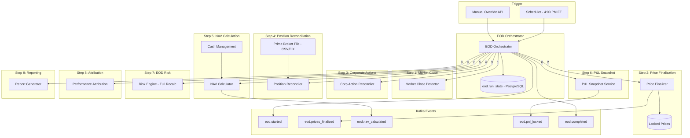

# EOD Processing Module

## Context & Problem

Real-time event processing handles the intraday lifecycle well — prices stream, trades execute, positions update, risk recalculates. But when the market closes at 4:00 PM ET, a hedge fund must produce a single, deterministic, auditable snapshot of the day. This is the end-of-day (EOD) batch process, and it is the most operationally critical workflow in the system.

The EOD process must:

- **Lock in final prices** — no further price updates affect today's P&L after close
- **Snapshot P&L** — realized and unrealized, per position and portfolio, frozen for reporting
- **Reconcile positions** — compare internal state against the prime broker's end-of-day statement
- **Calculate NAV** — the fund's net asset value, used for investor reporting and fee calculations
- **Run final risk** — full VaR recalculation with updated correlations and end-of-day positions
- **Produce attribution** — Brinson-Fachler decomposition using locked EOD data
- **Generate reports** — investor letters, regulatory extracts, internal dashboards

Every downstream consumer — investors, regulators, compliance, the PM — depends on EOD producing a consistent, correct, and complete picture. If EOD fails or produces incorrect results, the fund cannot report NAV, cannot calculate management/performance fees, and may breach regulatory filing deadlines.

The fundamental tension: EOD is a batch process running inside a real-time event-driven system. The orchestrator must temporarily shift the system from streaming mode to sequential, ordered, step-by-step execution — and then hand control back.

## Domain Concepts

| Concept | Definition |
|---|---|
| **EOD Sequence** | The ordered series of steps that must execute after market close, each depending on the prior step's output |
| **Price Finalization** | Capturing official closing prices and locking them so that mark-to-market uses a single, deterministic price for the business date |
| **P&L Snapshot** | A frozen record of realized and unrealized P&L per position, portfolio, and fund — immutable after EOD completes |
| **Position Reconciliation** | Comparing internal position quantities and cost bases against the prime broker's end-of-day statement, flagging discrepancies ("breaks") |
| **NAV Calculation** | Net Asset Value = sum of all position market values + cash balances - accrued fees. The single most important number a fund produces daily |
| **EOD Risk Run** | A full risk recalculation (VaR, stress tests, factor decomposition) using finalized prices and reconciled positions — distinct from intraday incremental risk |

## Architecture



## Design Decisions

### Sequential Execution with Checkpointing

EOD steps execute in strict order. Each step depends on the output of the previous step — you cannot calculate NAV before prices are finalized, and you cannot snapshot P&L before NAV is calculated. This is not a pipeline that can be parallelized.

Every step writes its completion status to `eod.run_state` in PostgreSQL. If EOD fails at step 6, restarting resumes from step 6, not step 1. This is critical because some steps are expensive (risk recalculation takes minutes) and some are idempotent only if re-run with the same inputs (price finalization).

**Tradeoff:** Sequential execution means EOD takes 15-30 minutes end-to-end. A parallel design could be faster, but the data dependencies between steps make it fragile. The sequential approach is simpler to reason about, debug, and audit.

### EOD Sequence

The nine steps execute in this order:

1. **Market Close Detection (4:00 PM ET for US equities)** — Confirm the market has closed. For multi-market funds, each market has its own close time, and EOD triggers after the last relevant market closes.

2. **Price Finalization** — Capture official closing prices from the market data module. Publish `eod.prices_finalized`. After this event, the mark-to-market engine uses the locked close price rather than real-time prices for this business date. Any late price corrections require a restatement workflow.

3. **Corporate Action Reconciliation** — Verify that all announced corporate actions for the business date have been applied to positions. Compare the security master's announced actions against the position-keeping module's applied actions. Flag any unapplied actions as breaks.

4. **Position Reconciliation** — Ingest the prime broker's end-of-day position file (typically CSV or FIX drop, arriving 30-60 minutes after close). Compare internal positions (quantity, cost basis) against the broker's records. Any discrepancy is a "break" that must be investigated before NAV is official.

5. **NAV Calculation** — Sum of all position market values (using locked prices) plus cash balances minus accrued fees. This is the number that goes to investors. NAV per share is computed by dividing by outstanding shares/units.

6. **P&L Snapshot** — Lock in daily realized and unrealized P&L per position and per portfolio. This snapshot is immutable — it becomes the basis for performance reporting, fee calculations, and tax lot accounting.

7. **EOD Risk Calculation** — Full VaR recalculation with updated correlations using the day's finalized return data. Unlike intraday incremental risk, this is a complete recomputation. Results are stored as the official risk-of-record for the business date.

8. **Performance Attribution** — Run Brinson-Fachler attribution using locked EOD data. Decompose daily return into allocation, selection, and interaction effects relative to the benchmark.

9. **Reporting** — Generate investor reports (NAV statement, performance summary), regulatory extracts (Form PF data points, 13F position data), and internal dashboards (risk summary, P&L attribution).

### Price Finalization — The Lock Mechanism

Price finalization is the single most important EOD step. Once `eod.prices_finalized` is published, every module in the system that computes values for this business date must use the locked closing price, not any subsequent real-time price.

Implementation: the market data module writes a `finalized_prices` record for the business date. The mark-to-market engine checks for finalized prices before using real-time prices. If a finalized price exists for the business date, it is used unconditionally.

```python
# price_finalization.py

from datetime import date
from decimal import Decimal

from pydantic import BaseModel, ConfigDict


class FinalizedPrice(BaseModel):
    model_config = ConfigDict(frozen=True)

    instrument_id: str
    business_date: date
    close_price: Decimal
    source: str              # "bloomberg", "reuters", "composite"
    finalized_at: str        # ISO timestamp
    finalized_by: str        # "eod_orchestrator" or "manual_override"


class PriceFinalizationResult(BaseModel):
    model_config = ConfigDict(frozen=True)

    business_date: date
    total_instruments: int
    finalized_count: int
    missing_count: int
    missing_instruments: list[str]
    is_complete: bool        # True if missing_count == 0
```

```sql
-- Locked closing prices — one row per instrument per business date
CREATE TABLE eod.finalized_prices (
    instrument_id   VARCHAR(32) NOT NULL,
    business_date   DATE NOT NULL,
    close_price     NUMERIC(18,8) NOT NULL,
    source          VARCHAR(32) NOT NULL,
    finalized_at    TIMESTAMPTZ NOT NULL DEFAULT NOW(),
    finalized_by    VARCHAR(64) NOT NULL,

    PRIMARY KEY (instrument_id, business_date)
);

CREATE INDEX ix_finalized_prices_date ON eod.finalized_prices (business_date);
```

### EOD Orchestrator

```python
# orchestrator.py

from typing import Protocol
from datetime import date, datetime
from enum import StrEnum
from uuid import UUID, uuid4

from pydantic import BaseModel, ConfigDict


class EODStepStatus(StrEnum):
    PENDING = "pending"
    RUNNING = "running"
    COMPLETED = "completed"
    FAILED = "failed"
    SKIPPED = "skipped"


class EODStep(StrEnum):
    MARKET_CLOSE = "market_close"
    PRICE_FINALIZATION = "price_finalization"
    CORP_ACTION_RECON = "corp_action_recon"
    POSITION_RECON = "position_recon"
    NAV_CALCULATION = "nav_calculation"
    PNL_SNAPSHOT = "pnl_snapshot"
    EOD_RISK = "eod_risk"
    PERFORMANCE_ATTRIBUTION = "performance_attribution"
    REPORTING = "reporting"


class EODStepResult(BaseModel):
    model_config = ConfigDict(frozen=True)

    step: EODStep
    status: EODStepStatus
    started_at: datetime
    completed_at: datetime | None = None
    error_message: str | None = None
    details: dict | None = None


class EODResult(BaseModel):
    model_config = ConfigDict(frozen=True)

    run_id: UUID
    business_date: date
    started_at: datetime
    completed_at: datetime | None = None
    steps: list[EODStepResult]
    is_successful: bool


class EODStepRunner(Protocol):
    """Each EOD step implements this interface."""

    async def run(self, business_date: date, run_id: UUID) -> EODStepResult: ...

    async def can_retry(self, business_date: date) -> bool: ...


class EODOrchestrator:
    """Runs the full EOD sequence. Steps are ordered and each must
    complete before the next."""

    STEP_ORDER: list[EODStep] = [
        EODStep.MARKET_CLOSE,
        EODStep.PRICE_FINALIZATION,
        EODStep.CORP_ACTION_RECON,
        EODStep.POSITION_RECON,
        EODStep.NAV_CALCULATION,
        EODStep.PNL_SNAPSHOT,
        EODStep.EOD_RISK,
        EODStep.PERFORMANCE_ATTRIBUTION,
        EODStep.REPORTING,
    ]

    def __init__(
        self,
        step_runners: dict[EODStep, EODStepRunner],
        state_store: "EODStateStore",
        publisher: "EventPublisher",
    ) -> None:
        self._runners = step_runners
        self._state = state_store
        self._publisher = publisher

    async def run_eod(self, business_date: date) -> EODResult:
        """Run full EOD sequence. Steps are ordered and each must
        complete before the next.

        If a previous run failed partway through, resumes from the
        last incomplete step.
        """
        run_id = uuid4()
        step_results: list[EODStepResult] = []

        # Check for prior partial run — resume from last incomplete step
        prior_run = await self._state.get_latest_run(business_date)
        resume_from_index = 0
        if prior_run and not prior_run.is_successful:
            resume_from_index = self._find_resume_point(prior_run)
            run_id = prior_run.run_id
            step_results = [
                s for s in prior_run.steps
                if s.status == EODStepStatus.COMPLETED
            ]

        await self._publisher.publish(
            topic="eod.started",
            key=str(business_date),
            event={
                "event_type": "eod.started",
                "data": {
                    "run_id": str(run_id),
                    "business_date": str(business_date),
                    "resume_from": self.STEP_ORDER[resume_from_index].value,
                },
            },
        )

        for step in self.STEP_ORDER[resume_from_index:]:
            runner = self._runners[step]
            result = await self._run_step_with_retry(
                runner, step, business_date, run_id,
            )
            step_results.append(result)
            await self._state.save_step_result(run_id, result)

            if result.status == EODStepStatus.FAILED:
                return EODResult(
                    run_id=run_id,
                    business_date=business_date,
                    started_at=step_results[0].started_at,
                    completed_at=datetime.utcnow(),
                    steps=step_results,
                    is_successful=False,
                )

            # Publish milestone events for key steps
            await self._publish_milestone(step, business_date, run_id)

        await self._publisher.publish(
            topic="eod.completed",
            key=str(business_date),
            event={
                "event_type": "eod.completed",
                "data": {
                    "run_id": str(run_id),
                    "business_date": str(business_date),
                },
            },
        )

        return EODResult(
            run_id=run_id,
            business_date=business_date,
            started_at=step_results[0].started_at,
            completed_at=datetime.utcnow(),
            steps=step_results,
            is_successful=True,
        )

    async def _run_step_with_retry(
        self,
        runner: EODStepRunner,
        step: EODStep,
        business_date: date,
        run_id: UUID,
        max_retries: int = 2,
    ) -> EODStepResult:
        """Execute a step with automatic retry on transient failures."""
        last_result: EODStepResult | None = None

        for attempt in range(max_retries + 1):
            result = await runner.run(business_date, run_id)
            last_result = result

            if result.status == EODStepStatus.COMPLETED:
                return result

            if attempt < max_retries and await runner.can_retry(business_date):
                continue  # retry
            else:
                break

        assert last_result is not None
        return last_result

    async def _publish_milestone(
        self, step: EODStep, business_date: date, run_id: UUID,
    ) -> None:
        milestone_topics: dict[EODStep, str] = {
            EODStep.PRICE_FINALIZATION: "eod.prices_finalized",
            EODStep.NAV_CALCULATION: "eod.nav_calculated",
            EODStep.PNL_SNAPSHOT: "eod.pnl_locked",
        }
        if step in milestone_topics:
            await self._publisher.publish(
                topic=milestone_topics[step],
                key=str(business_date),
                event={
                    "event_type": milestone_topics[step],
                    "data": {
                        "run_id": str(run_id),
                        "business_date": str(business_date),
                    },
                },
            )

    def _find_resume_point(self, prior_run: EODResult) -> int:
        """Find the index of the first non-completed step."""
        completed_steps = {
            s.step for s in prior_run.steps
            if s.status == EODStepStatus.COMPLETED
        }
        for i, step in enumerate(self.STEP_ORDER):
            if step not in completed_steps:
                return i
        return len(self.STEP_ORDER)
```

### NAV Calculation

NAV is the single number that matters most to investors. It must be computed after prices are finalized and positions are reconciled.

```python
# nav.py

from typing import Protocol
from datetime import date, datetime
from decimal import Decimal
from uuid import UUID

from pydantic import BaseModel, ConfigDict


class NAVSnapshot(BaseModel):
    model_config = ConfigDict(frozen=True)

    portfolio_id: UUID
    business_date: date
    gross_market_value: Decimal    # sum of abs(position market values)
    net_market_value: Decimal      # sum of signed position market values
    cash_balance: Decimal
    accrued_fees: Decimal          # management + performance fees accrued
    nav: Decimal                   # net_market_value + cash_balance - accrued_fees
    nav_per_share: Decimal         # nav / shares_outstanding
    shares_outstanding: Decimal
    currency: str
    computed_at: datetime


class CashReader(Protocol):
    async def get_cash_balance(
        self, portfolio_id: UUID, business_date: date,
    ) -> Decimal: ...


class FeeCalculator(Protocol):
    async def get_accrued_fees(
        self, portfolio_id: UUID, business_date: date,
    ) -> Decimal: ...


class SharesOutstandingReader(Protocol):
    async def get_shares_outstanding(
        self, portfolio_id: UUID, business_date: date,
    ) -> Decimal: ...


class PositionReader(Protocol):
    async def get_portfolio_positions(
        self, portfolio_id: UUID,
    ) -> list: ...


class NAVCalculator:
    """NAV = sum(position_market_values) + cash_balances - accrued_fees"""

    def __init__(
        self,
        position_reader: PositionReader,
        cash_reader: CashReader,
        fee_calculator: FeeCalculator,
        shares_reader: SharesOutstandingReader,
    ) -> None:
        self._positions = position_reader
        self._cash = cash_reader
        self._fees = fee_calculator
        self._shares = shares_reader

    async def calculate_nav(
        self, portfolio_id: UUID, business_date: date,
    ) -> NAVSnapshot:
        """Calculate NAV using finalized prices and reconciled positions.

        Must be called AFTER price finalization and position reconciliation.
        Uses the locked closing prices via the position reader's market values.
        """
        positions = await self._positions.get_portfolio_positions(portfolio_id)
        cash_balance = await self._cash.get_cash_balance(
            portfolio_id, business_date,
        )
        accrued_fees = await self._fees.get_accrued_fees(
            portfolio_id, business_date,
        )
        shares_outstanding = await self._shares.get_shares_outstanding(
            portfolio_id, business_date,
        )

        gross_market_value = sum(
            abs(p.market_value) for p in positions
        )
        net_market_value = sum(p.market_value for p in positions)

        nav = net_market_value + cash_balance - accrued_fees

        nav_per_share = (
            nav / shares_outstanding
            if shares_outstanding > 0
            else Decimal(0)
        )

        return NAVSnapshot(
            portfolio_id=portfolio_id,
            business_date=business_date,
            gross_market_value=gross_market_value,
            net_market_value=net_market_value,
            cash_balance=cash_balance,
            accrued_fees=accrued_fees,
            nav=nav,
            nav_per_share=nav_per_share,
            shares_outstanding=shares_outstanding,
            currency="USD",
            computed_at=datetime.utcnow(),
        )
```

```sql
-- NAV snapshots — one per portfolio per business date
CREATE TABLE eod.nav_snapshots (
    portfolio_id         UUID NOT NULL,
    business_date        DATE NOT NULL,
    gross_market_value   NUMERIC(18,2) NOT NULL,
    net_market_value     NUMERIC(18,2) NOT NULL,
    cash_balance         NUMERIC(18,2) NOT NULL,
    accrued_fees         NUMERIC(18,2) NOT NULL,
    nav                  NUMERIC(18,2) NOT NULL,
    nav_per_share        NUMERIC(18,8) NOT NULL,
    shares_outstanding   NUMERIC(18,8) NOT NULL,
    currency             VARCHAR(3) NOT NULL,
    computed_at          TIMESTAMPTZ NOT NULL DEFAULT NOW(),

    PRIMARY KEY (portfolio_id, business_date)
);
```

### Position Reconciliation

The prime broker sends an end-of-day position file, typically via SFTP as CSV or via FIX drop copy. Reconciliation compares every position (quantity and, optionally, market value) against internal records.

```python
# reconciliation.py

from datetime import date, datetime
from decimal import Decimal
from enum import StrEnum
from uuid import UUID

from pydantic import BaseModel, ConfigDict


class BreakType(StrEnum):
    QUANTITY_MISMATCH = "quantity_mismatch"
    MISSING_INTERNAL = "missing_internal"       # broker has it, we don't
    MISSING_BROKER = "missing_broker"           # we have it, broker doesn't
    COST_BASIS_MISMATCH = "cost_basis_mismatch"


class ReconciliationBreak(BaseModel):
    model_config = ConfigDict(frozen=True)

    instrument_id: str
    break_type: BreakType
    internal_quantity: Decimal
    broker_quantity: Decimal
    difference: Decimal
    is_material: bool          # abs(difference) > threshold


class BrokerPosition(BaseModel):
    model_config = ConfigDict(frozen=True)

    instrument_id: str
    quantity: Decimal
    market_value: Decimal
    currency: str


class ReconciliationResult(BaseModel):
    model_config = ConfigDict(frozen=True)

    portfolio_id: UUID
    business_date: date
    total_positions: int
    matched_positions: int
    breaks: list[ReconciliationBreak]
    is_clean: bool
    reconciled_at: datetime


class PositionReconciler:
    """Compares internal positions against prime broker statement."""

    MATERIAL_THRESHOLD = Decimal("0.01")  # flag breaks > 0.01 shares

    def __init__(
        self,
        position_reader: "PositionReader",
        broker_file_parser: "BrokerFileParser",
    ) -> None:
        self._positions = position_reader
        self._parser = broker_file_parser

    async def reconcile(
        self,
        portfolio_id: UUID,
        business_date: date,
        broker_file_path: str,
    ) -> ReconciliationResult:
        """Run position reconciliation against prime broker file.

        The broker file is expected to arrive 30-60 minutes after
        market close. If it hasn't arrived, the EOD orchestrator
        retries this step.
        """
        broker_positions = await self._parser.parse(broker_file_path)
        internal_positions = await self._positions.get_portfolio_positions(
            portfolio_id,
        )

        internal_map = {p.instrument_id: p for p in internal_positions}
        broker_map = {p.instrument_id: p for p in broker_positions}
        all_instruments = set(internal_map.keys()) | set(broker_map.keys())

        breaks: list[ReconciliationBreak] = []

        for instrument_id in all_instruments:
            internal = internal_map.get(instrument_id)
            broker = broker_map.get(instrument_id)

            if internal is None and broker is not None:
                breaks.append(ReconciliationBreak(
                    instrument_id=instrument_id,
                    break_type=BreakType.MISSING_INTERNAL,
                    internal_quantity=Decimal(0),
                    broker_quantity=broker.quantity,
                    difference=-broker.quantity,
                    is_material=abs(broker.quantity) > self.MATERIAL_THRESHOLD,
                ))
            elif broker is None and internal is not None:
                breaks.append(ReconciliationBreak(
                    instrument_id=instrument_id,
                    break_type=BreakType.MISSING_BROKER,
                    internal_quantity=internal.quantity,
                    broker_quantity=Decimal(0),
                    difference=internal.quantity,
                    is_material=abs(internal.quantity) > self.MATERIAL_THRESHOLD,
                ))
            elif internal is not None and broker is not None:
                diff = internal.quantity - broker.quantity
                if diff != Decimal(0):
                    breaks.append(ReconciliationBreak(
                        instrument_id=instrument_id,
                        break_type=BreakType.QUANTITY_MISMATCH,
                        internal_quantity=internal.quantity,
                        broker_quantity=broker.quantity,
                        difference=diff,
                        is_material=abs(diff) > self.MATERIAL_THRESHOLD,
                    ))

        return ReconciliationResult(
            portfolio_id=portfolio_id,
            business_date=business_date,
            total_positions=len(all_instruments),
            matched_positions=len(all_instruments) - len(breaks),
            breaks=breaks,
            is_clean=len(breaks) == 0,
            reconciled_at=datetime.utcnow(),
        )
```

### EOD Run State Schema

```sql
-- EOD run tracking — one run per business date (with retry support)
CREATE TABLE eod.runs (
    run_id          UUID PRIMARY KEY,
    business_date   DATE NOT NULL,
    started_at      TIMESTAMPTZ NOT NULL DEFAULT NOW(),
    completed_at    TIMESTAMPTZ,
    is_successful   BOOLEAN NOT NULL DEFAULT FALSE,

    UNIQUE (business_date, run_id)
);

CREATE TABLE eod.run_steps (
    run_id          UUID NOT NULL REFERENCES eod.runs(run_id),
    step            VARCHAR(64) NOT NULL,
    status          VARCHAR(16) NOT NULL,  -- pending, running, completed, failed, skipped
    started_at      TIMESTAMPTZ NOT NULL,
    completed_at    TIMESTAMPTZ,
    error_message   TEXT,
    details         JSONB,

    PRIMARY KEY (run_id, step)
);

CREATE INDEX ix_runs_date ON eod.runs (business_date);
```

## Kafka Events

| Direction | Topic | Event | Description |
|---|---|---|---|
| Published | `eod.started` | `eod.started` | EOD sequence has begun for a business date |
| Published | `eod.prices_finalized` | `eod.prices_finalized` | Closing prices locked — all modules must use finalized prices for this date |
| Published | `eod.nav_calculated` | `eod.nav_calculated` | NAV computed and stored for all portfolios |
| Published | `eod.pnl_locked` | `eod.pnl_locked` | Daily P&L snapshot frozen — no further P&L changes for this date |
| Published | `eod.completed` | `eod.completed` | All EOD steps finished successfully |
| Consumed | `prices.normalized` | `price.updated` | Market prices (consumed during price finalization to capture closing prices) |
| Consumed | `positions.changed` | `position.changed` | Position state (consumed indirectly via position reader) |

### Kafka Topic Configuration

```
eod.started             partitions=1  retention=30d  key=business_date
eod.prices_finalized    partitions=1  retention=30d  key=business_date
eod.nav_calculated      partitions=1  retention=30d  key=business_date
eod.pnl_locked          partitions=1  retention=30d  key=business_date
eod.completed           partitions=1  retention=30d  key=business_date
```

All EOD topics use a single partition. There is exactly one EOD run per business date — ordering and exactly-once semantics matter more than throughput here.

## Failure Modes

| Failure | Cause | Impact | Mitigation |
|---|---|---|---|
| EOD step failure mid-sequence | Database timeout, network partition, bug in calculator | EOD incomplete — NAV not published, investor reports delayed | Checkpointed state allows resume from failed step; automatic retry (2 attempts) before escalating to manual intervention |
| Price feed missing at close | Bloomberg/Reuters outage, instrument delisted without notice | Cannot finalize prices — entire EOD blocked | Fallback price hierarchy: primary vendor → secondary vendor → last traded price with staleness flag. Alert operations desk immediately |
| Prime broker file late | Broker processing delay, SFTP connectivity issue | Position reconciliation cannot run — NAV is provisional | Wait up to 90 minutes with polling. If still missing, proceed with "unreconciled" flag on NAV. Reconcile next morning |
| Reconciliation breaks found | Trade booking error, missed corporate action, broker error | NAV may be inaccurate, regulatory risk | Classify breaks as material (> $10K or > 1% of position) vs. immaterial. Material breaks block NAV finalization. Immaterial breaks are logged and investigated next day |
| NAV calculation error | Negative cash from unsettled trades, missing price for illiquid instrument | Cannot report to investors, fee calculation blocked | Validate NAV against prior day (flag if change > 5%). Require manual sign-off for anomalous NAV |
| Duplicate EOD run | Scheduler fires twice, manual trigger after auto-trigger | Double-counted P&L, duplicate reports | Idempotency check: if `eod.runs` already has a successful run for the business date, reject the second run |
| EOD runs during extended hours trading | After-hours trades arrive while EOD is processing | Inconsistency between locked EOD state and real-time state | EOD operates on a snapshot as of market close. After-hours trades are dated to the next business date. The `eod.prices_finalized` event signals the cutoff |
| Corporate action not applied | Announcement arrived but handler failed | Positions incorrect before reconciliation | Step 3 (corp action recon) catches this explicitly. If unapplied actions exist, EOD pauses for manual resolution |

## Performance Profile

| Metric | Target |
|---|---|
| Price finalization (all instruments) | < 30 seconds |
| Position reconciliation (per portfolio) | < 10 seconds |
| NAV calculation (per portfolio) | < 5 seconds |
| P&L snapshot (all portfolios) | < 60 seconds |
| EOD risk run (full VaR recalc) | < 10 minutes |
| Performance attribution | < 5 minutes |
| Report generation | < 5 minutes |
| **Total EOD wall clock** | **< 30 minutes** |

## Dependencies

```
eod-processing
  ├── depends on: shared kernel (types, events)
  ├── depends on: market-data (closing prices for finalization)
  ├── depends on: positions (position reader for reconciliation and NAV)
  ├── depends on: cash-management (cash balances for NAV)
  ├── depends on: risk (EOD VaR recalculation)
  ├── depends on: performance-attribution (Brinson-Fachler with locked data)
  ├── depends on: security-master (corporate action verification)
  ├── consumes: prices.normalized, positions.changed
  ├── publishes: eod.started, eod.prices_finalized, eod.nav_calculated, eod.pnl_locked, eod.completed
  └── consumed by: reporting, alerting, compliance, audit-trails
```

## Related Documents

- [Position Keeping](position-keeping.md) — provides position state and P&L data consumed by reconciliation and NAV calculation
- [Risk Engine](risk-engine.md) — runs the full EOD VaR recalculation as step 7
- [Performance Attribution](performance-attribution.md) — runs Brinson-Fachler with locked EOD data as step 8
- [Cash Management](cash-management.md) — provides cash balances for NAV calculation
- [Market Data Ingestion](market-data-ingestion.md) — provides closing prices for price finalization
- [Security Master](security-master.md) — provides corporate action data for reconciliation
- [System Overview](overview.md) — full system architecture and Kafka topic map
