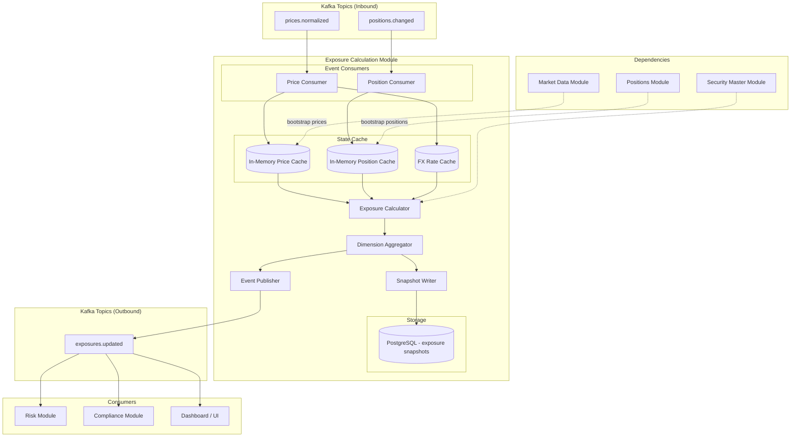

# Exposure Calculation Module

## Context & Problem

A portfolio manager's first question every morning: "What's my exposure?" Exposure tells you how much capital is at risk and in which directions. Gross exposure (sum of absolute position values) measures total market participation. Net exposure (sum of signed position values) measures directional bias. A fund with $100M long and $80M short has $180M gross and $20M net — it is leveraged but nearly market-neutral.

The challenge is that exposure is never static. Prices move continuously, positions change as trades execute, and multi-currency portfolios require FX conversion that itself fluctuates. A PM needs exposure numbers that reflect reality within seconds, not minutes. Stale exposure means stale risk decisions.

This module consumes real-time price updates and position changes, recomputes exposure across multiple dimensions (total, sector, country, currency, instrument type), persists snapshots for historical analysis, and publishes exposure events for downstream consumers like risk and compliance.

## Domain Concepts

| Concept | Definition |
|---|---|
| **Gross Exposure** | Sum of absolute market values of all positions: `SUM(ABS(quantity * price * fx_rate))` |
| **Net Exposure** | Sum of signed market values: `SUM(quantity * price * fx_rate)` — positive = net long, negative = net short |
| **Long Exposure** | Sum of market values for positions with positive quantity |
| **Short Exposure** | Sum of absolute market values for positions with negative quantity |
| **Exposure Dimension** | An axis along which exposure is sliced: sector, country, currency, instrument type |
| **Exposure Snapshot** | A point-in-time record of all exposure values, stored for historical and audit purposes |
| **Base Currency** | The portfolio's reporting currency — all position values are converted to this currency |
| **FX Rate** | The conversion rate from a position's native currency to the base currency |

## Architecture



## Design Decisions

### Reactive Recalculation, Not Polling

Exposure is recomputed whenever a price update or position change arrives. No polling intervals. A price tick for AAPL triggers recalculation of every exposure dimension that includes AAPL. This gives sub-second freshness without wasting compute on instruments that haven't changed.

### In-Memory State with Event-Sourced Bootstrap

Positions and prices are held in memory for fast calculation. On startup, the module bootstraps by reading current positions from the positions module and latest prices from market data. After bootstrap, it stays current via Kafka events. If the module restarts, it re-bootstraps — the source of truth is the upstream modules, not this module's memory.

### Multi-Currency Handling

Every position value is converted to the portfolio's base currency before aggregation. FX rates are treated as prices — they arrive on the same `prices.normalized` topic with instrument IDs like `EUR/USD`, `GBP/USD`. The FX rate cache is updated in real time alongside equity prices.

### Asset-Class-Aware Exposure Normalization

Different asset classes contribute to portfolio exposure differently. A naive `quantity × price` calculation is correct for equities but wrong for options (exposure is delta-adjusted), futures (notional value, not margin), and bonds (modified duration × notional for interest rate exposure). The exposure calculator uses an `ExposureNormalizer` protocol:

```python
# normalizer.py

from typing import Protocol
from decimal import Decimal


class ExposureNormalizer(Protocol):
    """Converts a position into its effective market exposure in base currency."""

    def normalize(self, position: dict) -> Decimal:
        """Return the delta-equivalent market exposure for this position."""
        ...


class EquityExposureNormalizer:
    """Equities/ETFs: exposure = quantity × price × fx_rate."""

    def normalize(self, position: dict) -> Decimal:
        return (
            Decimal(str(position["quantity"]))
            * Decimal(str(position["price"]))
            * Decimal(str(position.get("fx_rate", 1)))
        )


class OptionExposureNormalizer:
    """Options: delta-adjusted exposure = contracts × delta × underlying_price × multiplier × fx_rate.
    
    A call option with delta 0.5 on 100 shares of a $150 stock contributes
    $7,500 of effective market exposure, not the $3 option premium × 100.
    """

    def normalize(self, position: dict) -> Decimal:
        delta = Decimal(str(position.get("delta", 0)))
        underlying_price = Decimal(str(position.get("underlying_price", 0)))
        multiplier = Decimal(str(position.get("contract_multiplier", 100)))
        quantity = Decimal(str(position["quantity"]))
        fx_rate = Decimal(str(position.get("fx_rate", 1)))
        return quantity * delta * underlying_price * multiplier * fx_rate


class FutureExposureNormalizer:
    """Futures: notional exposure = contracts × contract_size × price × fx_rate.
    
    Margin posted is NOT the exposure — the exposure is the full notional.
    """

    def normalize(self, position: dict) -> Decimal:
        contract_size = Decimal(str(position.get("contract_size", 1)))
        quantity = Decimal(str(position["quantity"]))
        price = Decimal(str(position["price"]))
        fx_rate = Decimal(str(position.get("fx_rate", 1)))
        return quantity * contract_size * price * fx_rate


class FixedIncomeExposureNormalizer:
    """Bonds: market value exposure = par_held × clean_price / 100 + accrued.
    
    For interest rate exposure dimension, use duration × market_value instead.
    """

    def normalize(self, position: dict) -> Decimal:
        par_value = Decimal(str(position["quantity"]))  # quantity = par held
        clean_price = Decimal(str(position["price"]))
        accrued = Decimal(str(position.get("accrued_interest", 0)))
        fx_rate = Decimal(str(position.get("fx_rate", 1)))
        return (par_value * clean_price / Decimal("100") + accrued) * fx_rate


EXPOSURE_NORMALIZERS: dict[str, ExposureNormalizer] = {
    "equity": EquityExposureNormalizer(),
    "etf": EquityExposureNormalizer(),
    "option": OptionExposureNormalizer(),
    "future": FutureExposureNormalizer(),
    "fixed_income": FixedIncomeExposureNormalizer(),
}
```

The `ExposureCalculator._recalculate()` method looks up the normalizer by asset class when building `PositionValue` entries. For positions without a registered normalizer, it falls back to `quantity × price × fx_rate` (the equity default).

## Interface Contract

```python
# interface.py

from typing import Protocol
from datetime import datetime
from decimal import Decimal
from enum import StrEnum
from uuid import UUID

from pydantic import BaseModel, ConfigDict


class ExposureDimension(StrEnum):
    TOTAL = "total"
    SECTOR = "sector"
    COUNTRY = "country"
    CURRENCY = "currency"
    INSTRUMENT_TYPE = "instrument_type"


class ExposureBreakdown(BaseModel):
    model_config = ConfigDict(frozen=True)

    dimension: ExposureDimension
    key: str                          # "Technology", "US", "USD", "equity", or "total"
    gross: Decimal
    net: Decimal
    long: Decimal
    short: Decimal
    position_count: int


class PortfolioExposure(BaseModel):
    model_config = ConfigDict(frozen=True)

    portfolio_id: UUID
    base_currency: str
    timestamp: datetime
    total_gross: Decimal
    total_net: Decimal
    total_long: Decimal
    total_short: Decimal
    breakdowns: list[ExposureBreakdown]


class PositionValue(BaseModel):
    model_config = ConfigDict(frozen=True)

    instrument_id: str
    quantity: Decimal
    price: Decimal                    # in instrument's native currency
    native_currency: str
    fx_rate: Decimal                  # native → base currency
    market_value_base: Decimal        # quantity * price * fx_rate
    sector: str | None = None
    country: str | None = None
    instrument_type: str | None = None


class ExposureReader(Protocol):
    """Read interface exposed to other modules."""

    async def get_current_exposure(self, portfolio_id: UUID) -> PortfolioExposure:
        """Get the latest calculated exposure for a portfolio."""
        ...

    async def get_exposure_at(
        self, portfolio_id: UUID, timestamp: datetime,
    ) -> PortfolioExposure:
        """Get historical exposure snapshot closest to a given timestamp."""
        ...

    async def get_exposure_history(
        self, portfolio_id: UUID, start: datetime, end: datetime,
    ) -> list[PortfolioExposure]:
        """Get exposure snapshots over a time range."""
        ...

    async def get_exposure_by_dimension(
        self, portfolio_id: UUID, dimension: ExposureDimension,
    ) -> list[ExposureBreakdown]:
        """Get current exposure broken down by a single dimension."""
        ...
```

## Code Skeleton

### Exposure Calculator

```python
# calculator.py

from collections import defaultdict
from datetime import datetime, timezone
from decimal import Decimal
from uuid import UUID

import structlog

from .interface import (
    ExposureBreakdown,
    ExposureDimension,
    PortfolioExposure,
    PositionValue,
)

logger = structlog.get_logger()


class ExposureCalculator:
    """Core calculation engine. Stateless — receives all inputs, returns results."""

    def calculate(
        self,
        portfolio_id: UUID,
        base_currency: str,
        position_values: list[PositionValue],
    ) -> PortfolioExposure:
        """Calculate full exposure from valued positions."""
        total_gross = Decimal("0")
        total_net = Decimal("0")
        total_long = Decimal("0")
        total_short = Decimal("0")

        # Accumulators per dimension key
        dimension_accumulators: dict[tuple[ExposureDimension, str], _Accumulator] = defaultdict(_Accumulator)

        for pv in position_values:
            mv = pv.market_value_base
            abs_mv = abs(mv)

            total_net += mv
            total_gross += abs_mv
            if mv > 0:
                total_long += mv
            else:
                total_short += abs_mv

            # Aggregate into each dimension
            self._accumulate(dimension_accumulators, ExposureDimension.SECTOR, pv.sector, mv)
            self._accumulate(dimension_accumulators, ExposureDimension.COUNTRY, pv.country, mv)
            self._accumulate(dimension_accumulators, ExposureDimension.CURRENCY, pv.native_currency, mv)
            self._accumulate(dimension_accumulators, ExposureDimension.INSTRUMENT_TYPE, pv.instrument_type, mv)

        breakdowns = [
            ExposureBreakdown(
                dimension=dim,
                key=key,
                gross=acc.gross,
                net=acc.net,
                long=acc.long,
                short=acc.short,
                position_count=acc.count,
            )
            for (dim, key), acc in sorted(dimension_accumulators.items())
        ]

        return PortfolioExposure(
            portfolio_id=portfolio_id,
            base_currency=base_currency,
            timestamp=datetime.now(timezone.utc),
            total_gross=total_gross,
            total_net=total_net,
            total_long=total_long,
            total_short=total_short,
            breakdowns=breakdowns,
        )

    def _accumulate(
        self,
        accumulators: dict[tuple[ExposureDimension, str], "_Accumulator"],
        dimension: ExposureDimension,
        key: str | None,
        market_value: Decimal,
    ) -> None:
        if key is None:
            key = "unknown"
        acc = accumulators[(dimension, key)]
        acc.net += market_value
        acc.gross += abs(market_value)
        acc.count += 1
        if market_value > 0:
            acc.long += market_value
        else:
            acc.short += abs(market_value)


class _Accumulator:
    __slots__ = ("gross", "net", "long", "short", "count")

    def __init__(self) -> None:
        self.gross = Decimal("0")
        self.net = Decimal("0")
        self.long = Decimal("0")
        self.short = Decimal("0")
        self.count = 0
```

### Real-Time Exposure Service

```python
# service.py

from datetime import datetime, timezone
from decimal import Decimal
from uuid import UUID

import structlog

from .calculator import ExposureCalculator
from .interface import PortfolioExposure, PositionValue

logger = structlog.get_logger()


class Position:
    """In-memory position state."""
    __slots__ = ("instrument_id", "quantity", "currency", "sector", "country", "instrument_type")

    def __init__(
        self,
        instrument_id: str,
        quantity: Decimal,
        currency: str,
        sector: str | None,
        country: str | None,
        instrument_type: str | None,
    ) -> None:
        self.instrument_id = instrument_id
        self.quantity = quantity
        self.currency = currency
        self.sector = sector
        self.country = country
        self.instrument_type = instrument_type


class RealTimeExposureService:
    """Maintains in-memory state and triggers recalculation on changes."""

    def __init__(
        self,
        portfolio_id: UUID,
        base_currency: str,
        calculator: ExposureCalculator,
        snapshot_writer: "SnapshotWriter",
        event_publisher: "EventPublisher",
        snapshot_interval_seconds: int = 60,
    ) -> None:
        self._portfolio_id = portfolio_id
        self._base_currency = base_currency
        self._calculator = calculator
        self._snapshot_writer = snapshot_writer
        self._event_publisher = event_publisher
        self._snapshot_interval = snapshot_interval_seconds

        # In-memory state
        self._positions: dict[str, Position] = {}
        self._prices: dict[str, Decimal] = {}         # instrument_id → mid price
        self._fx_rates: dict[str, Decimal] = {}        # "EUR/USD" → rate
        self._last_snapshot: datetime | None = None
        self._current_exposure: PortfolioExposure | None = None

    async def on_price_update(self, instrument_id: str, mid: Decimal) -> None:
        """Handle a price update from prices.normalized topic."""
        # FX pairs are formatted as "XXX/YYY"
        if "/" in instrument_id and len(instrument_id) == 7:
            self._fx_rates[instrument_id] = mid
        else:
            self._prices[instrument_id] = mid

        # Only recalculate if we hold this instrument
        if instrument_id in self._positions or "/" in instrument_id:
            await self._recalculate()

    async def on_position_change(
        self,
        instrument_id: str,
        quantity: Decimal,
        currency: str,
        sector: str | None,
        country: str | None,
        instrument_type: str | None,
    ) -> None:
        """Handle a position change from positions.changed topic."""
        if quantity == Decimal("0"):
            self._positions.pop(instrument_id, None)
        else:
            self._positions[instrument_id] = Position(
                instrument_id=instrument_id,
                quantity=quantity,
                currency=currency,
                sector=sector,
                country=country,
                instrument_type=instrument_type,
            )
        await self._recalculate()

    def get_current_exposure(self) -> PortfolioExposure | None:
        return self._current_exposure

    async def _recalculate(self) -> None:
        """Recompute exposure from current in-memory state."""
        position_values = []

        for inst_id, pos in self._positions.items():
            price = self._prices.get(inst_id)
            if price is None:
                logger.warning("missing_price", instrument_id=inst_id)
                continue

            fx_rate = self._resolve_fx_rate(pos.currency)
            market_value = pos.quantity * price * fx_rate

            position_values.append(PositionValue(
                instrument_id=inst_id,
                quantity=pos.quantity,
                price=price,
                native_currency=pos.currency,
                fx_rate=fx_rate,
                market_value_base=market_value,
                sector=pos.sector,
                country=pos.country,
                instrument_type=pos.instrument_type,
            ))

        self._current_exposure = self._calculator.calculate(
            portfolio_id=self._portfolio_id,
            base_currency=self._base_currency,
            position_values=position_values,
        )

        # Publish event on every recalculation
        await self._event_publisher.publish(
            topic="exposures.updated",
            key=str(self._portfolio_id),
            event={
                "event_type": "exposure.updated",
                "portfolio_id": str(self._portfolio_id),
                "timestamp": self._current_exposure.timestamp.isoformat(),
                "total_gross": str(self._current_exposure.total_gross),
                "total_net": str(self._current_exposure.total_net),
                "total_long": str(self._current_exposure.total_long),
                "total_short": str(self._current_exposure.total_short),
                "base_currency": self._base_currency,
            },
        )

        # Persist snapshot at intervals (not on every tick)
        now = datetime.now(timezone.utc)
        if (
            self._last_snapshot is None
            or (now - self._last_snapshot).total_seconds() >= self._snapshot_interval
        ):
            await self._snapshot_writer.write(self._current_exposure)
            self._last_snapshot = now

    def _resolve_fx_rate(self, currency: str) -> Decimal:
        """Get FX rate from position currency to base currency."""
        if currency == self._base_currency:
            return Decimal("1")

        # Try direct pair: EUR/USD
        pair = f"{currency}/{self._base_currency}"
        rate = self._fx_rates.get(pair)
        if rate is not None:
            return rate

        # Try inverse pair: USD/EUR → 1/rate
        inverse_pair = f"{self._base_currency}/{currency}"
        inverse_rate = self._fx_rates.get(inverse_pair)
        if inverse_rate is not None and inverse_rate != Decimal("0"):
            return Decimal("1") / inverse_rate

        logger.warning("missing_fx_rate", currency=currency, base=self._base_currency)
        return Decimal("1")  # Fallback — logged as warning
```

### Kafka Event Consumers

```python
# consumers.py

import json
from decimal import Decimal

import structlog
from confluent_kafka import Consumer, Message

logger = structlog.get_logger()


class ExposureEventConsumer:
    """Consumes price and position events and routes to the exposure service."""

    def __init__(
        self,
        consumer: Consumer,
        exposure_service: "RealTimeExposureService",
    ) -> None:
        self._consumer = consumer
        self._service = exposure_service

    async def start(self) -> None:
        self._consumer.subscribe(["prices.normalized", "positions.changed"])
        logger.info("exposure_consumer_started", topics=["prices.normalized", "positions.changed"])

        while True:
            msg: Message | None = self._consumer.poll(timeout=0.1)
            if msg is None:
                continue
            if msg.error():
                logger.error("consumer_error", error=msg.error())
                continue

            topic = msg.topic()
            payload = json.loads(msg.value())

            if topic == "prices.normalized":
                await self._service.on_price_update(
                    instrument_id=payload["data"]["instrument_id"],
                    mid=Decimal(str(payload["data"]["mid"])),
                )
            elif topic == "positions.changed":
                await self._service.on_position_change(
                    instrument_id=payload["instrument_id"],
                    quantity=Decimal(str(payload["quantity"])),
                    currency=payload["currency"],
                    sector=payload.get("sector"),
                    country=payload.get("country"),
                    instrument_type=payload.get("instrument_type"),
                )
```

## Data Model

```sql
CREATE SCHEMA IF NOT EXISTS exposure;

-- Point-in-time exposure snapshots for a portfolio
CREATE TABLE exposure.snapshots (
    id              UUID PRIMARY KEY DEFAULT gen_random_uuid(),
    portfolio_id    UUID            NOT NULL,
    base_currency   VARCHAR(3)      NOT NULL,
    timestamp       TIMESTAMPTZ     NOT NULL,
    total_gross     NUMERIC(18,2)   NOT NULL,
    total_net       NUMERIC(18,2)   NOT NULL,
    total_long      NUMERIC(18,2)   NOT NULL,
    total_short     NUMERIC(18,2)   NOT NULL,
    created_at      TIMESTAMPTZ     NOT NULL DEFAULT NOW()
);

CREATE INDEX ix_snapshots_portfolio_time
    ON exposure.snapshots (portfolio_id, timestamp DESC);

-- Dimensional breakdown per snapshot
CREATE TABLE exposure.snapshot_breakdowns (
    id              UUID PRIMARY KEY DEFAULT gen_random_uuid(),
    snapshot_id     UUID            NOT NULL REFERENCES exposure.snapshots(id) ON DELETE CASCADE,
    dimension       VARCHAR(32)     NOT NULL,   -- 'sector', 'country', 'currency', 'instrument_type'
    dimension_key   VARCHAR(128)    NOT NULL,   -- 'Technology', 'US', 'EUR', 'equity'
    gross           NUMERIC(18,2)   NOT NULL,
    net             NUMERIC(18,2)   NOT NULL,
    long            NUMERIC(18,2)   NOT NULL,
    short           NUMERIC(18,2)   NOT NULL,
    position_count  INTEGER         NOT NULL
);

CREATE INDEX ix_breakdowns_snapshot
    ON exposure.snapshot_breakdowns (snapshot_id);

CREATE INDEX ix_breakdowns_dimension
    ON exposure.snapshot_breakdowns (dimension, dimension_key);

-- Position-level values at snapshot time (for drill-down and audit)
CREATE TABLE exposure.snapshot_positions (
    id                  UUID PRIMARY KEY DEFAULT gen_random_uuid(),
    snapshot_id         UUID            NOT NULL REFERENCES exposure.snapshots(id) ON DELETE CASCADE,
    instrument_id       VARCHAR(32)     NOT NULL,
    quantity            NUMERIC(18,6)   NOT NULL,
    price               NUMERIC(18,8)   NOT NULL,
    native_currency     VARCHAR(3)      NOT NULL,
    fx_rate             NUMERIC(18,8)   NOT NULL,
    market_value_base   NUMERIC(18,2)   NOT NULL
);

CREATE INDEX ix_snap_positions_snapshot
    ON exposure.snapshot_positions (snapshot_id);

-- Retention: keep minute-level snapshots for 90 days, daily for 5 years
-- (Implement via scheduled job that aggregates and prunes)
```

## Kafka Events Published

| Topic | Key | Event | Payload | Consumers |
|---|---|---|---|---|
| `exposures.updated` | `portfolio_id` | `exposure.updated` | Total gross/net/long/short, base currency, timestamp | Risk, Compliance, Dashboard |

## Patterns Used

| Pattern | Document |
|---|---|
| Event-driven reactive calculation | [Event-Driven Architecture](../../principles/event-driven-architecture.md) |
| In-memory cache with event-sourced bootstrap | [CQRS & Event Sourcing](../../principles/cqrs-event-sourcing.md) |
| Module interface via Protocol | [Module Interfaces](../../patterns/modularity/module-interfaces.md) |
| Structured logging for observability | [Structured Logging](../../patterns/observability/structured-logging.md) |
| Schema validation on Kafka events | [Schema Registry](../../patterns/messaging/schema-registry.md) |
| Snapshot persistence at intervals | [Batch vs Streaming](../../patterns/data-processing/batch-vs-streaming.md) |

## Failure Modes

| Failure | Cause | Impact | Mitigation |
|---|---|---|---|
| Missing price for held instrument | Market data feed down for one instrument | Exposure underreported — position excluded from calculation | Log warning, use last known price with staleness flag, alert if gap exceeds threshold |
| Missing FX rate | FX pair not published or feed stale | Multi-currency positions valued at wrong rate | Fallback to last known rate, log warning, alert compliance |
| Stale positions after restart | Bootstrap reads positions but misses in-flight trades | Exposure temporarily incorrect until next position event | Bootstrap from positions module + replay recent `positions.changed` events |
| Calculation storm | Rapid price updates cause continuous recalculation | High CPU, event flooding downstream | Debounce recalculation (max once per 100ms), coalesce price updates |
| Snapshot write failure | Database unavailable | No historical data persisted | Retry with backoff, buffer snapshots in memory, alert on persistent failure |
| Consumer lag | Kafka consumer falls behind price updates | Exposure reflects outdated prices | Monitor consumer lag metric, alert when lag exceeds 5 seconds |

## Performance Profile

| Metric | Target |
|---|---|
| Recalculation latency (price event → new exposure) | < 50ms for 500 positions |
| Recalculation latency (price event → new exposure) | < 200ms for 5,000 positions |
| Event publish latency (recalculation → Kafka) | < 10ms |
| Snapshot write latency | < 50ms |
| Memory footprint (5,000 positions + prices) | < 100MB |
| Historical exposure query (single portfolio, 1 day) | < 20ms |

## Dependencies

```
exposure-calculation
  ├── depends on: market-data-ingestion (prices, FX rates via prices.normalized)
  ├── depends on: positions (position quantities, instrument metadata via positions.changed)
  ├── depends on: security-master (instrument attributes for dimensional slicing)
  ├── depends on: shared kernel (types, events)
  ├── publishes: exposures.updated
  └── consumed by: risk, compliance, dashboard
```

## Related Documents

- [Market Data Ingestion](market-data-ingestion.md) — source of real-time prices and FX rates
- [Security Master](security-master.md) — source of instrument attributes (sector, country, type)
- [Alpha Engine](alpha-engine.md) — consumes exposure data for what-if analysis
- [Compliance Guardian](compliance-guardian.md) — monitors exposure limits
- [System Overview — Multi-Asset Strategy](overview.md#multi-asset-class-strategy) — asset class phasing and normalization requirements
