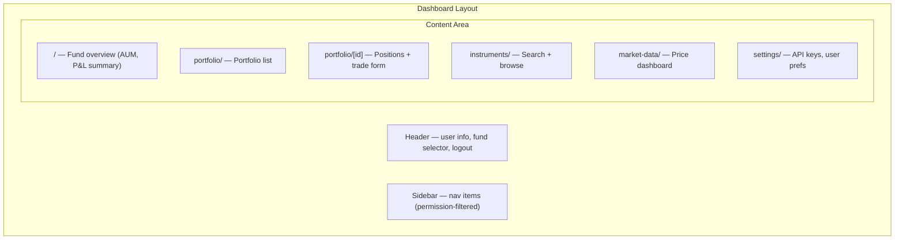
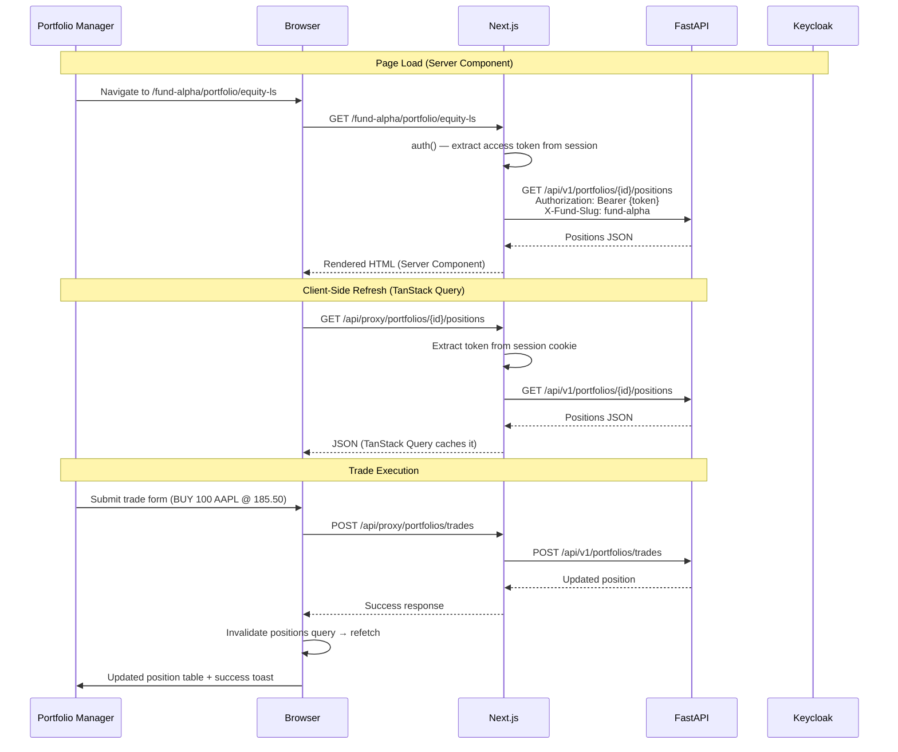

# Hedge Fund PM Desk — Frontend Dashboard

## Context & Problem

The backend is a modular FastAPI application with bounded contexts (platform, security master, market data, positions), Keycloak SSO, fund-scoped RBAC, and OpenFGA for resource-level access. It exposes a REST API with an auto-generated OpenAPI spec.

Without a frontend, the only consumers are API clients (curl, Postman, LLM agents). A portfolio manager needs a browser-based interface to see positions, execute trades, monitor prices, and search instruments — without leaving their desk.

This document designs the frontend as a Next.js application that composes the patterns in the frontend pattern library into a concrete, domain-specific dashboard for a hedge fund PM desk.

## Design Decisions

### Technology Stack

| Layer | Choice | Rationale |
|---|---|---|
| Framework | **Next.js 15+ (App Router)** | Server Components for fast initial loads, Server Actions for mutations, route groups for layout isolation |
| Auth | **Auth.js v5 + Keycloak** | OIDC Authorization Code + PKCE, httpOnly session cookies, server-side token management |
| API communication | **BFF proxy pattern** | Browser never sees access tokens — Next.js Route Handlers forward them to FastAPI |
| Type safety | **openapi-typescript + openapi-fetch** | Types generated from FastAPI's OpenAPI spec, end-to-end type safety |
| Server state | **TanStack Query v5** | Cache management, background refetch, optimistic updates for trades |
| Client state | **Zustand** | Minimal — only for ephemeral UI state (sidebar, table preferences). Fund context lives in the URL. |
| Styling | **Tailwind CSS + shadcn/ui** | Composable component library, no vendor lock-in, good density for financial UIs |
| Tables | **TanStack Table** | Column resizing, sorting, pinning, virtualization-ready for large position books |
| Notifications | **Sonner** | Toast notifications for trade confirmations, errors, session expiry |
| Linting | **Biome** | Single tool replacing ESLint + Prettier, faster, less config |
| Testing | **Vitest + Testing Library + Playwright + MSW** | Unit → component → E2E, network-level mocking |

### Fund Context in the URL

The active fund is a URL path segment: `/(dashboard)/[fundSlug]/...`. This is the most robust approach for multi-fund access:

- **Shareable links** — a PM can share `https://app/fund-alpha/portfolio/equity-long-short` with a colleague
- **Multi-tab** — each tab can show a different fund independently
- **Server-accessible** — Server Components read `params.fundSlug` without client state
- **Browser history** — back/forward navigates between funds correctly

The fund slug drives the `X-Fund-Slug` header sent to FastAPI, which determines the user's role and permission scope for that request.

### Trade Execution: Wait, Don't Assume

When a PM submits a trade, the UI shows a loading state and waits for backend confirmation. No optimistic updates — a trade that appears to succeed but then fails is dangerous. The PM might make subsequent decisions based on a position that doesn't exist.

TanStack Query's `useMutation` with `onSuccess → invalidateQueries` is the pattern: submit trade → show spinner → on success, refetch positions → display updated position. On failure, show an error toast with the backend's detail message.

## Architecture

### Page Layout



### Route → Feature Mapping

| Route | Feature Module | Server Data | Client Interactivity |
|---|---|---|---|
| `/(dashboard)/[fundSlug]/` | `platform` | Fund summary, portfolio list | Fund selector |
| `.../portfolio/` | `portfolio` | All portfolios for fund | Navigate to portfolio |
| `.../portfolio/[portfolioId]/` | `portfolio` | Positions, P&L | Sort, filter, execute trades |
| `.../instruments/` | `instruments` | Active instruments | Search, filter by asset class |
| `.../market-data/` | `market-data` | Latest prices | Auto-refresh, price charts |
| `/settings/` | `platform` | User profile, API keys | Generate API keys |

### Data Flow



## Page Designs

### Fund Overview (`/(dashboard)/[fundSlug]/`)

The landing page after login or fund switch. Shows high-level metrics for the active fund:

```
┌──────────────────────────────────────────────────────────┐
│ Fund Alpha                              [Switch Fund ▼]  │
├──────────────────────────────────────────────────────────┤
│                                                          │
│  ┌─────────────┐  ┌─────────────┐  ┌──────────────┐    │
│  │ Portfolios  │  │ Total P&L   │  │ Positions    │    │
│  │     2       │  │ +$12,345    │  │    24        │    │
│  └─────────────┘  └─────────────┘  └──────────────┘    │
│                                                          │
│  Portfolios                                              │
│  ┌──────────────────────────────────────────────────┐   │
│  │ Equity Long/Short    12 positions   +$8,200      │→  │
│  │ Global Macro          8 positions   +$4,145      │→  │
│  └──────────────────────────────────────────────────┘   │
│                                                          │
└──────────────────────────────────────────────────────────┘
```

**Data sources:**
- Portfolio list: `GET /api/v1/portfolios` (future endpoint — currently derived from positions)
- Position counts + P&L: aggregated from `GET /api/v1/portfolios/{id}/positions`

### Portfolio Positions (`/.../portfolio/[portfolioId]/`)

The primary working view. Positions table with real-time mark-to-market:

```
┌──────────────────────────────────────────────────────────────────┐
│ Equity Long/Short                      [New Trade] (if can_trade)│
├──────────────────────────────────────────────────────────────────┤
│                                                                  │
│ Instrument │ Qty    │ Avg Cost │ Mkt Price │ Mkt Value │ P&L    │
│ ──────────│────────│──────────│───────────│───────────│────────│
│ AAPL      │  100   │ 180.50   │ 185.25    │ 18,525    │ +$475  │
│ MSFT      │  -50   │ 420.00   │ 415.80    │ -20,790   │ +$210  │
│ GOOGL     │  200   │ 175.30   │ 172.15    │ 34,430    │ -$630  │
│ ──────────│────────│──────────│───────────│───────────│────────│
│ Total     │        │          │           │ 32,165    │ +$55   │
│                                                                  │
│ Last updated: 14:32:05 EST              Refreshes every 5s      │
└──────────────────────────────────────────────────────────────────┘
```

**Formatting rules:**
- Prices: 2 decimal places (equities), up to 8 for crypto
- P&L: green for positive, red for negative, currency formatted
- Quantities: negative for short positions (displayed with minus sign)
- Timestamps: user's timezone, relative for recent ("2 min ago")

**Permission gating:**
- Table visible to all roles with `positions:read`
- "New Trade" button wrapped in `<Can permission="trades:execute">`
- Trade form validates on submit, shows backend errors inline

### Trade Form (Modal/Drawer)

```
┌──────────────────────────────────┐
│ New Trade                     ✕  │
├──────────────────────────────────┤
│                                  │
│ Instrument  [AAPL ▼] (search)   │
│ Side        ○ Buy  ● Sell       │
│ Quantity    [100         ]       │
│ Price       [185.25      ]       │
│                                  │
│ ┌──────────────────────────────┐ │
│ │ Estimated value: $18,525.00 │ │
│ └──────────────────────────────┘ │
│                                  │
│        [Cancel]  [Execute Trade] │
│                                  │
│ ⚠ This will execute immediately │
└──────────────────────────────────┘
```

**Interaction:**
- Instrument search uses `GET /instruments/search?q=...` with debounced input
- Side toggles between buy/sell
- Quantity and price are string inputs (no float parsing)
- "Execute Trade" triggers `POST /portfolios/trades` via `useExecuteTrade` mutation
- Success: close modal, toast "Trade executed: BUY 100 AAPL", invalidate positions
- Failure: show error inline in the modal (don't close it)

### Instrument Search (`/.../instruments/`)

```
┌──────────────────────────────────────────────────────────┐
│ Instruments                                              │
├──────────────────────────────────────────────────────────┤
│ Search: [AAPL_____________]   Filter: [All Classes ▼]   │
│                                                          │
│ Ticker │ Name            │ Asset Class │ Exchange │ CCY  │
│ ────── │ ─────────────── │ ─────────── │ ──────── │ ──── │
│ AAPL   │ Apple Inc.      │ equity      │ NASDAQ   │ USD  │
│ AMZN   │ Amazon.com Inc. │ equity      │ NASDAQ   │ USD  │
│ ...                                                      │
└──────────────────────────────────────────────────────────┘
```

### Fund Selector

When a user belongs to multiple funds, the fund selector appears in the header. Implemented as a dropdown that navigates to the new fund's URL:

```typescript
// Navigate from /fund-alpha/portfolio to /fund-beta/portfolio
// TanStack Query automatically fetches new data for fund-beta
router.push(`/${newFundSlug}${currentSubPath}`);
```

The available funds come from `GET /api/v1/me/funds` (cached for 5 minutes). The active fund is highlighted. The user's role in each fund is shown as a badge.

## Error Handling

### Error Boundaries Per Feature

Each major dashboard section gets its own React Error Boundary. A crash in the market data widget doesn't take down the positions table:

```tsx
// app/(dashboard)/[fundSlug]/layout.tsx
<div className="grid grid-cols-1 gap-4">
  <ErrorBoundary fallback={<SectionError title="Positions" />}>
    <Suspense fallback={<PositionsSkeleton />}>
      {children}
    </Suspense>
  </ErrorBoundary>
</div>
```

### API Error Handling

| Status | Meaning | Frontend Behavior |
|--------|---------|-------------------|
| 401 | Token expired, refresh failed | Redirect to `/login` |
| 403 | Missing permission | Toast "You don't have permission for this action" |
| 404 | Resource not found | Show "not found" inline (don't redirect) |
| 422 | Validation error | Show field-level errors in form |
| 500 | Server error | Toast "Something went wrong", log to console |
| Network error | FastAPI unreachable | Toast "Connection lost", auto-retry via TanStack Query |

## Security

### Content Security Policy

```typescript
// next.config.ts
const securityHeaders = [
  {
    key: "Content-Security-Policy",
    value: [
      "default-src 'self'",
      "script-src 'self'",                    // No unsafe-inline
      "style-src 'self' 'unsafe-inline'",     // Tailwind needs this
      "img-src 'self' data:",
      "font-src 'self'",
      "connect-src 'self' ws://localhost:*",   // WebSocket for dev
      `frame-ancestors 'none'`,               // No iframes
    ].join("; "),
  },
  { key: "X-Frame-Options", value: "DENY" },
  { key: "X-Content-Type-Options", value: "nosniff" },
  { key: "Referrer-Policy", value: "strict-origin-when-cross-origin" },
  {
    key: "Permissions-Policy",
    value: "camera=(), microphone=(), geolocation=()",
  },
];
```

### Sensitive Data Display

- Portfolio P&L values are masked by default for over-the-shoulder privacy: `$••••••`. Click to reveal.
- Session auto-locks after 15 minutes of inactivity (configurable). Shows a "session locked" overlay with a re-authenticate button.
- No sensitive data in browser console logs. TanStack Query devtools are disabled in production builds.

## Docker Integration

```yaml
# Addition to docker-compose.yml
  ui:
    build: ./ui
    profiles: ["app"]
    ports:
      - "3000:3000"
    environment:
      NEXTAUTH_URL: "http://localhost:3000"
      NEXTAUTH_SECRET: "dev-secret-change-in-production"
      AUTH_KEYCLOAK_ID: "mini-hedge-ui"
      AUTH_KEYCLOAK_ISSUER: "http://localhost:8180/realms/minihedge"
      API_URL: "http://app:8000"
      NEXT_PUBLIC_KEYCLOAK_ISSUER: "http://localhost:8180/realms/minihedge"
      NEXT_PUBLIC_KEYCLOAK_CLIENT_ID: "mini-hedge-ui"
    depends_on:
      keycloak:
        condition: service_healthy
      app:
        condition: service_healthy
```

**Network note:** `API_URL` uses the Docker internal hostname (`app:8000`) for server-side API calls. Browser-facing Keycloak URLs use `localhost:8180` because the browser resolves them.

**Development flow:**
- `make up` starts core infrastructure (postgres, openfga, keycloak, redis)
- `make run` starts backend + frontend in Docker
- `cd ui && pnpm dev` runs the frontend locally against Docker infrastructure (faster hot reload)

## Testing Approach

| Layer | Tool | What |
|---|---|---|
| **Formatters** | Vitest | `formatPrice("185.25")` → `"185.25"`, `formatPnL("-567.89")` → `"-$567.89"` |
| **Permissions** | Vitest | `resolvePermissions(["viewer"])` doesn't include `TRADES_EXECUTE` |
| **Components** | Vitest + Testing Library + MSW | Position table renders correctly with mocked API data |
| **Trade form** | Vitest + Testing Library + MSW | Submit → loading → success toast. Error → stays open with message. |
| **Auth flow** | Playwright | Login via Keycloak → redirected to dashboard → session cookie set |
| **Fund switch** | Playwright | Navigate from fund-alpha to fund-beta → positions update |
| **Permission gate** | Playwright | Login as viewer → "New Trade" button not present |

MSW handlers for development and testing:

```typescript
// src/mocks/handlers.ts
import { http, HttpResponse } from "msw";

export const handlers = [
  http.get("/api/proxy/instruments", () =>
    HttpResponse.json([
      { id: "1", ticker: "AAPL", name: "Apple Inc.", asset_class: "equity" },
      { id: "2", ticker: "MSFT", name: "Microsoft", asset_class: "equity" },
    ]),
  ),

  http.get("/api/proxy/portfolios/:portfolioId/positions", () =>
    HttpResponse.json([
      {
        instrument_id: "AAPL",
        quantity: "100",
        avg_cost: "180.50",
        market_price: "185.25",
        market_value: "18525.00",
        unrealized_pnl: "475.00",
        currency: "USD",
      },
    ]),
  ),

  http.post("/api/proxy/portfolios/trades", async ({ request }) => {
    const body = await request.json();
    return HttpResponse.json({
      instrument_id: body.instrument_id,
      quantity: body.quantity,
      avg_cost: body.price,
      market_price: body.price,
      market_value: String(Number(body.quantity) * Number(body.price)),
      unrealized_pnl: "0.00",
      currency: body.currency,
    }, { status: 201 });
  }),
];
```

## Performance Profile

| Metric | Target | Approach |
|---|---|---|
| First Contentful Paint | < 500ms | Server Components render positions on the server |
| Time to Interactive | < 1s | Minimal client JS — only interactive islands hydrate |
| Position refresh latency | < 100ms | TanStack Query background refetch (5s interval) |
| Trade confirmation | < 500ms | Direct POST through BFF, no extra round-trips |
| Bundle size | < 150KB gzipped | Tree-shaking, no heavy chart libraries at launch |
| Lighthouse score | > 90 | Server rendering, correct caching headers, CSP |

## Future Enhancements

| Feature | Pattern | When |
|---|---|---|
| **Real-time prices via WebSocket** | FastAPI WebSocket endpoint → Zustand store → TanStack Query cache | When polling latency is insufficient |
| **Price charts** | Lightweight charting (lightweight-charts by TradingView) | When historical price visualization is needed |
| **Risk dashboard** | New feature module `features/risk/` | When risk engine backend module is built |
| **Compliance alerts** | Server-sent events for real-time compliance notifications | When compliance guardian is built |
| **Mobile responsive** | Tailwind responsive utilities, collapsible sidebar | When mobile access is required |
| **Dark mode** | Tailwind dark variant, shadcn/ui theme tokens | When user preference support is added |

## Related Documents

### Patterns (Frontend)
- [Next.js App Router](../../patterns/frontend/nextjs-app-router.md) — project structure, Server/Client boundaries
- [OIDC Auth Flow](../../patterns/frontend/oidc-auth-flow.md) — Auth.js + Keycloak, BFF proxy, token lifecycle
- [Frontend RBAC](../../patterns/frontend/rbac-frontend.md) — permission map, route guards, `<Can>` component
- [API Client Codegen](../../patterns/frontend/api-client-codegen.md) — OpenAPI types, TanStack Query, formatters

### Patterns (Backend)
- [Authentication & RBAC](../../patterns/api/authorization-rbac.md) — actor context, permission enforcement
- [OpenFGA Modeling](../../patterns/authorization/openfga-modeling.md) — resource-level access control
- [FastAPI Modular Layout](../../patterns/api/fastapi-modular-layout.md) — backend module structure

### System Design
- [System Overview](./overview.md) — full platform architecture, tenancy model, module boundaries
- [Position Keeping](./position-keeping.md) — event sourcing, read model, trade execution
- [Security Master](./security-master.md) — instrument registry, extensions
- [Market Data Ingestion](./market-data-ingestion.md) — price flow, simulator
