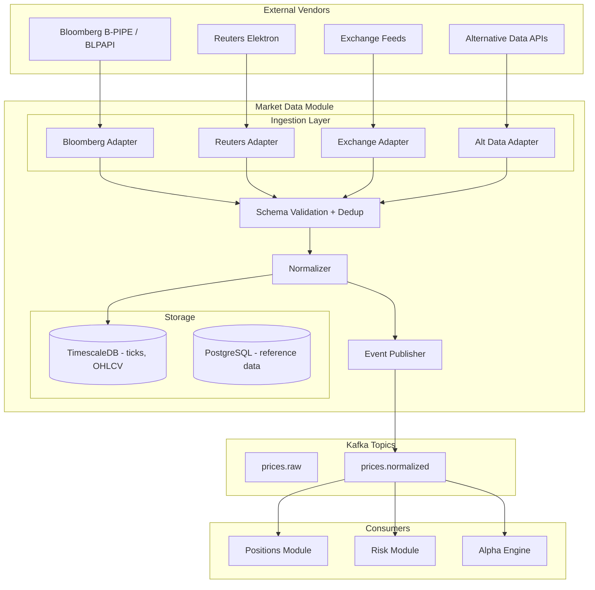

# Market Data Ingestion Module

## Context & Problem

Everything in a hedge fund starts with data. Prices, volumes, corporate actions, reference data — every other module (positions, risk, compliance, alpha) depends on timely, accurate, normalized market data. If market data is late, stale, or wrong, every downstream calculation is wrong.

This module acquires data from external vendors (Bloomberg, Reuters, exchanges), normalizes it into a canonical format, stores it in a time-series database, and publishes it as events for downstream consumers.

## Domain Concepts

| Concept | Definition |
|---|---|
| **Tick** | A single price observation at a point in time (bid, ask, mid, volume) |
| **OHLCV Bar** | Aggregated open/high/low/close/volume over a time interval |
| **Corporate Action** | Events that affect securities: splits, dividends, mergers |
| **Reference Data** | Static instrument attributes: ISIN, CUSIP, exchange, currency, sector |
| **Vendor** | External data source: Bloomberg, Reuters, exchange direct feeds |

## Architecture



## Design Decisions

### Anti-Corruption Layer Per Vendor

Each vendor has a dedicated adapter that translates vendor-specific formats into the module's canonical model. Switching vendors or adding a new one requires writing one adapter — no changes to the rest of the module.

```python
# interface.py — what the module exposes

from typing import Protocol, AsyncIterator
from datetime import datetime
from decimal import Decimal

from pydantic import BaseModel, ConfigDict


class PriceSnapshot(BaseModel):
    model_config = ConfigDict(frozen=True)

    instrument_id: str
    bid: Decimal
    ask: Decimal
    mid: Decimal
    volume: Decimal | None = None
    timestamp: datetime
    source: str


class OHLCVBar(BaseModel):
    model_config = ConfigDict(frozen=True)

    instrument_id: str
    interval: str          # "1m", "5m", "1h", "1d"
    open: Decimal
    high: Decimal
    low: Decimal
    close: Decimal
    volume: Decimal
    timestamp: datetime


class MarketDataReader(Protocol):
    """Read interface exposed to other modules."""
    async def get_latest_price(self, instrument_id: str) -> PriceSnapshot: ...
    async def get_price_at(self, instrument_id: str, timestamp: datetime) -> PriceSnapshot: ...
    async def get_price_history(
        self, instrument_id: str, start: datetime, end: datetime,
    ) -> list[PriceSnapshot]: ...
    async def get_ohlcv(
        self, instrument_id: str, interval: str, start: datetime, end: datetime,
    ) -> list[OHLCVBar]: ...


class MarketDataSubscriber(Protocol):
    """Streaming interface for real-time consumers."""
    async def subscribe(self, instrument_ids: list[str]) -> AsyncIterator[PriceSnapshot]: ...
```

### Bloomberg Adapter

```python
# adapters/bloomberg.py

import httpx
from decimal import Decimal
from datetime import datetime


class BloombergAdapter:
    """Translates Bloomberg BLPAPI responses to canonical PriceSnapshot."""

    def __init__(self, base_url: str, api_key: str) -> None:
        self._client = httpx.AsyncClient(
            base_url=base_url,
            headers={"Authorization": f"Bearer {api_key}"},
            timeout=httpx.Timeout(10.0, connect=5.0),
        )

    async def get_quotes(self, tickers: list[str]) -> list[PriceSnapshot]:
        response = await self._client.post(
            "/market/securities/quotes",
            json={"securities": tickers, "fields": ["BID", "ASK", "MID", "VOLUME", "LAST_UPDATE_TIME"]},
        )
        response.raise_for_status()
        return [self._to_snapshot(item) for item in response.json()["results"]]

    def _to_snapshot(self, data: dict) -> PriceSnapshot:
        return PriceSnapshot(
            instrument_id=self._normalize_ticker(data["SECURITY"]),
            bid=Decimal(str(data["BID"])),
            ask=Decimal(str(data["ASK"])),
            mid=Decimal(str(data["MID"])),
            volume=Decimal(str(data.get("VOLUME", 0))),
            timestamp=datetime.fromisoformat(data["LAST_UPDATE_TIME"]),
            source="bloomberg",
        )

    def _normalize_ticker(self, bloomberg_ticker: str) -> str:
        """Convert 'AAPL US Equity' → 'AAPL'."""
        return bloomberg_ticker.split()[0]
```

### Ingestion Pipeline

```python
# service.py

import asyncio
from datetime import datetime

import structlog

logger = structlog.get_logger()


class MarketDataIngestionService:
    """Coordinates data acquisition, validation, storage, and publishing."""

    def __init__(
        self,
        adapters: list[VendorAdapter],
        validator: PriceValidator,
        repository: PriceRepository,
        publisher: EventPublisher,
    ) -> None:
        self._adapters = adapters
        self._validator = validator
        self._repository = repository
        self._publisher = publisher

    async def ingest_batch(self, instrument_ids: list[str]) -> IngestionResult:
        """Pull prices from all adapters, validate, store, publish."""
        all_prices: list[PriceSnapshot] = []

        # Fetch from all vendors concurrently
        results = await asyncio.gather(
            *[adapter.get_quotes(instrument_ids) for adapter in self._adapters],
            return_exceptions=True,
        )

        for result in results:
            if isinstance(result, Exception):
                logger.warning("vendor_fetch_failed", error=str(result))
                continue
            all_prices.extend(result)

        # Validate and deduplicate
        valid_prices = []
        for price in all_prices:
            validation = self._validator.validate(price)
            if validation.is_valid:
                valid_prices.append(price)
            else:
                logger.warning(
                    "price_validation_failed",
                    instrument_id=price.instrument_id,
                    errors=validation.errors,
                )

        # Deduplicate: keep the most recent price per instrument
        latest_per_instrument: dict[str, PriceSnapshot] = {}
        for price in valid_prices:
            existing = latest_per_instrument.get(price.instrument_id)
            if existing is None or price.timestamp > existing.timestamp:
                latest_per_instrument[price.instrument_id] = price

        deduped = list(latest_per_instrument.values())

        # Store
        await self._repository.insert_batch(
            [p.model_dump() for p in deduped]
        )

        # Publish events
        for price in deduped:
            await self._publisher.publish(
                topic="prices.normalized",
                key=price.instrument_id,
                event={
                    "event_type": "price.updated",
                    "event_id": f"price-{price.instrument_id}-{price.timestamp.isoformat()}",
                    "timestamp": price.timestamp.isoformat(),
                    "data": price.model_dump(mode="json"),
                },
            )

        return IngestionResult(
            total_fetched=len(all_prices),
            valid=len(deduped),
            rejected=len(all_prices) - len(deduped),
        )
```

### Price Validation

```python
# validator.py

from decimal import Decimal
from datetime import datetime, timedelta, timezone
from dataclasses import dataclass


@dataclass
class ValidationResult:
    is_valid: bool
    errors: list[str]


class PriceValidator:
    """Validates price data before storage."""

    def __init__(self, max_staleness: timedelta = timedelta(minutes=30)) -> None:
        self._max_staleness = max_staleness

    def validate(self, price: PriceSnapshot) -> ValidationResult:
        errors = []

        # Bid/ask spread must be non-negative
        if price.ask < price.bid:
            errors.append(f"Inverted spread: bid={price.bid} > ask={price.ask}")

        # Mid must be between bid and ask
        if not (price.bid <= price.mid <= price.ask):
            errors.append(f"Mid {price.mid} outside bid/ask range [{price.bid}, {price.ask}]")

        # Prices must be positive
        if price.bid <= 0 or price.ask <= 0:
            errors.append(f"Non-positive price: bid={price.bid}, ask={price.ask}")

        # Spread must not be unreasonably wide (> 10% of mid)
        if price.mid > 0:
            spread_pct = (price.ask - price.bid) / price.mid
            if spread_pct > Decimal("0.10"):
                errors.append(f"Wide spread: {spread_pct:.2%} of mid")

        # Timestamp must not be in the future or too stale
        now = datetime.now(timezone.utc)
        if price.timestamp > now + timedelta(seconds=30):
            errors.append(f"Future timestamp: {price.timestamp}")
        if now - price.timestamp > self._max_staleness:
            errors.append(f"Stale price: {now - price.timestamp} old")

        return ValidationResult(is_valid=len(errors) == 0, errors=errors)
```

### Data Model (TimescaleDB)

```sql
-- Tick-level prices (hypertable)
CREATE TABLE market_data.prices (
    timestamp       TIMESTAMPTZ     NOT NULL,
    instrument_id   VARCHAR(32)     NOT NULL,
    bid             NUMERIC(18,8)   NOT NULL,
    ask             NUMERIC(18,8)   NOT NULL,
    mid             NUMERIC(18,8)   NOT NULL,
    volume          NUMERIC(18,2),
    source          VARCHAR(32)     NOT NULL,
    PRIMARY KEY (timestamp, instrument_id)
);

SELECT create_hypertable('market_data.prices', by_range('timestamp', INTERVAL '7 days'));

-- Compression: segment by instrument for efficient per-instrument queries
ALTER TABLE market_data.prices SET (
    timescaledb.compress,
    timescaledb.compress_segmentby = 'instrument_id',
    timescaledb.compress_orderby = 'timestamp DESC'
);
SELECT add_compression_policy('market_data.prices', compress_after => INTERVAL '7 days');
SELECT add_retention_policy('market_data.prices', drop_after => INTERVAL '2 years');

-- Continuous aggregates for OHLCV bars
CREATE MATERIALIZED VIEW market_data.ohlcv_1m
WITH (timescaledb.continuous) AS
SELECT
    time_bucket('1 minute', timestamp) AS bucket,
    instrument_id,
    first(mid, timestamp) AS open,
    max(mid)              AS high,
    min(mid)              AS low,
    last(mid, timestamp)  AS close,
    sum(volume)           AS volume
FROM market_data.prices
GROUP BY bucket, instrument_id
WITH NO DATA;

SELECT add_continuous_aggregate_policy('market_data.ohlcv_1m',
    start_offset    => INTERVAL '1 hour',
    end_offset      => INTERVAL '1 minute',
    schedule_interval => INTERVAL '30 seconds'
);

-- Hierarchical: daily bars from 1-minute bars
CREATE MATERIALIZED VIEW market_data.ohlcv_1d
WITH (timescaledb.continuous) AS
SELECT
    time_bucket('1 day', bucket) AS bucket,
    instrument_id,
    first(open, bucket) AS open,
    max(high)           AS high,
    min(low)            AS low,
    last(close, bucket) AS close,
    sum(volume)         AS volume
FROM market_data.ohlcv_1m
GROUP BY time_bucket('1 day', bucket), instrument_id
WITH NO DATA;

SELECT add_continuous_aggregate_policy('market_data.ohlcv_1d',
    start_offset    => INTERVAL '3 days',
    end_offset      => INTERVAL '1 day',
    schedule_interval => INTERVAL '1 hour'
);
```

### Kafka Events Published

| Topic | Key | Event | Consumers |
|---|---|---|---|
| `prices.normalized` | `instrument_id` | `price.updated` | Positions, Risk, Alpha |
| `market-data.status` | `source` | `feed.connected`, `feed.disconnected`, `feed.stale` | Monitoring, Alerting |

> **Note:** Corporate actions (`corporate-actions.announced`) are published by the [Security Master](security-master.md) module, not Market Data.

### Feed Health Monitoring

```python
class FeedHealthMonitor:
    """Monitors data feed freshness and alerts on staleness."""

    def __init__(self, repository: PriceRepository, publisher: EventPublisher) -> None:
        self._repository = repository
        self._publisher = publisher

    async def check_feed_health(self) -> list[FeedStatus]:
        """Check all instrument feeds for staleness."""
        instruments = await self._repository.get_monitored_instruments()
        stale = []

        for instrument_id in instruments:
            latest = await self._repository.get_latest_timestamp(instrument_id)
            age = datetime.now(timezone.utc) - latest
            if age > timedelta(minutes=5):
                stale.append(FeedStatus(
                    instrument_id=instrument_id,
                    last_update=latest,
                    age=age,
                    status="stale",
                ))
                await self._publisher.publish(
                    topic="market-data.status",
                    key=instrument_id,
                    event={
                        "event_type": "feed.stale",
                        "instrument_id": instrument_id,
                        "last_update": latest.isoformat(),
                        "age_seconds": age.total_seconds(),
                    },
                )

        return stale
```

## Patterns Used

| Pattern | Document |
|---|---|
| Anti-corruption layer per vendor | [External API Adapters](../../patterns/api/external-api-adapters.md) |
| TimescaleDB hypertables + continuous aggregates | [TimescaleDB Hypertables](../../patterns/data-access/timescaledb-hypertables.md) |
| Event publishing for downstream consumers | [Event-Driven Architecture](../../principles/event-driven-architecture.md) |
| Schema validation at ingestion boundary | [Data Quality Validation](../../patterns/data-processing/data-quality-validation.md) |
| Data normalization | [Data Normalization](../../patterns/data-processing/data-normalization.md) |
| Circuit breaker on vendor APIs | [Circuit Breakers](../../patterns/resilience/circuit-breakers.md) |

## Failure Modes

| Failure | Cause | Impact | Mitigation |
|---|---|---|---|
| Vendor feed down | Bloomberg outage, network issue | Stale prices across the platform | Circuit breaker, fallback to last known prices, `feed.stale` event alerts risk/compliance |
| Data quality drop | Vendor sends bad data (zero prices, inverted spreads) | Incorrect P&L, risk calculations | Validation layer rejects bad data, alerts on rejection rate |
| Ingestion lag | High volume, slow database writes | Stale prices for downstream consumers | Monitor ingestion latency, batch inserts, backpressure handling |
| Duplicate data | Vendor sends same tick twice | Inflated volumes, incorrect OHLCV | Dedup by (instrument_id, timestamp) primary key |
| Corporate action missed | Split or dividend not processed | Incorrect position quantities | Reconciliation job, dual-source corporate action data |
| Schema change from vendor | Bloomberg changes field names | Adapter crashes | Adapter isolates the change, only adapter code updates |

## Performance Profile

| Metric | Target |
|---|---|
| Ingestion latency (tick → storage) | < 50ms |
| Ingestion latency (tick → Kafka publish) | < 100ms |
| Batch insert throughput | > 10,000 rows/sec |
| Price query (latest, single instrument) | < 5ms |
| Price query (1 day history, single instrument) | < 20ms |
| OHLCV query (30 days, daily bars) | < 10ms (continuous aggregate) |

## Dependencies

```
market-data-ingestion
  ├── depends on: shared kernel (types, events)
  ├── depends on: nothing else (leaf module)
  ├── publishes: prices.normalized, market-data.status
  └── consumed by: positions, risk, alpha-engine, compliance
```

## Related Documents

- [Security Master](security-master.md) — instrument reference data this module uses for normalization
