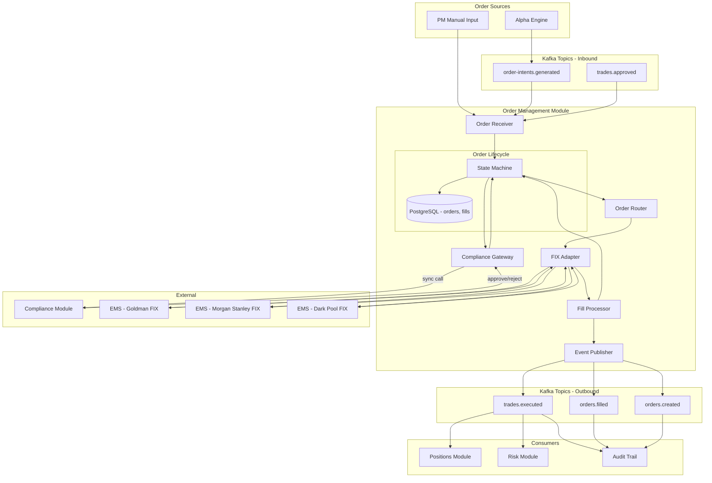
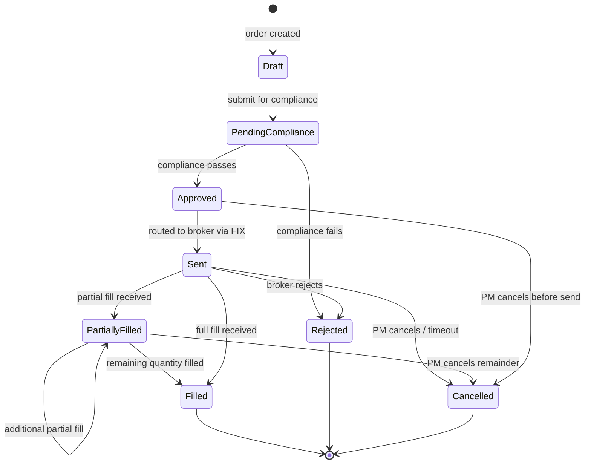

# Order Management Module

## Context & Problem

A hedge fund PM desk generates trading intent from two sources: algorithmic alpha engines that produce signals and portfolio managers who make discretionary decisions. In both cases, the intent must be transformed into an executable order, validated against compliance rules, routed to a broker or venue, and tracked through its full lifecycle until it becomes a fill that updates positions.

Without a centralized Order Management System (OMS), order state is scattered across spreadsheets, chat logs, and broker portals. This creates compliance risk (unvetted trades), operational risk (duplicate orders, lost fills), and audit gaps (no authoritative record of what was ordered vs. what was executed).

This module owns the full lifecycle of an order — from intent to execution — and is the single system of record for order state. It integrates with the Execution Management System (EMS) via the FIX protocol for routing to brokers and venues, and with the compliance module for pre-trade checks.

## Domain Concepts

| Concept | Definition |
|---|---|
| **Order** | An instruction to buy or sell a quantity of an instrument at specified terms (limit, market, etc.) |
| **Order Intent** | A raw signal from the alpha engine or PM expressing a desire to trade — not yet a validated order |
| **Order State** | Position in the lifecycle state machine: Draft → Pending Compliance → Approved → Sent → Partially Filled → Filled / Rejected / Cancelled |
| **Fill** | A broker confirmation that some or all of an order has been executed at a specific price and quantity |
| **Execution Report** | A FIX message (MsgType=8) from the broker confirming order status changes and fills |
| **FIX Session** | A persistent connection to a broker using the FIX 4.2/4.4 protocol for order routing and execution reports |
| **Broker** | A counterparty that executes orders on behalf of the fund (Goldman, Morgan Stanley, etc.) |
| **Venue** | A specific market or dark pool where an order can be executed |
| **Time in Force** | How long an order remains active: Day, GTC (Good Til Cancel), IOC (Immediate or Cancel), FOK (Fill or Kill) |
| **Slippage** | The difference between the expected execution price and the actual fill price |

## Architecture



### Order Lifecycle State Machine



## Design Decisions

### State Machine as the Core Abstraction

The order state machine is the single source of truth for what transitions are valid. Every mutation goes through the state machine — no code bypasses it. This prevents impossible states like a cancelled order receiving a fill, and provides a natural audit log of transitions.

### Synchronous Compliance Check

The compliance check is a synchronous call, not an event. An order must not be routed to a broker until compliance has explicitly approved it. Asynchronous compliance would create a window where an unapproved order could be sent. The tradeoff is latency — compliance adds ~50ms to order submission. For a hedge fund (not HFT), this is acceptable.

### FIX Protocol Adapter

FIX is the industry standard for order routing. Rather than embedding FIX details throughout the module, the FIX adapter translates between our canonical order model and FIX messages. This isolates the protocol complexity and makes it possible to test order logic without a live FIX session.

### Fill Processing Produces TradeExecuted Events

The `trades.executed` event is the most important event in the system — it drives position keeping, P&L calculation, and risk updates. Fill processing is responsible for producing this event only when a fill is confirmed and validated. Partial fills produce both an `orders.filled` event (with partial flag) and a `trades.executed` event for the filled quantity.

## Interface Contract

```python
# interface.py — what the module exposes to other modules

from typing import Protocol
from datetime import datetime
from decimal import Decimal
from enum import StrEnum
from uuid import UUID

from pydantic import BaseModel, ConfigDict, Field


class OrderSide(StrEnum):
    BUY = "BUY"
    SELL = "SELL"


class OrderType(StrEnum):
    MARKET = "MARKET"
    LIMIT = "LIMIT"
    STOP = "STOP"
    STOP_LIMIT = "STOP_LIMIT"


class TimeInForce(StrEnum):
    DAY = "DAY"
    GTC = "GTC"
    IOC = "IOC"
    FOK = "FOK"


class OrderState(StrEnum):
    DRAFT = "DRAFT"
    PENDING_COMPLIANCE = "PENDING_COMPLIANCE"
    APPROVED = "APPROVED"
    SENT = "SENT"
    PARTIALLY_FILLED = "PARTIALLY_FILLED"
    FILLED = "FILLED"
    REJECTED = "REJECTED"
    CANCELLED = "CANCELLED"


class CreateOrderRequest(BaseModel):
    model_config = ConfigDict(frozen=True)

    instrument_id: str
    side: OrderSide
    quantity: Decimal = Field(gt=0)
    order_type: OrderType
    limit_price: Decimal | None = None
    stop_price: Decimal | None = None
    time_in_force: TimeInForce = TimeInForce.DAY
    portfolio_id: str
    strategy_id: str | None = None
    broker_id: str | None = None
    notes: str | None = None


class OrderSummary(BaseModel):
    model_config = ConfigDict(frozen=True)

    order_id: UUID
    instrument_id: str
    side: OrderSide
    quantity: Decimal
    filled_quantity: Decimal
    remaining_quantity: Decimal
    average_fill_price: Decimal | None
    state: OrderState
    created_at: datetime
    updated_at: datetime


class FillDetail(BaseModel):
    model_config = ConfigDict(frozen=True)

    fill_id: UUID
    order_id: UUID
    quantity: Decimal
    price: Decimal
    broker_id: str
    venue: str
    executed_at: datetime
    commission: Decimal


class OrderReader(Protocol):
    """Read interface for querying orders."""
    async def get_order(self, order_id: UUID) -> OrderSummary: ...
    async def get_orders_by_portfolio(
        self, portfolio_id: str, states: list[OrderState] | None = None,
    ) -> list[OrderSummary]: ...
    async def get_fills(self, order_id: UUID) -> list[FillDetail]: ...
    async def get_open_orders(self) -> list[OrderSummary]: ...


class OrderWriter(Protocol):
    """Write interface for order lifecycle actions."""
    async def create_order(self, request: CreateOrderRequest, user_id: str) -> OrderSummary: ...
    async def cancel_order(self, order_id: UUID, user_id: str, reason: str) -> OrderSummary: ...
```

## Code Skeleton

### Order State Machine

```python
# state_machine.py

from enum import StrEnum
from dataclasses import dataclass


class OrderState(StrEnum):
    DRAFT = "DRAFT"
    PENDING_COMPLIANCE = "PENDING_COMPLIANCE"
    APPROVED = "APPROVED"
    SENT = "SENT"
    PARTIALLY_FILLED = "PARTIALLY_FILLED"
    FILLED = "FILLED"
    REJECTED = "REJECTED"
    CANCELLED = "CANCELLED"


class OrderTransition(StrEnum):
    SUBMIT_COMPLIANCE = "SUBMIT_COMPLIANCE"
    COMPLIANCE_APPROVED = "COMPLIANCE_APPROVED"
    COMPLIANCE_REJECTED = "COMPLIANCE_REJECTED"
    SEND_TO_BROKER = "SEND_TO_BROKER"
    PARTIAL_FILL = "PARTIAL_FILL"
    FULL_FILL = "FULL_FILL"
    BROKER_REJECT = "BROKER_REJECT"
    CANCEL = "CANCEL"


@dataclass(frozen=True)
class TransitionRule:
    from_state: OrderState
    transition: OrderTransition
    to_state: OrderState


# Exhaustive transition table — if it's not here, it's not allowed
_TRANSITIONS: list[TransitionRule] = [
    TransitionRule(OrderState.DRAFT, OrderTransition.SUBMIT_COMPLIANCE, OrderState.PENDING_COMPLIANCE),
    TransitionRule(OrderState.PENDING_COMPLIANCE, OrderTransition.COMPLIANCE_APPROVED, OrderState.APPROVED),
    TransitionRule(OrderState.PENDING_COMPLIANCE, OrderTransition.COMPLIANCE_REJECTED, OrderState.REJECTED),
    TransitionRule(OrderState.APPROVED, OrderTransition.SEND_TO_BROKER, OrderState.SENT),
    TransitionRule(OrderState.APPROVED, OrderTransition.CANCEL, OrderState.CANCELLED),
    TransitionRule(OrderState.SENT, OrderTransition.PARTIAL_FILL, OrderState.PARTIALLY_FILLED),
    TransitionRule(OrderState.SENT, OrderTransition.FULL_FILL, OrderState.FILLED),
    TransitionRule(OrderState.SENT, OrderTransition.BROKER_REJECT, OrderState.REJECTED),
    TransitionRule(OrderState.SENT, OrderTransition.CANCEL, OrderState.CANCELLED),
    TransitionRule(OrderState.PARTIALLY_FILLED, OrderTransition.PARTIAL_FILL, OrderState.PARTIALLY_FILLED),
    TransitionRule(OrderState.PARTIALLY_FILLED, OrderTransition.FULL_FILL, OrderState.FILLED),
    TransitionRule(OrderState.PARTIALLY_FILLED, OrderTransition.CANCEL, OrderState.CANCELLED),
]

_TRANSITION_MAP: dict[tuple[OrderState, OrderTransition], OrderState] = {
    (rule.from_state, rule.transition): rule.to_state for rule in _TRANSITIONS
}


class InvalidTransitionError(Exception):
    def __init__(self, current_state: OrderState, transition: OrderTransition) -> None:
        self.current_state = current_state
        self.transition = transition
        super().__init__(
            f"Invalid transition {transition.value} from state {current_state.value}"
        )


def apply_transition(current_state: OrderState, transition: OrderTransition) -> OrderState:
    """Apply a transition and return the new state, or raise InvalidTransitionError."""
    key = (current_state, transition)
    new_state = _TRANSITION_MAP.get(key)
    if new_state is None:
        raise InvalidTransitionError(current_state, transition)
    return new_state


def get_valid_transitions(current_state: OrderState) -> list[OrderTransition]:
    """Return all valid transitions from the current state."""
    return [t for (s, t), _ in _TRANSITION_MAP.items() if s == current_state]
```

### Order Service

```python
# service.py

from datetime import datetime, timezone
from decimal import Decimal
from uuid import UUID, uuid4

import structlog

from .state_machine import OrderState, OrderTransition, apply_transition
from .interface import CreateOrderRequest, OrderSummary, FillDetail

logger = structlog.get_logger()


class OrderService:
    """Coordinates order lifecycle: creation, compliance, routing, fills."""

    def __init__(
        self,
        repository: "OrderRepository",
        compliance_gateway: "ComplianceGateway",
        order_router: "OrderRouter",
        event_publisher: "EventPublisher",
    ) -> None:
        self._repository = repository
        self._compliance = compliance_gateway
        self._router = order_router
        self._publisher = event_publisher

    async def create_order(self, request: CreateOrderRequest, user_id: str) -> OrderSummary:
        """Create a new order in DRAFT state and immediately submit for compliance."""
        order_id = uuid4()
        now = datetime.now(timezone.utc)

        order = Order(
            order_id=order_id,
            instrument_id=request.instrument_id,
            side=request.side,
            quantity=request.quantity,
            filled_quantity=Decimal("0"),
            order_type=request.order_type,
            limit_price=request.limit_price,
            stop_price=request.stop_price,
            time_in_force=request.time_in_force,
            portfolio_id=request.portfolio_id,
            strategy_id=request.strategy_id,
            broker_id=request.broker_id,
            state=OrderState.DRAFT,
            created_by=user_id,
            created_at=now,
            updated_at=now,
        )

        await self._repository.save(order)
        await self._publisher.publish(
            topic="orders.created",
            key=str(order_id),
            event=OrderCreatedEvent(
                order_id=order_id,
                instrument_id=request.instrument_id,
                side=request.side,
                quantity=request.quantity,
                portfolio_id=request.portfolio_id,
                created_by=user_id,
                timestamp=now,
            ).model_dump(mode="json"),
        )

        logger.info("order_created", order_id=str(order_id), instrument=request.instrument_id)

        # Immediately submit for compliance
        await self._submit_for_compliance(order)
        return await self._to_summary(order)

    async def _submit_for_compliance(self, order: "Order") -> None:
        """Transition to PENDING_COMPLIANCE and call compliance synchronously."""
        order.state = apply_transition(order.state, OrderTransition.SUBMIT_COMPLIANCE)
        order.updated_at = datetime.now(timezone.utc)
        await self._repository.save(order)

        try:
            result = await self._compliance.check_pre_trade(
                instrument_id=order.instrument_id,
                side=order.side,
                quantity=order.quantity,
                portfolio_id=order.portfolio_id,
            )
        except Exception:
            logger.exception("compliance_check_failed", order_id=str(order.order_id))
            # Compliance failure is a rejection — we do not route uncertain orders
            order.state = apply_transition(order.state, OrderTransition.COMPLIANCE_REJECTED)
            order.rejection_reason = "Compliance service unavailable"
            order.updated_at = datetime.now(timezone.utc)
            await self._repository.save(order)
            return

        if result.approved:
            order.state = apply_transition(order.state, OrderTransition.COMPLIANCE_APPROVED)
            order.updated_at = datetime.now(timezone.utc)
            await self._repository.save(order)
            logger.info("order_compliance_approved", order_id=str(order.order_id))
            # Auto-route to broker
            await self._route_to_broker(order)
        else:
            order.state = apply_transition(order.state, OrderTransition.COMPLIANCE_REJECTED)
            order.rejection_reason = result.reason
            order.updated_at = datetime.now(timezone.utc)
            await self._repository.save(order)
            logger.warning(
                "order_compliance_rejected",
                order_id=str(order.order_id),
                reason=result.reason,
            )

    async def _route_to_broker(self, order: "Order") -> None:
        """Send the order to the broker via FIX adapter."""
        order.state = apply_transition(order.state, OrderTransition.SEND_TO_BROKER)
        order.sent_at = datetime.now(timezone.utc)
        order.updated_at = order.sent_at
        await self._repository.save(order)

        await self._router.route_order(order)
        logger.info(
            "order_sent_to_broker",
            order_id=str(order.order_id),
            broker=order.broker_id,
        )

    async def process_fill(self, order_id: UUID, fill: FillDetail) -> None:
        """Process an execution report / fill from the broker."""
        order = await self._repository.get(order_id)
        if order is None:
            logger.error("fill_for_unknown_order", order_id=str(order_id))
            return

        # Update filled quantity
        order.filled_quantity += fill.quantity
        remaining = order.quantity - order.filled_quantity

        if remaining <= 0:
            order.state = apply_transition(order.state, OrderTransition.FULL_FILL)
        else:
            order.state = apply_transition(order.state, OrderTransition.PARTIAL_FILL)

        # Compute volume-weighted average fill price
        existing_fills = await self._repository.get_fills(order_id)
        total_value = sum(f.quantity * f.price for f in existing_fills) + fill.quantity * fill.price
        total_qty = sum(f.quantity for f in existing_fills) + fill.quantity
        order.average_fill_price = total_value / total_qty

        order.updated_at = datetime.now(timezone.utc)
        await self._repository.save_fill(fill)
        await self._repository.save(order)

        # Publish fill event
        await self._publisher.publish(
            topic="orders.filled",
            key=str(order_id),
            event=OrderFilledEvent(
                order_id=order_id,
                fill_id=fill.fill_id,
                quantity=fill.quantity,
                price=fill.price,
                remaining_quantity=remaining,
                is_final=remaining <= 0,
                timestamp=fill.executed_at,
            ).model_dump(mode="json"),
        )

        # Publish TradeExecuted — the event that drives position keeping
        await self._publisher.publish(
            topic="trades.executed",
            key=order.instrument_id,
            event=TradeExecutedEvent(
                trade_id=fill.fill_id,
                order_id=order_id,
                instrument_id=order.instrument_id,
                side=order.side,
                quantity=fill.quantity,
                price=fill.price,
                commission=fill.commission,
                portfolio_id=order.portfolio_id,
                strategy_id=order.strategy_id,
                broker_id=fill.broker_id,
                venue=fill.venue,
                executed_at=fill.executed_at,
            ).model_dump(mode="json"),
        )

        logger.info(
            "fill_processed",
            order_id=str(order_id),
            fill_qty=str(fill.quantity),
            fill_price=str(fill.price),
            remaining=str(remaining),
            state=order.state.value,
        )

    async def cancel_order(self, order_id: UUID, user_id: str, reason: str) -> OrderSummary:
        """Cancel an order. Only valid from Approved, Sent, or PartiallyFilled states."""
        order = await self._repository.get(order_id)
        if order is None:
            raise OrderNotFoundError(order_id)

        order.state = apply_transition(order.state, OrderTransition.CANCEL)
        order.cancellation_reason = reason
        order.cancelled_by = user_id
        order.updated_at = datetime.now(timezone.utc)
        await self._repository.save(order)

        # If the order was already sent, send a cancel request to the broker
        if order.sent_at is not None:
            await self._router.cancel_order(order)

        logger.info(
            "order_cancelled",
            order_id=str(order_id),
            user=user_id,
            reason=reason,
        )
        return await self._to_summary(order)

    async def _to_summary(self, order: "Order") -> OrderSummary:
        return OrderSummary(
            order_id=order.order_id,
            instrument_id=order.instrument_id,
            side=order.side,
            quantity=order.quantity,
            filled_quantity=order.filled_quantity,
            remaining_quantity=order.quantity - order.filled_quantity,
            average_fill_price=order.average_fill_price,
            state=order.state,
            created_at=order.created_at,
            updated_at=order.updated_at,
        )
```

### FIX Adapter

```python
# adapters/fix_adapter.py

"""
FIX protocol adapter for order routing and execution report processing.

Translates between internal order models and FIX 4.4 messages using simplefix.
The adapter manages FIX sessions per broker and handles reconnection.
"""

import asyncio
from datetime import datetime, timezone
from decimal import Decimal
from uuid import UUID, uuid4

import simplefix  # simplefix==1.0.17
import structlog

logger = structlog.get_logger()

# FIX 4.4 tag constants
TAG_MSG_TYPE = 35
TAG_CL_ORD_ID = 11
TAG_SYMBOL = 55
TAG_SIDE = 54
TAG_ORDER_QTY = 38
TAG_ORD_TYPE = 40
TAG_PRICE = 44
TAG_STOP_PX = 99
TAG_TIME_IN_FORCE = 59
TAG_EXEC_TYPE = 150
TAG_EXEC_ID = 17
TAG_LAST_QTY = 32
TAG_LAST_PX = 31
TAG_CUM_QTY = 14
TAG_LEAVES_QTY = 151
TAG_ORD_STATUS = 39
TAG_COMMISSION = 12
TAG_LAST_MKT = 30

FIX_SIDE_MAP = {"BUY": "1", "SELL": "2"}
FIX_ORD_TYPE_MAP = {"MARKET": "1", "LIMIT": "2", "STOP": "3", "STOP_LIMIT": "4"}
FIX_TIF_MAP = {"DAY": "0", "GTC": "1", "IOC": "3", "FOK": "4"}


class FIXSession:
    """Manages a single FIX session to a broker."""

    def __init__(
        self,
        broker_id: str,
        host: str,
        port: int,
        sender_comp_id: str,
        target_comp_id: str,
        on_execution_report: "Callable",
    ) -> None:
        self.broker_id = broker_id
        self._host = host
        self._port = port
        self._sender_comp_id = sender_comp_id
        self._target_comp_id = target_comp_id
        self._on_execution_report = on_execution_report
        self._reader: asyncio.StreamReader | None = None
        self._writer: asyncio.StreamWriter | None = None
        self._connected = False
        self._seq_num = 1

    async def connect(self) -> None:
        self._reader, self._writer = await asyncio.open_connection(
            self._host, self._port,
        )
        self._connected = True
        await self._send_logon()
        logger.info("fix_session_connected", broker=self.broker_id)
        # Start reading execution reports in background
        asyncio.create_task(self._read_loop())

    async def send_new_order(self, order: "Order") -> None:
        """Send a FIX NewOrderSingle (MsgType=D)."""
        msg = simplefix.FixMessage()
        msg.append_pair(TAG_MSG_TYPE, "D")
        msg.append_pair(TAG_CL_ORD_ID, str(order.order_id))
        msg.append_pair(TAG_SYMBOL, order.instrument_id)
        msg.append_pair(TAG_SIDE, FIX_SIDE_MAP[order.side.value])
        msg.append_pair(TAG_ORDER_QTY, str(order.quantity))
        msg.append_pair(TAG_ORD_TYPE, FIX_ORD_TYPE_MAP[order.order_type.value])
        msg.append_pair(TAG_TIME_IN_FORCE, FIX_TIF_MAP[order.time_in_force.value])

        if order.limit_price is not None:
            msg.append_pair(TAG_PRICE, str(order.limit_price))
        if order.stop_price is not None:
            msg.append_pair(TAG_STOP_PX, str(order.stop_price))

        await self._send(msg)
        logger.info(
            "fix_new_order_sent",
            broker=self.broker_id,
            order_id=str(order.order_id),
        )

    async def send_cancel_request(self, order: "Order") -> None:
        """Send a FIX OrderCancelRequest (MsgType=F)."""
        msg = simplefix.FixMessage()
        msg.append_pair(TAG_MSG_TYPE, "F")
        msg.append_pair(TAG_CL_ORD_ID, str(uuid4()))  # new ClOrdID for cancel
        msg.append_pair(41, str(order.order_id))  # OrigClOrdID
        msg.append_pair(TAG_SYMBOL, order.instrument_id)
        msg.append_pair(TAG_SIDE, FIX_SIDE_MAP[order.side.value])

        await self._send(msg)
        logger.info("fix_cancel_sent", broker=self.broker_id, order_id=str(order.order_id))

    async def _read_loop(self) -> None:
        """Continuously read FIX messages from the broker."""
        parser = simplefix.FixParser()
        while self._connected:
            try:
                data = await self._reader.read(4096)
                if not data:
                    logger.warning("fix_connection_closed", broker=self.broker_id)
                    self._connected = False
                    break
                parser.append_buffer(data)
                while True:
                    msg = parser.get_message()
                    if msg is None:
                        break
                    await self._handle_message(msg)
            except Exception:
                logger.exception("fix_read_error", broker=self.broker_id)
                await asyncio.sleep(1.0)

    async def _handle_message(self, msg: simplefix.FixMessage) -> None:
        """Dispatch incoming FIX messages by type."""
        msg_type = msg.get(TAG_MSG_TYPE)
        if msg_type == b"8":  # ExecutionReport
            await self._handle_execution_report(msg)
        elif msg_type == b"9":  # OrderCancelReject
            logger.warning(
                "fix_cancel_rejected",
                broker=self.broker_id,
                order_id=msg.get(TAG_CL_ORD_ID),
            )

    async def _handle_execution_report(self, msg: simplefix.FixMessage) -> None:
        """Parse a FIX ExecutionReport and forward to the fill processor."""
        exec_type = msg.get(TAG_EXEC_TYPE)
        cl_ord_id = msg.get(TAG_CL_ORD_ID).decode()

        if exec_type in (b"1", b"2"):  # Partial Fill or Fill
            fill = FillDetail(
                fill_id=uuid4(),
                order_id=UUID(cl_ord_id),
                quantity=Decimal(msg.get(TAG_LAST_QTY).decode()),
                price=Decimal(msg.get(TAG_LAST_PX).decode()),
                broker_id=self.broker_id,
                venue=msg.get(TAG_LAST_MKT, b"UNKNOWN").decode(),
                executed_at=datetime.now(timezone.utc),
                commission=Decimal(msg.get(TAG_COMMISSION, b"0").decode()),
            )
            await self._on_execution_report(fill)
        elif exec_type == b"8":  # Rejected
            logger.warning(
                "fix_order_rejected",
                broker=self.broker_id,
                order_id=cl_ord_id,
                reason=msg.get(58, b"").decode(),  # Tag 58 = Text
            )

    async def _send_logon(self) -> None:
        msg = simplefix.FixMessage()
        msg.append_pair(TAG_MSG_TYPE, "A")  # Logon
        msg.append_pair(108, "30")  # HeartBtInt
        await self._send(msg)

    async def _send(self, msg: simplefix.FixMessage) -> None:
        msg.append_pair(49, self._sender_comp_id)
        msg.append_pair(56, self._target_comp_id)
        msg.append_pair(34, str(self._seq_num))
        self._seq_num += 1
        raw = msg.encode()
        self._writer.write(raw)
        await self._writer.drain()


class OrderRouter:
    """Routes orders to the appropriate broker FIX session."""

    def __init__(self, sessions: dict[str, FIXSession], default_broker: str) -> None:
        self._sessions = sessions
        self._default_broker = default_broker

    async def route_order(self, order: "Order") -> None:
        broker_id = order.broker_id or self._default_broker
        session = self._sessions.get(broker_id)
        if session is None:
            raise BrokerNotAvailableError(broker_id)
        await session.send_new_order(order)

    async def cancel_order(self, order: "Order") -> None:
        broker_id = order.broker_id or self._default_broker
        session = self._sessions.get(broker_id)
        if session is None:
            logger.error("cancel_no_session", broker=broker_id, order_id=str(order.order_id))
            return
        await session.send_cancel_request(order)
```

### Compliance Gateway

```python
# gateways/compliance.py

from dataclasses import dataclass
from decimal import Decimal

import httpx
import structlog

logger = structlog.get_logger()


@dataclass(frozen=True)
class ComplianceResult:
    approved: bool
    reason: str | None = None
    rule_ids: list[str] | None = None


class ComplianceGateway:
    """Synchronous gateway to the Compliance module for pre-trade checks."""

    def __init__(self, base_url: str, timeout_seconds: float = 5.0) -> None:
        self._client = httpx.AsyncClient(
            base_url=base_url,
            timeout=httpx.Timeout(timeout_seconds, connect=2.0),
        )

    async def check_pre_trade(
        self,
        instrument_id: str,
        side: str,
        quantity: Decimal,
        portfolio_id: str,
    ) -> ComplianceResult:
        """Call compliance module for pre-trade validation.

        Returns ComplianceResult with approved=True/False.
        Raises on network/timeout errors — caller must handle.
        """
        response = await self._client.post(
            "/api/v1/compliance/pre-trade-check",
            json={
                "instrument_id": instrument_id,
                "side": side,
                "quantity": str(quantity),
                "portfolio_id": portfolio_id,
            },
        )
        response.raise_for_status()
        data = response.json()

        result = ComplianceResult(
            approved=data["approved"],
            reason=data.get("reason"),
            rule_ids=data.get("violated_rules"),
        )

        logger.info(
            "compliance_check_result",
            instrument=instrument_id,
            approved=result.approved,
            reason=result.reason,
        )
        return result
```

### Event Models

```python
# events.py

from datetime import datetime
from decimal import Decimal
from uuid import UUID

from pydantic import BaseModel, ConfigDict


class OrderCreatedEvent(BaseModel):
    model_config = ConfigDict(frozen=True)

    event_type: str = "order.created"
    order_id: UUID
    instrument_id: str
    side: str
    quantity: Decimal
    portfolio_id: str
    created_by: str
    timestamp: datetime


class OrderFilledEvent(BaseModel):
    model_config = ConfigDict(frozen=True)

    event_type: str = "order.filled"
    order_id: UUID
    fill_id: UUID
    quantity: Decimal
    price: Decimal
    remaining_quantity: Decimal
    is_final: bool
    timestamp: datetime


class TradeExecutedEvent(BaseModel):
    """The critical event that drives position keeping and P&L."""
    model_config = ConfigDict(frozen=True)

    event_type: str = "trade.executed"
    trade_id: UUID
    order_id: UUID
    instrument_id: str
    side: str
    quantity: Decimal
    price: Decimal
    commission: Decimal
    portfolio_id: str
    strategy_id: str | None = None
    broker_id: str
    venue: str
    executed_at: datetime
```

## Data Model

```sql
-- Order Management schema

CREATE SCHEMA IF NOT EXISTS oms;

-- Orders table
CREATE TABLE oms.orders (
    order_id            UUID            PRIMARY KEY DEFAULT gen_random_uuid(),
    instrument_id       VARCHAR(32)     NOT NULL,
    side                VARCHAR(4)      NOT NULL CHECK (side IN ('BUY', 'SELL')),
    quantity            NUMERIC(18,8)   NOT NULL CHECK (quantity > 0),
    filled_quantity     NUMERIC(18,8)   NOT NULL DEFAULT 0 CHECK (filled_quantity >= 0),
    order_type          VARCHAR(16)     NOT NULL CHECK (order_type IN ('MARKET', 'LIMIT', 'STOP', 'STOP_LIMIT')),
    limit_price         NUMERIC(18,8),
    stop_price          NUMERIC(18,8),
    time_in_force       VARCHAR(4)      NOT NULL DEFAULT 'DAY' CHECK (time_in_force IN ('DAY', 'GTC', 'IOC', 'FOK')),
    portfolio_id        VARCHAR(64)     NOT NULL,
    strategy_id         VARCHAR(64),
    broker_id           VARCHAR(32),
    state               VARCHAR(24)     NOT NULL DEFAULT 'DRAFT',
    average_fill_price  NUMERIC(18,8),
    rejection_reason    TEXT,
    cancellation_reason TEXT,
    cancelled_by        VARCHAR(128),
    created_by          VARCHAR(128)    NOT NULL,
    created_at          TIMESTAMPTZ     NOT NULL DEFAULT now(),
    updated_at          TIMESTAMPTZ     NOT NULL DEFAULT now(),
    sent_at             TIMESTAMPTZ,
    CONSTRAINT chk_limit_price CHECK (
        (order_type IN ('LIMIT', 'STOP_LIMIT') AND limit_price IS NOT NULL)
        OR order_type NOT IN ('LIMIT', 'STOP_LIMIT')
    ),
    CONSTRAINT chk_stop_price CHECK (
        (order_type IN ('STOP', 'STOP_LIMIT') AND stop_price IS NOT NULL)
        OR order_type NOT IN ('STOP', 'STOP_LIMIT')
    ),
    CONSTRAINT chk_filled_lte_quantity CHECK (filled_quantity <= quantity)
);

CREATE INDEX idx_orders_portfolio_state ON oms.orders (portfolio_id, state);
CREATE INDEX idx_orders_instrument ON oms.orders (instrument_id);
CREATE INDEX idx_orders_state ON oms.orders (state) WHERE state NOT IN ('FILLED', 'REJECTED', 'CANCELLED');
CREATE INDEX idx_orders_created_at ON oms.orders (created_at);

-- State transition log (append-only audit of every state change)
CREATE TABLE oms.order_state_transitions (
    id              BIGINT GENERATED ALWAYS AS IDENTITY PRIMARY KEY,
    order_id        UUID            NOT NULL REFERENCES oms.orders(order_id),
    from_state      VARCHAR(24)     NOT NULL,
    to_state        VARCHAR(24)     NOT NULL,
    transition      VARCHAR(32)     NOT NULL,
    triggered_by    VARCHAR(128)    NOT NULL,
    metadata        JSONB,
    created_at      TIMESTAMPTZ     NOT NULL DEFAULT now()
);

CREATE INDEX idx_transitions_order ON oms.order_state_transitions (order_id, created_at);

-- Fills table (one row per execution report fill)
CREATE TABLE oms.fills (
    fill_id         UUID            PRIMARY KEY DEFAULT gen_random_uuid(),
    order_id        UUID            NOT NULL REFERENCES oms.orders(order_id),
    quantity        NUMERIC(18,8)   NOT NULL CHECK (quantity > 0),
    price           NUMERIC(18,8)   NOT NULL CHECK (price > 0),
    commission      NUMERIC(18,8)   NOT NULL DEFAULT 0,
    broker_id       VARCHAR(32)     NOT NULL,
    venue           VARCHAR(64)     NOT NULL,
    fix_exec_id     VARCHAR(64),
    executed_at     TIMESTAMPTZ     NOT NULL,
    created_at      TIMESTAMPTZ     NOT NULL DEFAULT now()
);

CREATE INDEX idx_fills_order ON oms.fills (order_id, executed_at);
CREATE INDEX idx_fills_executed_at ON oms.fills (executed_at);
```

## Kafka Events Published

| Topic | Key | Event Type | Payload Summary | Consumers |
|---|---|---|---|---|
| `orders.created` | `order_id` | `order.created` | Order ID, instrument, side, quantity, portfolio, user | Audit Trail, Risk |
| `orders.filled` | `order_id` | `order.filled` | Order ID, fill ID, fill qty/price, remaining qty, is_final flag | Audit Trail, Risk |
| `trades.executed` | `instrument_id` | `trade.executed` | Trade ID, order ID, instrument, side, qty, price, commission, portfolio, broker, venue | Positions, Risk, P&L, Audit Trail |

### Events Consumed

| Topic | Event Type | Action |
|---|---|---|
| `order-intents.generated` | `order_intent.created` | Create a new order from alpha engine signal |
| `trades.approved` | `trade.approved` | Create a new order from a manually approved trade request |

## Patterns Used

| Pattern | Document |
|---|---|
| State machine for entity lifecycle | [Module Interfaces](../../patterns/modularity/module-interfaces.md) |
| Anti-corruption layer (FIX adapter) | [External API Adapters](../../patterns/api/external-api-adapters.md) |
| Synchronous gateway for critical checks | [Circuit Breakers](../../patterns/resilience/circuit-breakers.md) |
| Event publishing for downstream consumers | [Kafka Topology](../../patterns/messaging/kafka-topology.md) |
| Idempotent fill processing | [Idempotency](../../patterns/resilience/idempotency.md) |
| Structured logging for observability | [Structured Logging](../../patterns/observability/structured-logging.md) |
| Repository pattern for persistence | [SQLAlchemy Repository](../../patterns/data-access/sqlalchemy-repository.md) |

## Failure Modes

| Failure | Cause | Impact | Mitigation |
|---|---|---|---|
| Compliance service unavailable | Network issue, compliance module down | Orders cannot be submitted — all orders rejected | Circuit breaker on compliance gateway; reject with clear reason; alert ops team |
| FIX session disconnected | Broker connectivity loss, firewall issue | Orders cannot be routed; fills not received | Automatic reconnection with exponential backoff; queue orders for retry; `fix.disconnected` alert |
| Duplicate fill from broker | Broker sends same execution report twice | Position double-counted, incorrect P&L | Idempotency check on FIX ExecID — deduplicate before processing |
| Fill for unknown order | ClOrdID mismatch, stale session state | Orphan fill with no parent order | Log as critical alert; store in dead letter table for manual reconciliation |
| State machine violation | Bug or race condition attempts invalid transition | Order stuck in inconsistent state | `InvalidTransitionError` prevents the transition; order state preserved; alert for investigation |
| Partial fill with quantity exceeding remaining | Broker error or decimal rounding | `filled_quantity > quantity` constraint violation | Validate fill quantity against remaining before applying; reject excess fills |
| Database write failure during fill | PostgreSQL down or connection pool exhausted | Fill acknowledged by FIX but not persisted | Transactional outbox pattern; retry with idempotency; reconcile against broker records |
| Order timeout (DAY order not filled by market close) | Low liquidity, limit price too aggressive | Order lingers in SENT state indefinitely | End-of-day sweep job cancels expired DAY orders; GTC orders remain active |

## Performance Profile

| Metric | Target |
|---|---|
| Order creation → compliance check complete | < 100ms |
| Order creation → sent to broker (FIX) | < 200ms |
| Fill received → TradeExecuted event published | < 50ms |
| Fill received → position updated (end to end) | < 200ms |
| Order query (single order by ID) | < 5ms |
| Open orders query (all active) | < 20ms |
| Fill processing throughput | > 1,000 fills/sec |

## Dependencies

```
order-management
  ├── depends on: compliance module (sync pre-trade check)
  ├── depends on: security-master (instrument validation)
  ├── depends on: shared kernel (types, events, error handling)
  ├── external: broker FIX sessions (Goldman, Morgan Stanley, dark pools)
  ├── consumes: order-intents.generated, trades.approved
  ├── publishes: orders.created, orders.filled, trades.executed
  └── consumed by: positions, risk, p&l, audit-trail
```

## Related Documents

- [Market Data Ingestion](market-data-ingestion.md) — provides real-time prices used for limit price validation and slippage monitoring
- [Security Master](security-master.md) — instrument reference data for order validation
- [Audit Trails](audit-trails.md) — consumes all OMS events for regulatory record keeping
- [Event-Driven Architecture](../../principles/event-driven-architecture.md) — the `trades.executed` event is the backbone of position keeping
- [CQRS & Event Sourcing](../../principles/cqrs-event-sourcing.md) — order state transitions form a natural event-sourced aggregate
- [Contract-First Design](../../principles/contract-first-design.md) — FIX protocol and Kafka event schemas as contracts
