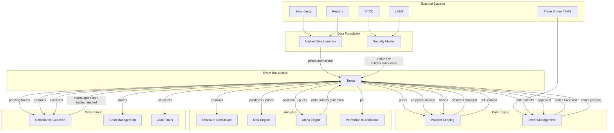
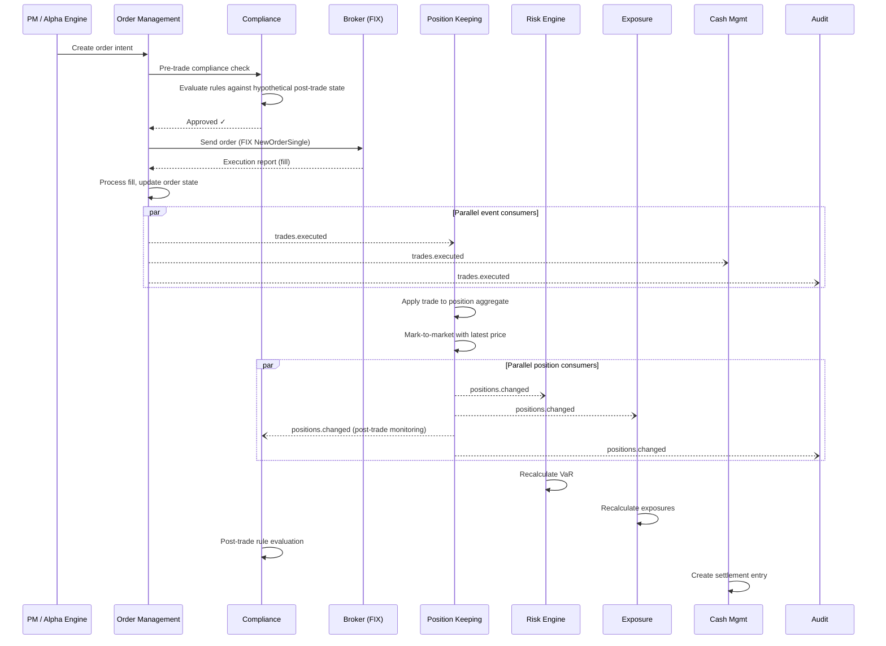
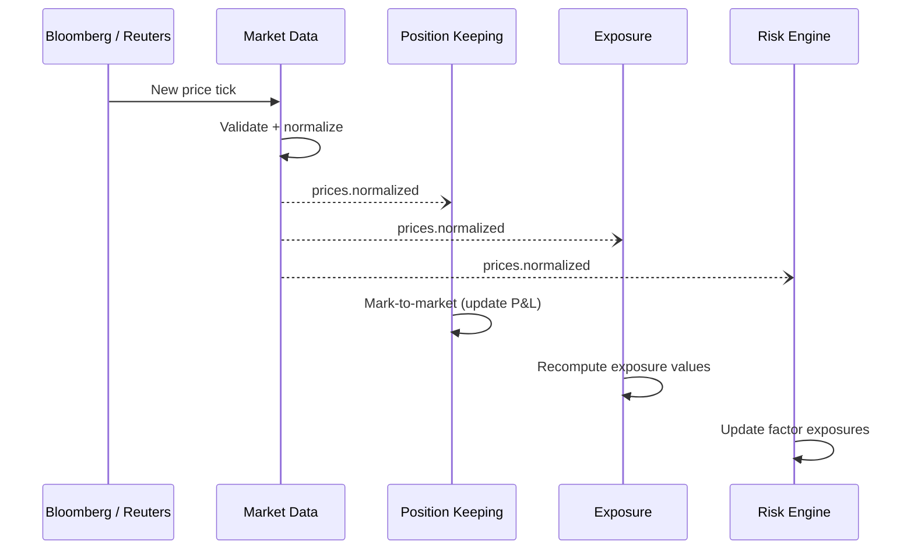
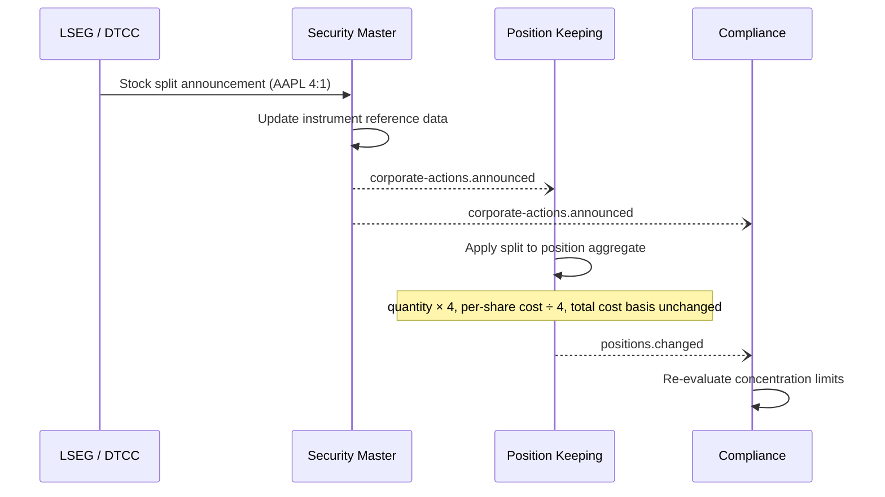
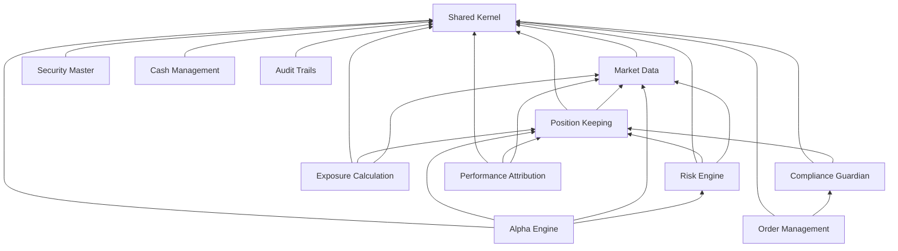
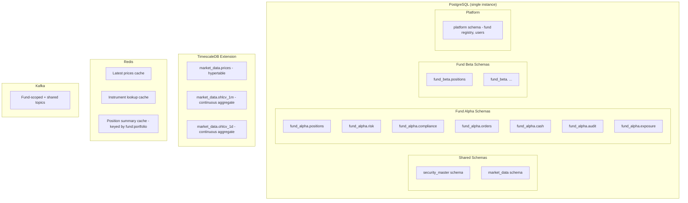
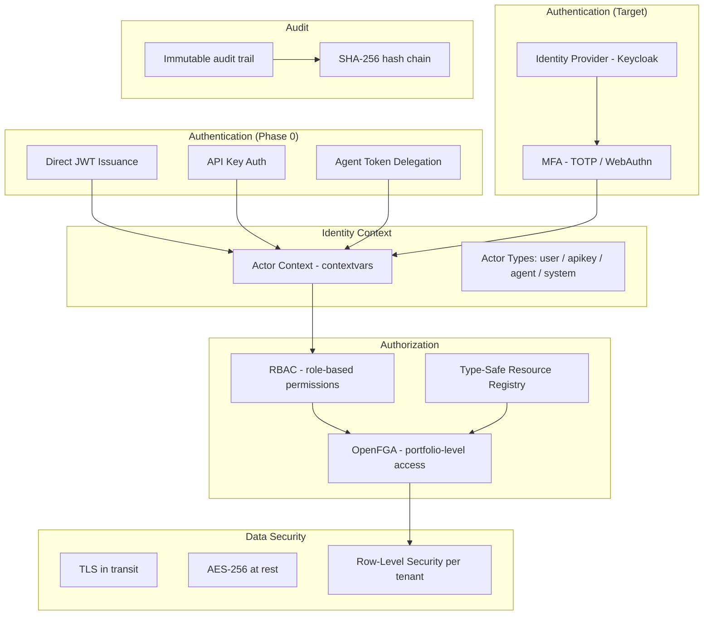

# Hedge Fund PM Desk Platform — System Overview

## Context & Problem

A portfolio manager's desk is the operational center of a hedge fund. The PM needs to see positions, P&L, and exposures in real time. They need to generate trade ideas, simulate their impact, route orders, and monitor compliance — all from a unified platform.

Most hedge funds cobble this together from vendor systems (Bloomberg Terminal, proprietary Excel sheets, third-party OMS) connected by manual processes and overnight batch jobs. The result is fragmented: data is stale, risk is computed hours after trades happen, and compliance checks are reactive instead of preventive.

This platform replaces that patchwork with a modular monolith — a single deployable system with strong internal boundaries, real-time event flow, and a unified data model. Each module is independently designed but communicates through well-defined interfaces and Kafka events.

## Tenancy Model

This platform is a **multi-fund, multi-portfolio** system. A single deployment serves multiple hedge funds, each with multiple portfolios (strategies, sub-funds, managed accounts). Funds are the top-level isolation boundary — they must never see each other's data. Portfolios are the operational partition within a fund.

| Question | Answer | Implication |
|---|---|---|
| How many funds? | Many (10–100+) per deployment | Fund-level data isolation is a hard requirement |
| How many portfolios per fund? | Many (10–100) | Portfolio is the partition key for positions, orders, risk, compliance |
| Who are the users? | PMs, analysts, risk managers, compliance officers, operations — a user may belong to multiple funds with different roles | RBAC per role, OpenFGA for fund membership + portfolio-level access |
| Data isolation? | Schema-per-fund with RLS as defense-in-depth | A query in Fund A physically cannot reach Fund B's tables |

### Fund Isolation Strategy: Schema-Per-Fund

Each fund gets its own set of PostgreSQL schemas. Shared reference data (instruments, market data) lives in common schemas accessible to all funds:

```
database: minihedge
├── fund_alpha/                     # Fund Alpha's private data
│   ├── fund_alpha.positions
│   ├── fund_alpha.orders
│   ├── fund_alpha.risk
│   ├── fund_alpha.compliance
│   ├── fund_alpha.cash
│   ├── fund_alpha.exposure
│   ├── fund_alpha.performance
│   ├── fund_alpha.alpha
│   └── fund_alpha.audit
├── fund_beta/                      # Fund Beta's private data
│   ├── fund_beta.positions
│   ├── fund_beta.orders
│   └── ...
├── shared/                         # Cross-fund reference data
│   ├── security_master.instruments
│   ├── security_master.instrument_identifiers
│   ├── market_data.prices
│   └── market_data.ohlcv_*
└── platform/                       # Platform management
    ├── platform.funds              # Fund registry
    ├── platform.users              # User directory
    └── platform.fund_memberships   # User → fund → role mapping
```

**Why schema-per-fund, not row-level security alone?** Schema-per-fund gives hard query boundaries — a bug in Fund A's position query cannot reach Fund B's tables because they live in different schemas. RLS on shared schemas (market_data, security_master) provides defense-in-depth for data that all funds can read. See [Multi-Tenancy](../../patterns/data-access/multi-tenancy.md) for the implementation pattern.

**Why not database-per-fund?** For most deployments (< 100 funds), separate databases add operational overhead (separate backups, connection pools, monitoring) without meaningful benefit over schema isolation. If a specific fund requires full database isolation (regulatory, contractual), the application code is the same — only the connection configuration changes.

### Kafka Topic Scoping

Kafka topics are fund-scoped using a naming convention. Each fund's events are isolated at the topic level — a consumer for Fund Alpha never sees Fund Beta's events:

```
fund-alpha.positions.changed      # Fund Alpha's position events
fund-alpha.trades.executed        # Fund Alpha's trade events
fund-beta.positions.changed       # Fund Beta's — separate topic, separate partitions

# Shared topics (no fund prefix)
prices.normalized                  # Market data — same prices for all funds
instruments.updated                # Reference data — shared
corporate-actions.announced        # Corporate actions — shared
```

**Partition keys within fund topics:** `portfolio_id` is the default partition key. This ensures all events for a portfolio land on the same partition, preserving ordering for position calculations, compliance checks, and P&L attribution.

### Fund Lifecycle

| Operation | What Happens |
|---|---|
| **Onboard fund** | Create fund schemas (one per module), run migrations, create fund admin user, create Kafka topics, seed compliance rules |
| **Offboard fund** | Export all data (regulatory retention), drop fund schemas, delete Kafka topics, revoke user access, retain audit trail in cold storage per retention policy |
| **User joins fund** | Create fund_membership record with role, grant access to fund schemas via search_path |
| **User leaves fund** | Revoke fund_membership, remove schema access, audit log entry |

## Multi-Asset Class Strategy

The platform supports all asset classes a hedge fund may trade. Rather than building a monolithic model that tries to represent every instrument type in a single structure, the design uses a **base-plus-extension pattern** where common attributes are shared and asset-class-specific attributes live in extension tables and strategy implementations.

### Supported Asset Classes

| Asset Class | Position Unit | Pricing Model | Settlement | Key Differences |
|---|---|---|---|---|
| **Equities** | Shares | Market price (bid/ask/mid) | T+1 (US), T+2 (EU) | FIFO lots, dividends, splits |
| **Fixed Income** | Par value | Clean price + accrued interest | T+1 | Coupon, maturity, duration, convexity |
| **FX (Spot & Forwards)** | Notional (base currency) | FX rate | T+2 (spot), custom (forward) | Two-leg settlement, no "shares" |
| **Listed Options** | Contracts (× multiplier) | Options model (Black-Scholes) | T+1 | Strike, expiry, Greeks, exercise/assignment |
| **Futures** | Contracts | Mark-to-market (daily settlement) | Daily margin | Variation margin, roll mechanics, expiry |
| **Swaps (IRS, CDS, TRS)** | Notional | Model-based (discounted cash flows) | Per reset schedule | OTC, fixed/floating legs, netting |
| **Private/Illiquid** | Units or shares | Quarterly NAV (fund admin) | Custom | Capital calls, distributions, no market price |

### Extensibility Pattern

The core insight: **every module needs an asset-class-aware extension point**, but the extension should not infect the base architecture. Each module defines a `Strategy` protocol that asset-class-specific implementations satisfy:

```
SecurityMaster:    InstrumentExtension protocol  → EquityExtension, BondExtension, OptionExtension
PositionKeeping:   PositionStrategy protocol     → EquityPositionStrategy, BondPositionStrategy, ...
RiskEngine:        RiskCalculator protocol       → EquityRiskCalculator, FixedIncomeRiskCalculator, ...
ExposureCalc:      ExposureNormalizer protocol   → equity=market_value, option=delta-adjusted, ...
CashManagement:    SettlementConvention protocol → T+1, T+2, daily margin, ...
Compliance:        ExposureAggregator protocol   → total AAPL = shares + options + TRS referencing AAPL
MarketData:        PriceDataShape protocol       → bid/ask/mid, yield/spread, vol surface, ...
```

### Implementation Phasing

| Phase | Asset Classes | Rationale |
|---|---|---|
| **Phase 0–1** | Equities only | Prove the architecture, establish all module boundaries |
| **Phase 2** | + Fixed Income | Most common after equities, required for multi-asset funds |
| **Phase 3** | + FX | Needed once portfolios hold multi-currency instruments |
| **Phase 4** | + Listed Options, Futures | Exchange-traded derivatives, standardized contracts |
| **Phase 5+** | + Swaps, Private/Illiquid | OTC instruments, complex pricing models |

Each new asset class requires: (1) security master extension table + model, (2) position strategy implementation, (3) risk calculator, (4) exposure normalizer, (5) settlement convention, (6) market data adapter. The base architecture and existing asset classes are untouched.

## System Architecture



## Module Inventory

### Data Foundation

These are leaf modules with no internal dependencies — they acquire and normalize external data for the rest of the platform.

| Module | Purpose | Primary Output |
|---|---|---|
| [Market Data Ingestion](market-data-ingestion.md) | Acquires prices from vendors, validates, normalizes, stores in TimescaleDB | `prices.normalized` events, OHLCV continuous aggregates |
| [Security Master](security-master.md) | Canonical instrument reference data, identifier resolution, corporate actions | `instruments.updated`, `corporate-actions.announced` events |

### Core Engine

The transactional heart of the system — where trades become positions.

| Module | Purpose | Primary Output |
|---|---|---|
| [Position Keeping](position-keeping.md) | Event-sourced positions, FIFO lot tracking, mark-to-market, P&L calculation | `positions.changed`, `pnl.updated` events |
| [Order Management](order-management.md) | Order lifecycle (draft → fill), FIX protocol integration, fill processing | `trades.executed` events |

### Analytics

Read-heavy modules that consume positions and prices to produce insight.

| Module | Purpose | Primary Output |
|---|---|---|
| [Exposure Calculation](exposure-calculation.md) | Real-time gross/net exposure by sector, country, currency | `exposures.updated` events |
| [Risk Engine](risk-engine.md) | VaR (historical simulation), stress testing, factor model decomposition | `risk.calculated` events |
| [Alpha Engine](alpha-engine.md) | What-if analysis, portfolio optimization (PyPortfolioOpt), order intent generation | `order-intents.generated` events |
| [Performance Attribution](performance-attribution.md) | Brinson-Fachler attribution, risk-based P&L decomposition | `attribution.calculated` events |

### Governance

Modules that enforce rules, track cash, and maintain the regulatory audit trail.

| Module | Purpose | Primary Output |
|---|---|---|
| [Compliance Guardian](compliance-guardian.md) | Pre-trade blocking, post-trade monitoring, data-driven rule engine | `trades.approved`, `trades.rejected`, `compliance.violations` events |
| [Cash Management](cash-management.md) | Settlement tracking (T+1/T+2), multi-currency cash positions, cash projection | `cash.projected` events |
| [Audit Trails](audit-trails.md) | Immutable, tamper-evident audit log for all system actions | None (terminal consumer) |

## Event Flow

### Trade Lifecycle (Happy Path)



### Price Update Flow



### Corporate Action Flow



## Kafka Topic Map

Fund-specific topics use the `{fund_slug}.` prefix (see [Kafka Topic Scoping](#kafka-topic-scoping) above). Shared topics have no prefix. The table below shows the logical topic name — prepend the fund slug for fund-scoped topics.

| Topic | Scope | Producer | Consumers | Partition Key | Retention |
|---|---|---|---|---|---|
| `{fund}.trades.executed` | Fund | Order Management | Positions, Cash, Risk, Exposure, Audit | `instrument_id` ¹ | 30 days |
| `{fund}.trades.pending` | Fund | Order Management | Compliance | `portfolio_id` | 7 days |
| `{fund}.trades.approved` | Fund | Compliance | Order Management | `portfolio_id` | 7 days |
| `{fund}.trades.rejected` | Fund | Compliance | OMS, Risk, Exposure, Audit | `portfolio_id` | 30 days |
| `{fund}.positions.changed` | Fund | Positions | Risk, Exposure, Compliance, Audit | `portfolio_id:instrument_id` | 30 days |
| `{fund}.pnl.updated` | Fund | Positions | Performance Attribution, Audit | `portfolio_id` | 30 days |
| `{fund}.order-intents.generated` | Fund | Alpha Engine | Order Management | `portfolio_id` | 7 days |
| `{fund}.exposures.updated` | Fund | Exposure | Alpha, Risk | `portfolio_id` | 7 days |
| `{fund}.risk.calculated` | Fund | Risk Engine | Alpha, Compliance | `portfolio_id` | 30 days |
| `{fund}.risk.breach` | Fund | Risk Engine | Compliance, Alerting | `portfolio_id` | 90 days |
| `{fund}.compliance.violations` | Fund | Compliance | Audit | `portfolio_id` | 90 days |
| `{fund}.orders.created` | Fund | OMS | Audit | `portfolio_id` | 30 days |
| `{fund}.orders.filled` | Fund | OMS | Positions, Cash Management, Audit | `portfolio_id` | 30 days |
| `{fund}.cash.projected` | Fund | Cash Management | — | `portfolio_id` | 7 days |
| `{fund}.cash.settlement_due` | Fund | Cash Management | Operations, Alerting | `portfolio_id` | 30 days |
| `{fund}.cash.balance_warning` | Fund | Cash Management | Risk, Alerting | `portfolio_id` | 30 days |
| `{fund}.attribution.calculated` | Fund | Performance | — | `portfolio_id` | 30 days |
| `prices.normalized` | Shared | Market Data | Positions, Risk, Exposure, Alpha | `instrument_id` | 7 days |
| `instruments.updated` | Shared | Security Master | Market Data, Positions | `instrument_id` | 30 days |
| `corporate-actions.announced` | Shared | Security Master | Positions, Compliance, Cash Mgmt | `instrument_id` | 90 days |
| `market-data.status` | Shared | Market Data | Monitoring | `source` | 7 days |

> ¹ `trades.executed` uses `instrument_id` as partition key — this ensures all fills for the same instrument are ordered, matching the OMS code that publishes to this topic.

## Real-Time vs. EOD Processing Boundary

Not everything should run in real time. Some calculations are expensive, some require finalized data, and some are only meaningful at a point-in-time snapshot. The system draws an explicit boundary:

### Real-Time (Event-Driven, Continuous)

These react to every event as it arrives — sub-second latency is the target:

| Capability | Trigger | Why Real-Time |
|---|---|---|
| Position updates | `trades.executed`, `corporate-actions.announced` | PM needs current positions to make decisions |
| Mark-to-market P&L | `prices.normalized` | Stale P&L leads to bad trading decisions |
| Gross/net exposure | `positions.changed` | Exposure limits are guardrails — must be current |
| Pre-trade compliance | `trades.pending` | Blocking check — cannot wait for EOD |
| Post-trade compliance | `positions.changed` | Violations must be detected immediately |
| Cash settlement entries | `trades.executed` | Settlement ladder must reflect intraday activity |

### End-of-Day Batch (Scheduled, Sequential)

These run once per day after market close, using finalized data:

| Capability | Why EOD | Dependency |
|---|---|---|
| Price finalization | Official close prices replace intraday ticks | Market close detected |
| Position reconciliation | Matches internal positions against prime broker statement | Broker file delivery (usually T+0 evening) |
| NAV calculation | Requires finalized prices and reconciled positions | Price finalization + reconciliation |
| P&L lock | Daily P&L becomes the official record for reporting | NAV calculation |
| Full VaR recalculation | Historical simulation VaR is compute-intensive, uses finalized prices | Price finalization |
| Performance attribution | Brinson-Fachler attribution requires finalized daily returns | P&L lock |
| Compliance daily report | Point-in-time snapshot of all rule evaluations | Position reconciliation |
| Audit digest | Daily summary hash for tamper evidence | All EOD steps complete |

### The Grey Zone

Some capabilities run in both modes:

- **Risk metrics**: Intraday VaR uses approximations (delta-normal, last known covariances). EOD VaR uses full historical simulation with finalized data. The intraday number is a directional guide; the EOD number is the official risk figure.
- **Cash projections**: Intraday projections are updated with each trade. EOD projections incorporate settlement confirmations and are the basis for margin calls.

See [EOD Processing](eod-processing.md) for the sequential batch workflow.

## Module Dependency Graph



**Dependency rules (enforced by Tach):**
- Data foundation modules (Market Data, Security Master) depend only on the shared kernel
- Core engine modules (Positions) depend on data foundation
- Analytics modules depend on core engine + data foundation
- Governance modules depend on core engine at most
- Audit Trails depends on nothing — it is a terminal event consumer
- **No circular dependencies**

### Tach Configuration

> **Note:** Tach v0.34+ uses a standalone `tach.toml` file with bare keys — not a `[tool.tach]` wrapper inside `pyproject.toml`. Module paths are fully qualified from the source root.

```toml
# tach.toml — standalone file in project root
exact = true
exclude = ["tests"]
source_roots = ["."]

[[modules]]
path = "app.shared"
depends_on = []

[[modules]]
path = "app.modules.market_data"
depends_on = ["app.shared"]

[[modules]]
path = "app.modules.security_master"
depends_on = ["app.shared"]

[[modules]]
path = "app.modules.positions"
depends_on = ["app.shared", "app.modules.market_data"]

[[modules]]
path = "app.modules.order_management"
depends_on = ["app.shared", "app.modules.compliance", "app.modules.security_master"]

[[modules]]
path = "app.modules.exposure"
depends_on = ["app.shared", "app.modules.positions", "app.modules.market_data", "app.modules.security_master"]

[[modules]]
path = "app.modules.risk"
depends_on = ["app.shared", "app.modules.positions", "app.modules.market_data", "app.modules.security_master"]

[[modules]]
path = "app.modules.alpha"
depends_on = ["app.shared", "app.modules.positions", "app.modules.market_data", "app.modules.risk", "app.modules.exposure", "app.modules.security_master"]

[[modules]]
path = "app.modules.compliance"
depends_on = ["app.shared", "app.modules.positions", "app.modules.market_data", "app.modules.security_master"]

[[modules]]
path = "app.modules.performance"
depends_on = ["app.shared", "app.modules.positions", "app.modules.market_data", "app.modules.risk"]

[[modules]]
path = "app.modules.cash"
depends_on = ["app.shared", "app.modules.security_master", "app.modules.market_data"]

[[modules]]
path = "app.modules.audit"
depends_on = ["app.shared"]
```

## Data Architecture

### Polyglot Persistence



All modules share a single PostgreSQL instance. **Shared reference data** (security master, market data) lives in common schemas accessible to all funds. **Fund-specific data** (positions, orders, risk, compliance, cash, audit) lives in per-fund schemas — one set of module schemas per fund. See [Tenancy Model](#tenancy-model) for the isolation strategy.

TimescaleDB hypertables handle time-series data. Redis caches hot-path lookups (keyed by `fund:portfolio:instrument` for fund isolation). Kafka provides the event backbone with fund-scoped topics.

This is a pragmatic starting point. Modules that outgrow the shared instance (e.g., market data at very high tick rates) can be extracted to a separate database without changing application code — only the connection configuration changes.

### Schema Isolation

Each module owns its schema exclusively:
- **Write access**: only the owning module writes to its schema
- **Read access**: other modules read via the module's Protocol interface, never via direct SQL against another module's tables
- **Cross-module data**: flows through Kafka events or synchronous interface calls

## Security Architecture



### Current Implementation (Phase 0)

| Layer | Implementation | Status |
|---|---|---|
| **Authentication** | Direct JWT issuance (dev-mode `/auth/token`), API key auth (`ApiKey` header / `X-API-Key`), Agent token delegation (`/auth/agent-token` — requires `funds:manage` permission) | Implemented |
| **Actor context** | `RequestContext` via `contextvars` — carries actor ID, actor type, fund slug, roles, permissions, delegation chain. Strict mode raises on missing context; explicit system fallback for event handlers | Implemented |
| **Coarse authorization** | RBAC with 6 roles (admin, portfolio_manager, analyst, risk_manager, compliance, viewer) mapped to 8 permissions. `require_permission()` FastAPI dependency | Implemented |
| **Fine-grained authorization** | OpenFGA with type-safe resource registry. `require_access()` generic dependency. Startup validation against JSON model. Portfolio-level access checks (can_view, can_trade, can_manage) | Implemented |
| **JWT security** | HS256 signing. Dev secret rejected in non-local environments via Pydantic validator. 60-min expiry | Implemented |
| **Data isolation** | Application-level via fund_slug in request context. No schema-per-fund or RLS yet | Partial |

### Target State

| Layer | Implementation |
|---|---|
| **Authentication** | Keycloak with MFA (TOTP). JWT access tokens (15 min TTL). API keys for service accounts with bcrypt/argon2 hashing |
| **Coarse authorization** | RBAC roles: admin, portfolio_manager, analyst, risk_manager, compliance, viewer |
| **Fine-grained authorization** | OpenFGA for portfolio-level access with automated tuple management on resource creation |
| **Data isolation** | Schema-per-fund with RLS as defense-in-depth (see [Tenancy Model](#tenancy-model)) |
| **Token security** | RS256 signing with key rotation, JTI-based revocation list (Redis-backed), short-lived tokens |
| **Encryption** | TLS 1.3 for all connections, AES-256 for data at rest, PostgreSQL `pgcrypto` for sensitive fields |
| **Audit** | Every significant action logged with actor, action, resource, timestamp, and hash chain |

## Operational Dashboard Metrics

| Metric | Source | Alert Threshold |
|---|---|---|
| Market data feed freshness | Market Data module | > 5 min stale → P1 |
| Position reconciliation breaks | Position Keeping | Any break → P2 |
| Kafka consumer lag (all groups) | Kafka | > 10K messages → P2 |
| API error rate | FastAPI middleware | > 5% → P2 |
| API p99 latency | FastAPI middleware | > 2s → P3 |
| Compliance violations | Compliance Guardian | Any violation → P2 |
| VaR breach | Risk Engine | VaR > limit → P1 |
| Cash projection negative | Cash Management | Projected negative balance → P3 |
| Audit hash chain integrity | Audit Trails | Any break → P1 |
| Order fill rate | Order Management | < 95% → P3 |

## Implementation Roadmap

### Phase 0: Skeleton & Developer Experience (Weeks 1–2)

**Goal:** Prove the architecture works end-to-end. One vertical slice from simulated prices through positions to API responses.

| Deliverable | Modules | Description |
|---|---|---|
| Project scaffold | — | pyproject.toml (uv), Docker Compose (TimescaleDB + Redis), Makefile, CI-ready quality tooling |
| Shared kernel | Shared | Base event bus (in-process), domain errors, async database setup, structured logging, semantic types |
| Security Master (minimal) | Security Master | Instrument model, repository, seed data (10 instruments), basic CRUD routes |
| Market Data Simulator | Market Data | GBM price simulator with Cholesky-correlated sectors, in-memory cache, persistence |
| Position Keeping (core) | Positions | Event-sourced aggregate, FIFO lot matching, trade handler, mark-to-market handler, read model |
| Module enforcement | — | Tach configuration enforcing dependency rules across all modules |
| Test foundation | — | Unit tests (aggregate, event bus, simulator), integration tests (testcontainers PostgreSQL) |

**Exit criteria:** `make up && make run` starts the system. Live simulated prices flow, trades execute via API, positions and P&L update. `make check` passes all quality gates (lint, typecheck, tach, tests).

### Phase 1: Foundation & Core Data (Months 1–3)

**Goal:** Data flows, positions work, basic API.

| Deliverable | Modules | Description |
|---|---|---|
| Infrastructure | — | Docker Compose, PostgreSQL + TimescaleDB, Kafka, CI/CD pipeline |
| Shared kernel | — | Money, InstrumentId, base event types, session factory |
| Market Data Ingestion | Market Data | Bloomberg adapter, price validation, TimescaleDB storage, `prices.normalized` events |
| Security Master | Security Master | Instrument CRUD, identifier resolution, basic corporate actions |
| Position Keeping | Positions | Event store, trade handler, FIFO lots, mark-to-market, `positions.changed` events |
| Basic API | FastAPI | Price queries, position queries, manual trade entry |

**Exit criteria:** Can ingest live prices, enter trades manually, see positions and P&L update in real time.

### Phase 2: Trading & Compliance (Months 4–6)

**Goal:** Automated order flow with compliance gating.

| Deliverable | Modules | Description |
|---|---|---|
| Order Management | OMS | Order state machine, basic order routing (mock broker) |
| FIX Integration | OMS | FIX adapter for broker connectivity |
| Compliance Guardian | Compliance | Rule engine, pre-trade checks, post-trade monitoring |
| Exposure Calculation | Exposure | Real-time gross/net exposure, multi-currency |
| PM Dashboard | FastAPI + Frontend | Unified view of positions, P&L, exposures, compliance status |

**Exit criteria:** PM can generate orders, compliance auto-blocks violating trades, exposures update in real time.

### Phase 3: Analytics & Risk (Months 7–9)

**Goal:** Forward-looking risk and performance measurement.

| Deliverable | Modules | Description |
|---|---|---|
| Risk Engine | Risk | Historical VaR, parametric VaR, stress testing (4 scenarios) |
| Factor Models | Risk | Factor decomposition (market, size, value, momentum, volatility) |
| Alpha Engine | Alpha | What-if analysis, portfolio optimization, order intent generation |
| Performance Attribution | Performance | Brinson-Fachler, risk-based P&L attribution |
| Cash Management | Cash | Settlement tracking, cash projections |

**Exit criteria:** VaR computed daily, PM can run what-if scenarios, performance attribution available.

### Phase 4: Hardening & Operations (Months 10–12)

**Goal:** Production-ready with full auditability.

| Deliverable | Modules | Description |
|---|---|---|
| Audit Trails | Audit | Hash chain, 7-year retention, tamper detection |
| Reconciliation | Positions | Daily broker reconciliation, break investigation workflow — see [Reconciliation](../../patterns/data-access/reconciliation.md) |
| Observability | Infrastructure | Prometheus metrics, Grafana dashboards, Jaeger tracing, alerting |
| Security hardening | Infrastructure | MFA enforcement, OpenFGA portfolio access, encryption at rest |
| Disaster recovery | Infrastructure | Backup/restore procedures, failover testing — see [Disaster Recovery](../../infrastructure/disaster-recovery.md) |

**Exit criteria:** System is auditable, observable, and resilient. Ready for production use.

### Phase 5: Continuous Enhancement (Ongoing)

- Alternative data integration (sentiment, satellite, web scraping)
- ML model integration for alpha generation — see [Alpha Engine AI/ML path](alpha-engine.md#aiml-integration-path-phase-5)
- Advanced risk models (Monte Carlo VaR, CVaR)
- Real-time P&L attribution (intraday, not just daily)
- Additional asset class implementations per the [Multi-Asset Class Strategy](#multi-asset-class-strategy) phasing plan

## Technology Stack Summary

| Layer | Technology |
|---|---|
| **Language** | Python 3.12+ |
| **API Framework** | FastAPI |
| **ORM** | SQLAlchemy 2.0 (async) |
| **Migrations** | Alembic |
| **Validation** | Pydantic v2 |
| **Transactional DB** | PostgreSQL 16 |
| **Time-Series** | TimescaleDB |
| **Event Streaming** | Apache Kafka (KRaft) |
| **Schema Governance** | Confluent Schema Registry (Avro) |
| **Cache** | Redis |
| **Authorization** | RBAC + OpenFGA |
| **Identity** | Keycloak (OAuth 2.0 / OIDC) |
| **Module Enforcement** | Tach |
| **Type Checking** | mypy (strict) |
| **Linting** | ruff |
| **Testing** | pytest + testcontainers |
| **Observability** | Prometheus + Grafana + Jaeger (OpenTelemetry) |
| **Local Infra** | Docker Compose |
| **Quant Libraries** | NumPy, Pandas, PyPortfolioOpt |

## Related Documents

- [Modular Monolith](../../principles/modular-monolith.md) — the architectural approach
- [Event-Driven Architecture](../../principles/event-driven-architecture.md) — Kafka as central nervous system
- [CQRS & Event Sourcing](../../principles/cqrs-event-sourcing.md) — position keeping strategy
- [Bounded Contexts](../../principles/bounded-contexts.md) — how module boundaries were drawn
- [EOD Processing](eod-processing.md) — end-of-day batch processing workflow
- [Docker Compose Patterns](../../infrastructure/docker-compose-patterns.md) — local development setup
- [Market Data Simulator](market-data-simulator.md) — local development market data generator
- [CI/CD Patterns](../../infrastructure/ci-cd-patterns.md) — build and deployment pipeline
- [Reconciliation](../../patterns/data-access/reconciliation.md) — position and cash reconciliation against external parties
- [Disaster Recovery & Data Retention](../../infrastructure/disaster-recovery.md) — backup, archival, and recovery procedures
