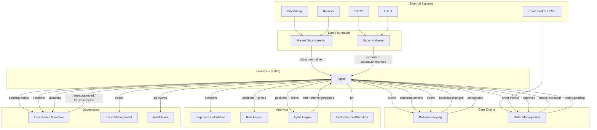
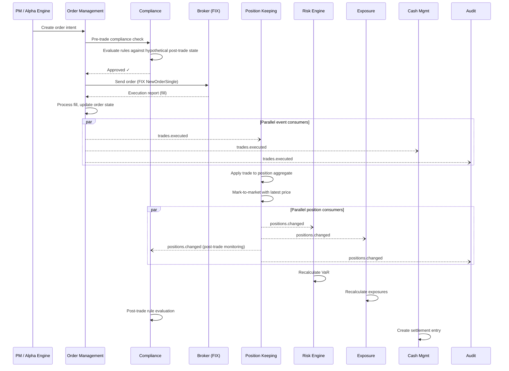
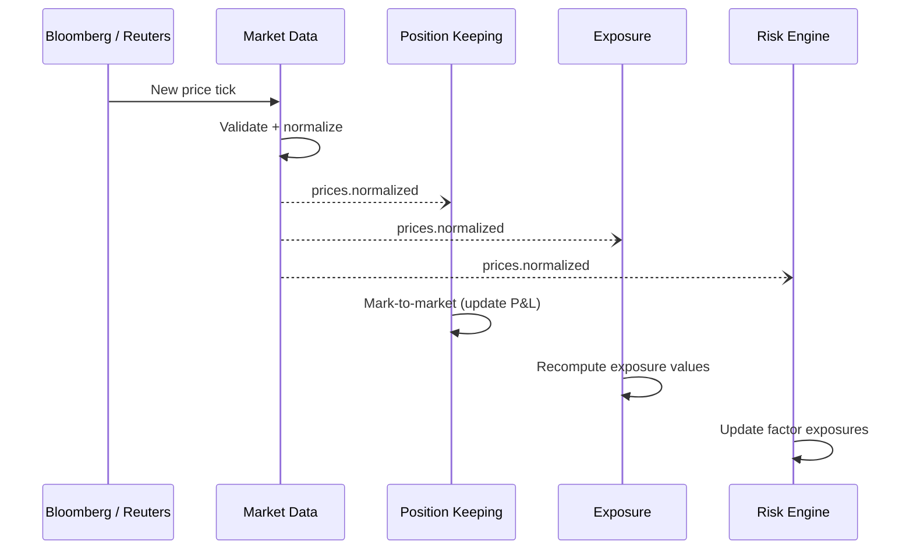
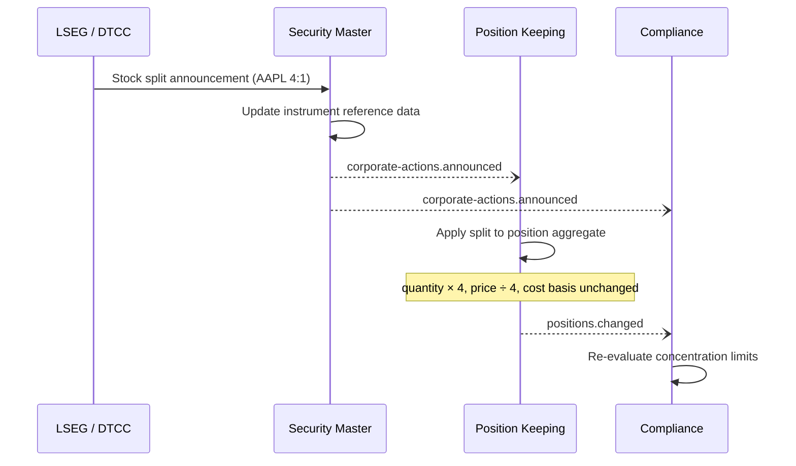
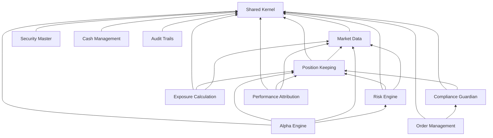
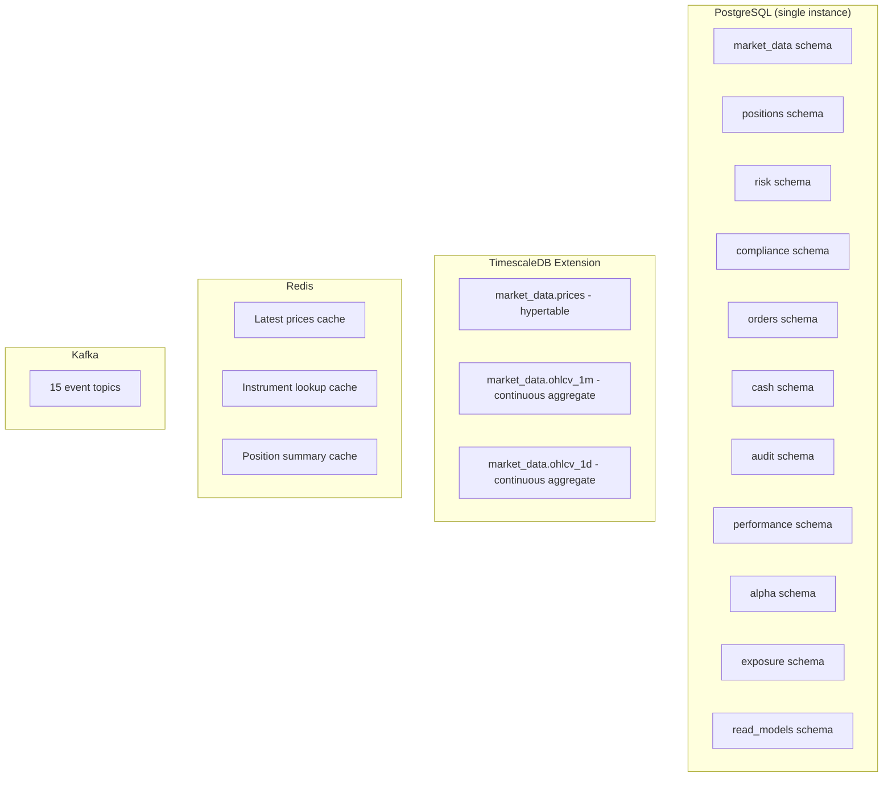
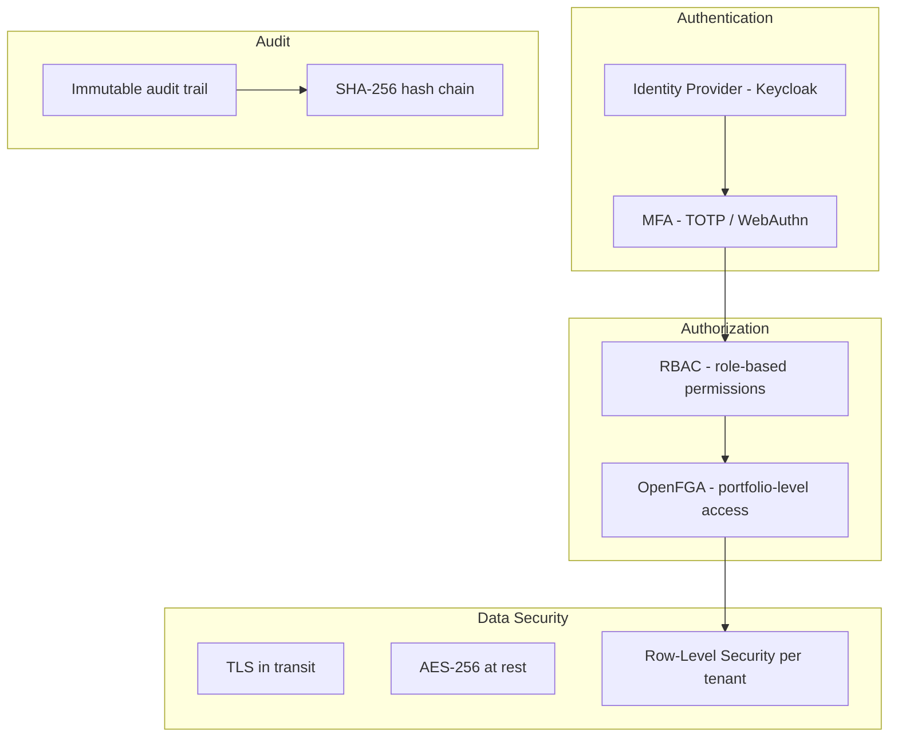

# Hedge Fund PM Desk Platform — System Overview

## Context & Problem

A portfolio manager's desk is the operational center of a hedge fund. The PM needs to see positions, P&L, and exposures in real time. They need to generate trade ideas, simulate their impact, route orders, and monitor compliance — all from a unified platform.

Most hedge funds cobble this together from vendor systems (Bloomberg Terminal, proprietary Excel sheets, third-party OMS) connected by manual processes and overnight batch jobs. The result is fragmented: data is stale, risk is computed hours after trades happen, and compliance checks are reactive instead of preventive.

This platform replaces that patchwork with a modular monolith — a single deployable system with strong internal boundaries, real-time event flow, and a unified data model. Each module is independently designed but communicates through well-defined interfaces and Kafka events.

## System Architecture



## Module Inventory

### Data Foundation

These are leaf modules with no internal dependencies — they acquire and normalize external data for the rest of the platform.

| Module | Purpose | Primary Output |
|---|---|---|
| [Market Data Ingestion](market-data-ingestion.md) | Acquires prices from vendors, validates, normalizes, stores in TimescaleDB | `prices.normalized` events, OHLCV continuous aggregates |
| [Security Master](security-master.md) | Canonical instrument reference data, identifier resolution, corporate actions | `instruments.updated`, `corporate-actions.announced` events |

### Core Engine

The transactional heart of the system — where trades become positions.

| Module | Purpose | Primary Output |
|---|---|---|
| [Position Keeping](position-keeping.md) | Event-sourced positions, FIFO lot tracking, mark-to-market, P&L calculation | `positions.changed`, `pnl.updated` events |
| [Order Management](order-management.md) | Order lifecycle (draft → fill), FIX protocol integration, fill processing | `trades.executed` events |

### Analytics

Read-heavy modules that consume positions and prices to produce insight.

| Module | Purpose | Primary Output |
|---|---|---|
| [Exposure Calculation](exposure-calculation.md) | Real-time gross/net exposure by sector, country, currency | `exposures.updated` events |
| [Risk Engine](risk-engine.md) | VaR (historical simulation), stress testing, factor model decomposition | `risk.calculated` events |
| [Alpha Engine](alpha-engine.md) | What-if analysis, portfolio optimization (PyPortfolioOpt), order intent generation | `order-intents.generated` events |
| [Performance Attribution](performance-attribution.md) | Brinson-Fachler attribution, risk-based P&L decomposition | `attribution.calculated` events |

### Governance

Modules that enforce rules, track cash, and maintain the regulatory audit trail.

| Module | Purpose | Primary Output |
|---|---|---|
| [Compliance Guardian](compliance-guardian.md) | Pre-trade blocking, post-trade monitoring, data-driven rule engine | `trades.approved`, `trades.rejected`, `compliance.violations` events |
| [Cash Management](cash-management.md) | Settlement tracking (T+1/T+2), multi-currency cash positions, cash projection | `cash.projected` events |
| [Audit Trails](audit-trails.md) | Immutable, tamper-evident audit log for all system actions | None (terminal consumer) |

## Event Flow

### Trade Lifecycle (Happy Path)



### Price Update Flow



### Corporate Action Flow



## Kafka Topic Map

| Topic | Producer | Consumers | Partition Key | Retention |
|---|---|---|---|---|
| `prices.normalized` | Market Data | Positions, Risk, Exposure, Alpha | `instrument_id` | 7 days |
| `instruments.updated` | Security Master | Market Data, Positions | `instrument_id` | 30 days |
| `corporate-actions.announced` | Security Master | Positions, Compliance | `instrument_id` | 90 days |
| `trades.executed` | Order Management | Positions, Cash, Audit | `portfolio_id` | 30 days |
| `trades.pending` | Order Management | Compliance | `portfolio_id` | 7 days |
| `trades.approved` | Compliance | Order Management | `portfolio_id` | 7 days |
| `trades.rejected` | Compliance | Order Management, Audit | `portfolio_id` | 30 days |
| `positions.changed` | Positions | Risk, Exposure, Compliance, Audit | `portfolio_id:instrument_id` | 30 days |
| `pnl.updated` | Positions | Performance Attribution, Audit | `portfolio_id` | 30 days |
| `order-intents.generated` | Alpha Engine | Order Management | `portfolio_id` | 7 days |
| `exposures.updated` | Exposure | Alpha, Risk | `portfolio_id` | 7 days |
| `risk.calculated` | Risk | Alpha | `portfolio_id` | 30 days |
| `compliance.violations` | Compliance | Audit | `portfolio_id` | 90 days |
| `cash.projected` | Cash Management | — | `portfolio_id` | 7 days |
| `attribution.calculated` | Performance | — | `portfolio_id` | 30 days |
| `market-data.status` | Market Data | Monitoring | `source` | 7 days |

## Module Dependency Graph



**Dependency rules (enforced by Tach):**
- Data foundation modules (Market Data, Security Master) depend only on the shared kernel
- Core engine modules (Positions) depend on data foundation
- Analytics modules depend on core engine + data foundation
- Governance modules depend on core engine at most
- Audit Trails depends on nothing — it is a terminal event consumer
- **No circular dependencies**

### Tach Configuration

```toml
[tool.tach]
root = "app"
exact = true

[[tool.tach.modules]]
path = "shared"
depends_on = []

[[tool.tach.modules]]
path = "modules.market_data"
depends_on = ["shared"]

[[tool.tach.modules]]
path = "modules.security_master"
depends_on = ["shared"]

[[tool.tach.modules]]
path = "modules.positions"
depends_on = ["shared", "modules.market_data"]

[[tool.tach.modules]]
path = "modules.order_management"
depends_on = ["shared", "modules.compliance"]

[[tool.tach.modules]]
path = "modules.exposure"
depends_on = ["shared", "modules.positions", "modules.market_data"]

[[tool.tach.modules]]
path = "modules.risk"
depends_on = ["shared", "modules.positions", "modules.market_data"]

[[tool.tach.modules]]
path = "modules.alpha"
depends_on = ["shared", "modules.positions", "modules.market_data", "modules.risk"]

[[tool.tach.modules]]
path = "modules.compliance"
depends_on = ["shared", "modules.positions"]

[[tool.tach.modules]]
path = "modules.performance"
depends_on = ["shared", "modules.positions", "modules.market_data"]

[[tool.tach.modules]]
path = "modules.cash"
depends_on = ["shared"]

[[tool.tach.modules]]
path = "modules.audit"
depends_on = ["shared"]
```

## Data Architecture

### Polyglot Persistence



All modules share a single PostgreSQL instance but use separate schemas — one schema per bounded context. TimescaleDB hypertables handle time-series data. Redis caches hot-path lookups. Kafka provides the event backbone.

This is a pragmatic starting point. Modules that outgrow the shared instance (e.g., market data at very high tick rates) can be extracted to a separate database without changing application code — only the connection configuration changes.

### Schema Isolation

Each module owns its schema exclusively:
- **Write access**: only the owning module writes to its schema
- **Read access**: other modules read via the module's Protocol interface, never via direct SQL against another module's tables
- **Cross-module data**: flows through Kafka events or synchronous interface calls

## Security Architecture



| Layer | Implementation |
|---|---|
| **Authentication** | Keycloak with MFA (TOTP). JWT access tokens (15 min TTL). |
| **Coarse authorization** | RBAC roles: admin, portfolio_manager, analyst, risk_manager, compliance, viewer |
| **Fine-grained authorization** | OpenFGA for portfolio-level access: "can user X trade portfolio Y?" |
| **Encryption** | TLS 1.3 for all connections, AES-256 for data at rest, PostgreSQL `pgcrypto` for sensitive fields |
| **Audit** | Every significant action logged with actor, action, resource, timestamp, and hash chain |

## Operational Dashboard Metrics

| Metric | Source | Alert Threshold |
|---|---|---|
| Market data feed freshness | Market Data module | > 5 min stale → P1 |
| Position reconciliation breaks | Position Keeping | Any break → P2 |
| Kafka consumer lag (all groups) | Kafka | > 10K messages → P2 |
| API error rate | FastAPI middleware | > 5% → P2 |
| API p99 latency | FastAPI middleware | > 2s → P3 |
| Compliance violations | Compliance Guardian | Any violation → P2 |
| VaR breach | Risk Engine | VaR > limit → P1 |
| Cash projection negative | Cash Management | Projected negative balance → P3 |
| Audit hash chain integrity | Audit Trails | Any break → P1 |
| Order fill rate | Order Management | < 95% → P3 |

## Implementation Roadmap

### Phase 1: Foundation & Core Data (Months 1–3)

**Goal:** Data flows, positions work, basic API.

| Deliverable | Modules | Description |
|---|---|---|
| Infrastructure | — | Docker Compose, PostgreSQL + TimescaleDB, Kafka, CI/CD pipeline |
| Shared kernel | — | Money, InstrumentId, base event types, session factory |
| Market Data Ingestion | Market Data | Bloomberg adapter, price validation, TimescaleDB storage, `prices.normalized` events |
| Security Master | Security Master | Instrument CRUD, identifier resolution, basic corporate actions |
| Position Keeping | Positions | Event store, trade handler, FIFO lots, mark-to-market, `positions.changed` events |
| Basic API | FastAPI | Price queries, position queries, manual trade entry |

**Exit criteria:** Can ingest live prices, enter trades manually, see positions and P&L update in real time.

### Phase 2: Trading & Compliance (Months 4–6)

**Goal:** Automated order flow with compliance gating.

| Deliverable | Modules | Description |
|---|---|---|
| Order Management | OMS | Order state machine, basic order routing (mock broker) |
| FIX Integration | OMS | FIX adapter for broker connectivity |
| Compliance Guardian | Compliance | Rule engine, pre-trade checks, post-trade monitoring |
| Exposure Calculation | Exposure | Real-time gross/net exposure, multi-currency |
| PM Dashboard | FastAPI + Frontend | Unified view of positions, P&L, exposures, compliance status |

**Exit criteria:** PM can generate orders, compliance auto-blocks violating trades, exposures update in real time.

### Phase 3: Analytics & Risk (Months 7–9)

**Goal:** Forward-looking risk and performance measurement.

| Deliverable | Modules | Description |
|---|---|---|
| Risk Engine | Risk | Historical VaR, parametric VaR, stress testing (4 scenarios) |
| Factor Models | Risk | Factor decomposition (market, size, value, momentum, volatility) |
| Alpha Engine | Alpha | What-if analysis, portfolio optimization, order intent generation |
| Performance Attribution | Performance | Brinson-Fachler, risk-based P&L attribution |
| Cash Management | Cash | Settlement tracking, cash projections |

**Exit criteria:** VaR computed daily, PM can run what-if scenarios, performance attribution available.

### Phase 4: Hardening & Operations (Months 10–12)

**Goal:** Production-ready with full auditability.

| Deliverable | Modules | Description |
|---|---|---|
| Audit Trails | Audit | Hash chain, 7-year retention, tamper detection |
| Reconciliation | Positions | Daily broker reconciliation, break investigation workflow |
| Observability | Infrastructure | Prometheus metrics, Grafana dashboards, Jaeger tracing, alerting |
| Security hardening | Infrastructure | MFA enforcement, OpenFGA portfolio access, encryption at rest |
| Disaster recovery | Infrastructure | Backup/restore procedures, failover testing |

**Exit criteria:** System is auditable, observable, and resilient. Ready for production use.

### Phase 5: Continuous Enhancement (Ongoing)

- Alternative data integration (sentiment, satellite, web scraping)
- ML model integration for alpha generation
- Advanced risk models (Monte Carlo VaR, CVaR)
- Multi-asset class support (fixed income, derivatives)
- Real-time P&L attribution (intraday, not just daily)

## Technology Stack Summary

| Layer | Technology |
|---|---|
| **Language** | Python 3.12+ |
| **API Framework** | FastAPI |
| **ORM** | SQLAlchemy 2.0 (async) |
| **Migrations** | Alembic |
| **Validation** | Pydantic v2 |
| **Transactional DB** | PostgreSQL 16 |
| **Time-Series** | TimescaleDB |
| **Event Streaming** | Apache Kafka (KRaft) |
| **Schema Governance** | Confluent Schema Registry (Avro) |
| **Cache** | Redis |
| **Authorization** | RBAC + OpenFGA |
| **Identity** | Keycloak (OAuth 2.0 / OIDC) |
| **Module Enforcement** | Tach |
| **Type Checking** | mypy (strict) |
| **Linting** | ruff |
| **Testing** | pytest + testcontainers |
| **Observability** | Prometheus + Grafana + Jaeger (OpenTelemetry) |
| **Local Infra** | Docker Compose |
| **Quant Libraries** | NumPy, Pandas, PyPortfolioOpt |

## Related Documents

- [Modular Monolith](../../principles/modular-monolith.md) — the architectural approach
- [Event-Driven Architecture](../../principles/event-driven-architecture.md) — Kafka as central nervous system
- [CQRS & Event Sourcing](../../principles/cqrs-event-sourcing.md) — position keeping strategy
- [Bounded Contexts](../../principles/bounded-contexts.md) — how module boundaries were drawn
- [Docker Compose Patterns](../../infrastructure/docker-compose-patterns.md) — local development setup
- [CI/CD Patterns](../../infrastructure/ci-cd-patterns.md) — build and deployment pipeline
