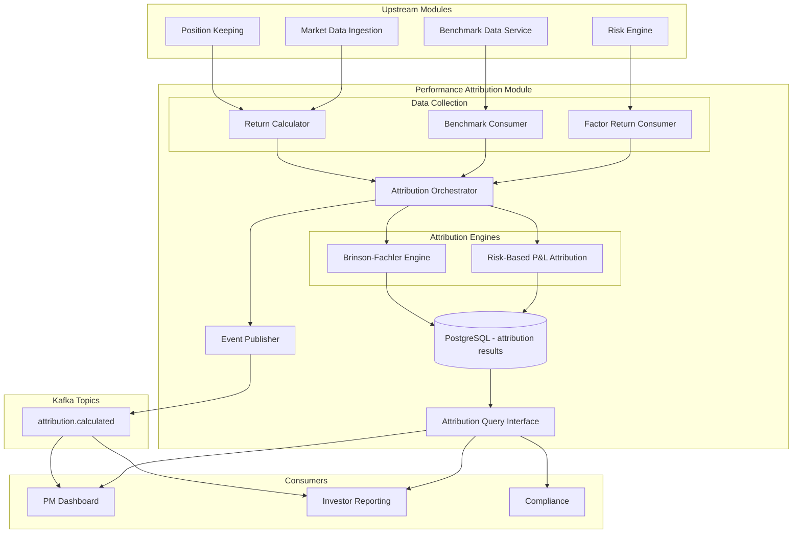

# Performance Attribution Module

## Context & Problem

A portfolio manager's job is to generate alpha — returns above what the market delivers for free. But when a fund is up 15% in a year, how much came from skill (stock picking, timing) versus simply being long a rising market? Performance attribution separates the "what happened" of returns into the "why it happened."

Without rigorous attribution, a PM who loads up on tech stocks during a tech rally looks like a genius. Attribution reveals that 12% came from the sector bet (allocation effect) and only 3% from picking the right stocks within tech (selection effect). Conversely, a PM who underperforms a benchmark by 1% might actually be generating significant alpha that is masked by an underweight in a surging sector.

This module implements two complementary attribution models:
1. **Brinson-Fachler** — decomposes returns relative to a benchmark into allocation, selection, and interaction effects.
2. **Risk-based P&L attribution** — decomposes P&L into systematic (factor-driven) and idiosyncratic (alpha) components using the risk engine's factor model.

## Domain Concepts

| Concept | Definition |
|---|---|
| **Allocation Effect** | Return contribution from overweighting or underweighting sectors/regions versus the benchmark |
| **Selection Effect** | Return contribution from picking better or worse securities within each sector versus the benchmark |
| **Interaction Effect** | The cross-term: the combined effect of simultaneously overweighting a sector and picking better stocks in it |
| **Benchmark** | The reference portfolio (e.g., S&P 500) against which performance is measured |
| **Active Return** | Portfolio return minus benchmark return — what the PM added (or lost) |
| **Systematic Return** | The portion of returns explained by exposure to common risk factors (market, size, value, momentum, volatility) |
| **Idiosyncratic Return (Alpha)** | The residual return not explained by factor exposures — the PM's true skill signal |
| **Attribution Period** | The time window over which attribution is calculated (daily, monthly, inception-to-date) |

## Architecture



## Design Decisions

### Decimal Precision for All Financial Calculations

Attribution results flow into investor reports and regulatory filings. Floating-point rounding errors that accumulate over hundreds of positions and dozens of periods are not acceptable. All financial calculations use Python's `Decimal` type with explicit precision control. This costs some performance but eliminates a class of reconciliation bugs.

### Brinson-Fachler Over Brinson-Hood-Beebower

Brinson-Fachler is the standard over the older Brinson-Hood-Beebower (BHB) model because it correctly measures allocation effect relative to the benchmark's total return rather than each sector's return. In BHB, the allocation effect can be counterintuitive when the benchmark sector return is negative. Brinson-Fachler fixes this by subtracting the total benchmark return in the allocation term.

### Daily Granularity with Multi-Period Linking

Attribution is calculated daily and then linked across periods (monthly, quarterly, inception-to-date) using geometric linking (Carino method). Arithmetic linking (simply summing daily effects) introduces compounding errors over longer periods.

### Dual Attribution Models

Brinson-Fachler tells the PM "where" the returns came from (which sectors). Risk-based attribution tells the PM "why" — how much was the market moving versus genuine alpha. Both views are valuable and not redundant.

## Interface Contract

```python
# interface.py

from typing import Protocol
from datetime import date, datetime
from decimal import Decimal
from uuid import UUID
from enum import StrEnum

from pydantic import BaseModel, ConfigDict


class AttributionModel(StrEnum):
    BRINSON_FACHLER = "brinson_fachler"
    RISK_BASED = "risk_based"


class BrinsonFachlerSectorResult(BaseModel):
    model_config = ConfigDict(frozen=True)

    sector: str
    portfolio_weight: Decimal
    benchmark_weight: Decimal
    portfolio_return: Decimal
    benchmark_return: Decimal
    allocation_effect: Decimal
    selection_effect: Decimal
    interaction_effect: Decimal
    total_effect: Decimal


class BrinsonFachlerResult(BaseModel):
    model_config = ConfigDict(frozen=True)

    portfolio_id: UUID
    benchmark_id: str
    period_start: date
    period_end: date
    portfolio_return: Decimal
    benchmark_return: Decimal
    active_return: Decimal
    total_allocation_effect: Decimal
    total_selection_effect: Decimal
    total_interaction_effect: Decimal
    sector_results: list[BrinsonFachlerSectorResult]


class RiskAttributionResult(BaseModel):
    model_config = ConfigDict(frozen=True)

    portfolio_id: UUID
    period_start: date
    period_end: date
    total_pnl: Decimal
    systematic_pnl: Decimal           # factor-driven P&L
    idiosyncratic_pnl: Decimal        # alpha (residual)
    factor_contributions: list["FactorPnLContribution"]


class FactorPnLContribution(BaseModel):
    model_config = ConfigDict(frozen=True)

    factor_name: str
    exposure: Decimal
    factor_return: Decimal
    pnl_contribution: Decimal


class AttributionSnapshot(BaseModel):
    model_config = ConfigDict(frozen=True)

    portfolio_id: UUID
    as_of_date: date
    calculated_at: datetime
    brinson_fachler: BrinsonFachlerResult | None = None
    risk_attribution: RiskAttributionResult | None = None


class AttributionReader(Protocol):
    """Read interface exposed to other modules."""

    async def get_brinson_fachler(
        self, portfolio_id: UUID, period_start: date, period_end: date,
        benchmark_id: str,
    ) -> BrinsonFachlerResult: ...

    async def get_risk_attribution(
        self, portfolio_id: UUID, period_start: date, period_end: date,
    ) -> RiskAttributionResult: ...

    async def get_attribution_history(
        self, portfolio_id: UUID, start: date, end: date,
        model: AttributionModel,
    ) -> list[AttributionSnapshot]: ...

    async def get_cumulative_attribution(
        self, portfolio_id: UUID, start: date, end: date,
        benchmark_id: str,
    ) -> BrinsonFachlerResult: ...
```

## Code Skeleton

### Brinson-Fachler Attribution

```python
# engines/brinson_fachler.py

from decimal import Decimal, ROUND_HALF_UP
from datetime import date
from uuid import UUID

import structlog

logger = structlog.get_logger()

# Precision for financial calculations: 10 decimal places internally,
# rounded to 6 for storage and reporting.
CALC_PRECISION = Decimal("0.0000000001")
REPORT_PRECISION = Decimal("0.000001")


class BrinsonFachlerEngine:
    """
    Brinson-Fachler performance attribution.

    Decomposes active return (R_p - R_b) into three effects per sector:

    Allocation Effect:
        (w_p,s - w_b,s) * (R_b,s - R_b)
        "Did overweighting this sector help, given how the sector performed
        relative to the total benchmark?"

    Selection Effect:
        w_b,s * (R_p,s - R_b,s)
        "At benchmark weights, did we pick better stocks in this sector?"

    Interaction Effect:
        (w_p,s - w_b,s) * (R_p,s - R_b,s)
        "Cross-term: we overweighted AND picked better stocks."

    The sum of all three effects across all sectors equals the active return.
    """

    def calculate(
        self,
        portfolio_id: UUID,
        benchmark_id: str,
        period_start: date,
        period_end: date,
        portfolio_sectors: list[dict],
        benchmark_sectors: list[dict],
    ) -> dict:
        """
        Args:
            portfolio_sectors: list of dicts, each with:
                sector: str
                weight: Decimal — portfolio weight in this sector
                return_: Decimal — portfolio return in this sector
            benchmark_sectors: list of dicts, each with:
                sector: str
                weight: Decimal — benchmark weight
                return_: Decimal — benchmark sector return

        Returns:
            BrinsonFachlerResult as dict.
        """
        # Build lookup maps
        p_map: dict[str, dict] = {s["sector"]: s for s in portfolio_sectors}
        b_map: dict[str, dict] = {s["sector"]: s for s in benchmark_sectors}

        # All sectors present in either portfolio or benchmark
        all_sectors = sorted(set(p_map.keys()) | set(b_map.keys()))

        # Total benchmark return (weighted sum of sector returns)
        total_benchmark_return = sum(
            b_map[s]["weight"] * b_map[s]["return_"]
            for s in b_map
        )

        # Total portfolio return
        total_portfolio_return = sum(
            p_map[s]["weight"] * p_map[s]["return_"]
            for s in p_map
        )

        sector_results = []
        total_allocation = Decimal("0")
        total_selection = Decimal("0")
        total_interaction = Decimal("0")

        for sector in all_sectors:
            w_p = p_map.get(sector, {}).get("weight", Decimal("0"))
            w_b = b_map.get(sector, {}).get("weight", Decimal("0"))
            r_p = p_map.get(sector, {}).get("return_", Decimal("0"))
            r_b = b_map.get(sector, {}).get("return_", Decimal("0"))

            # Brinson-Fachler formulas
            allocation = (w_p - w_b) * (r_b - total_benchmark_return)
            selection = w_b * (r_p - r_b)
            interaction = (w_p - w_b) * (r_p - r_b)
            total_effect = allocation + selection + interaction

            # Quantize to reporting precision
            allocation = allocation.quantize(REPORT_PRECISION, rounding=ROUND_HALF_UP)
            selection = selection.quantize(REPORT_PRECISION, rounding=ROUND_HALF_UP)
            interaction = interaction.quantize(REPORT_PRECISION, rounding=ROUND_HALF_UP)
            total_effect = total_effect.quantize(REPORT_PRECISION, rounding=ROUND_HALF_UP)

            total_allocation += allocation
            total_selection += selection
            total_interaction += interaction

            sector_results.append({
                "sector": sector,
                "portfolio_weight": w_p.quantize(REPORT_PRECISION),
                "benchmark_weight": w_b.quantize(REPORT_PRECISION),
                "portfolio_return": r_p.quantize(REPORT_PRECISION),
                "benchmark_return": r_b.quantize(REPORT_PRECISION),
                "allocation_effect": allocation,
                "selection_effect": selection,
                "interaction_effect": interaction,
                "total_effect": total_effect,
            })

        active_return = total_portfolio_return - total_benchmark_return

        # Sanity check: sum of effects should equal active return
        effects_sum = total_allocation + total_selection + total_interaction
        residual = active_return - effects_sum
        if abs(residual) > Decimal("0.0001"):
            logger.warning(
                "attribution_residual",
                portfolio_id=str(portfolio_id),
                active_return=str(active_return),
                effects_sum=str(effects_sum),
                residual=str(residual),
            )

        logger.info(
            "brinson_fachler_calculated",
            portfolio_id=str(portfolio_id),
            benchmark=benchmark_id,
            active_return=str(active_return),
            allocation=str(total_allocation),
            selection=str(total_selection),
            interaction=str(total_interaction),
        )

        return {
            "portfolio_id": portfolio_id,
            "benchmark_id": benchmark_id,
            "period_start": period_start,
            "period_end": period_end,
            "portfolio_return": total_portfolio_return.quantize(REPORT_PRECISION),
            "benchmark_return": total_benchmark_return.quantize(REPORT_PRECISION),
            "active_return": active_return.quantize(REPORT_PRECISION),
            "total_allocation_effect": total_allocation.quantize(REPORT_PRECISION),
            "total_selection_effect": total_selection.quantize(REPORT_PRECISION),
            "total_interaction_effect": total_interaction.quantize(REPORT_PRECISION),
            "sector_results": sector_results,
        }
```

### Risk-Based P&L Attribution

```python
# engines/risk_attribution.py

from decimal import Decimal, ROUND_HALF_UP
from datetime import date
from uuid import UUID

import structlog

logger = structlog.get_logger()

REPORT_PRECISION = Decimal("0.000001")


class RiskBasedAttributionEngine:
    """
    Decomposes portfolio P&L into systematic (factor-driven) and
    idiosyncratic (alpha) components.

    Total P&L = Systematic P&L + Idiosyncratic P&L

    Systematic P&L = Σ (β_k * F_k * NAV)
        where β_k is portfolio exposure to factor k and F_k is the factor return

    Idiosyncratic P&L = Total P&L - Systematic P&L
        This is the residual — the alpha (positive or negative) generated by
        the PM's specific stock picks, independent of factor movements.
    """

    def calculate(
        self,
        portfolio_id: UUID,
        period_start: date,
        period_end: date,
        total_pnl: Decimal,
        nav: Decimal,
        factor_exposures: dict[str, Decimal],
        factor_returns: dict[str, Decimal],
    ) -> dict:
        """
        Args:
            portfolio_id: portfolio identifier
            period_start, period_end: attribution period
            total_pnl: actual portfolio P&L over the period
            nav: portfolio NAV at start of period (for scaling)
            factor_exposures: {factor_name: portfolio_beta}
            factor_returns: {factor_name: factor_return_over_period}

        Returns:
            RiskAttributionResult as dict.
        """
        factor_contributions = []
        systematic_pnl = Decimal("0")

        for factor_name, exposure in factor_exposures.items():
            factor_return = factor_returns.get(factor_name, Decimal("0"))
            # P&L contribution = beta * factor_return * NAV
            contribution = (exposure * factor_return * nav).quantize(
                Decimal("0.01"), rounding=ROUND_HALF_UP,
            )
            systematic_pnl += contribution

            factor_contributions.append({
                "factor_name": factor_name,
                "exposure": exposure.quantize(REPORT_PRECISION),
                "factor_return": factor_return.quantize(REPORT_PRECISION),
                "pnl_contribution": contribution,
            })

        idiosyncratic_pnl = total_pnl - systematic_pnl

        logger.info(
            "risk_attribution_calculated",
            portfolio_id=str(portfolio_id),
            total_pnl=str(total_pnl),
            systematic_pnl=str(systematic_pnl),
            idiosyncratic_pnl=str(idiosyncratic_pnl),
            alpha_pct=str(
                (idiosyncratic_pnl / nav).quantize(REPORT_PRECISION)
                if nav else Decimal("0")
            ),
        )

        return {
            "portfolio_id": portfolio_id,
            "period_start": period_start,
            "period_end": period_end,
            "total_pnl": total_pnl.quantize(Decimal("0.01")),
            "systematic_pnl": systematic_pnl.quantize(Decimal("0.01")),
            "idiosyncratic_pnl": idiosyncratic_pnl.quantize(Decimal("0.01")),
            "factor_contributions": factor_contributions,
        }
```

### Attribution Orchestrator

```python
# service.py

from datetime import date, datetime
from decimal import Decimal
from uuid import UUID

import structlog

logger = structlog.get_logger()


class AttributionOrchestrator:
    """
    Coordinates daily attribution calculations.

    Triggered by:
    - End-of-day batch: after prices are final and positions are reconciled
    - On-demand: PM requests attribution for a specific period
    """

    def __init__(
        self,
        brinson_fachler: BrinsonFachlerEngine,
        risk_attribution: RiskBasedAttributionEngine,
        position_reader: PositionReader,
        market_data_reader: MarketDataReader,
        benchmark_reader: BenchmarkReader,
        risk_reader: RiskEngineReader,
        repository: AttributionRepository,
        publisher: EventPublisher,
    ) -> None:
        self._bf = brinson_fachler
        self._risk_attr = risk_attribution
        self._positions = position_reader
        self._market_data = market_data_reader
        self._benchmarks = benchmark_reader
        self._risk = risk_reader
        self._repository = repository
        self._publisher = publisher

    async def calculate_daily_attribution(
        self,
        portfolio_id: UUID,
        benchmark_id: str,
        as_of_date: date,
    ) -> AttributionSnapshot:
        """Run both attribution models for a single day."""

        # --- Gather inputs ---
        portfolio_sectors = await self._positions.get_sector_weights_and_returns(
            portfolio_id, as_of_date,
        )
        benchmark_sectors = await self._benchmarks.get_sector_weights_and_returns(
            benchmark_id, as_of_date,
        )

        # --- Brinson-Fachler ---
        bf_result = self._bf.calculate(
            portfolio_id=portfolio_id,
            benchmark_id=benchmark_id,
            period_start=as_of_date,
            period_end=as_of_date,
            portfolio_sectors=portfolio_sectors,
            benchmark_sectors=benchmark_sectors,
        )

        # --- Risk-based attribution ---
        total_pnl = await self._positions.get_daily_pnl(portfolio_id, as_of_date)
        nav = await self._positions.get_nav(portfolio_id, as_of_date)
        risk_snapshot = await self._risk.get_latest_snapshot(portfolio_id)

        factor_exposures = {
            fe["factor_name"]: fe["exposure"]
            for fe in risk_snapshot.factor_exposures
        }
        factor_returns = await self._market_data.get_factor_returns(as_of_date)

        risk_result = self._risk_attr.calculate(
            portfolio_id=portfolio_id,
            period_start=as_of_date,
            period_end=as_of_date,
            total_pnl=total_pnl,
            nav=nav,
            factor_exposures=factor_exposures,
            factor_returns=factor_returns,
        )

        # --- Persist ---
        snapshot = AttributionSnapshot(
            portfolio_id=portfolio_id,
            as_of_date=as_of_date,
            calculated_at=datetime.utcnow(),
            brinson_fachler=bf_result,
            risk_attribution=risk_result,
        )
        await self._repository.save(snapshot)

        # --- Publish ---
        await self._publisher.publish(
            topic="attribution.calculated",
            key=str(portfolio_id),
            event={
                "event_type": "attribution.daily_calculated",
                "event_id": f"attr-{portfolio_id}-{as_of_date.isoformat()}",
                "timestamp": datetime.utcnow().isoformat(),
                "data": {
                    "portfolio_id": str(portfolio_id),
                    "as_of_date": as_of_date.isoformat(),
                    "benchmark_id": benchmark_id,
                    "active_return": str(bf_result["active_return"]),
                    "allocation_effect": str(bf_result["total_allocation_effect"]),
                    "selection_effect": str(bf_result["total_selection_effect"]),
                    "systematic_pnl": str(risk_result["systematic_pnl"]),
                    "idiosyncratic_pnl": str(risk_result["idiosyncratic_pnl"]),
                },
            },
        )

        return snapshot
```

## Data Model

```sql
CREATE SCHEMA IF NOT EXISTS attribution;

-- Daily Brinson-Fachler results
CREATE TABLE attribution.brinson_fachler (
    id                      UUID PRIMARY KEY DEFAULT gen_random_uuid(),
    portfolio_id            UUID NOT NULL,
    benchmark_id            VARCHAR(32) NOT NULL,
    period_start            DATE NOT NULL,
    period_end              DATE NOT NULL,
    calculated_at           TIMESTAMPTZ NOT NULL DEFAULT NOW(),
    portfolio_return        NUMERIC(12,6) NOT NULL,
    benchmark_return        NUMERIC(12,6) NOT NULL,
    active_return           NUMERIC(12,6) NOT NULL,
    total_allocation_effect NUMERIC(12,6) NOT NULL,
    total_selection_effect  NUMERIC(12,6) NOT NULL,
    total_interaction_effect NUMERIC(12,6) NOT NULL,
    UNIQUE (portfolio_id, benchmark_id, period_start, period_end)
);

CREATE INDEX ix_bf_portfolio_date ON attribution.brinson_fachler (portfolio_id, period_start DESC);

-- Sector-level Brinson-Fachler breakdown
CREATE TABLE attribution.brinson_fachler_sectors (
    id                  UUID PRIMARY KEY DEFAULT gen_random_uuid(),
    bf_result_id        UUID NOT NULL REFERENCES attribution.brinson_fachler(id) ON DELETE CASCADE,
    sector              VARCHAR(64) NOT NULL,
    portfolio_weight    NUMERIC(10,6) NOT NULL,
    benchmark_weight    NUMERIC(10,6) NOT NULL,
    portfolio_return    NUMERIC(12,6) NOT NULL,
    benchmark_return    NUMERIC(12,6) NOT NULL,
    allocation_effect   NUMERIC(12,6) NOT NULL,
    selection_effect    NUMERIC(12,6) NOT NULL,
    interaction_effect  NUMERIC(12,6) NOT NULL,
    total_effect        NUMERIC(12,6) NOT NULL
);

CREATE INDEX ix_bf_sectors_result ON attribution.brinson_fachler_sectors (bf_result_id);

-- Risk-based P&L attribution
CREATE TABLE attribution.risk_based (
    id                  UUID PRIMARY KEY DEFAULT gen_random_uuid(),
    portfolio_id        UUID NOT NULL,
    period_start        DATE NOT NULL,
    period_end          DATE NOT NULL,
    calculated_at       TIMESTAMPTZ NOT NULL DEFAULT NOW(),
    total_pnl           NUMERIC(18,2) NOT NULL,
    systematic_pnl      NUMERIC(18,2) NOT NULL,
    idiosyncratic_pnl   NUMERIC(18,2) NOT NULL,
    UNIQUE (portfolio_id, period_start, period_end)
);

CREATE INDEX ix_risk_attr_portfolio_date ON attribution.risk_based (portfolio_id, period_start DESC);

-- Factor-level P&L contributions
CREATE TABLE attribution.risk_factor_contributions (
    id                  UUID PRIMARY KEY DEFAULT gen_random_uuid(),
    risk_attr_id        UUID NOT NULL REFERENCES attribution.risk_based(id) ON DELETE CASCADE,
    factor_name         VARCHAR(32) NOT NULL,
    exposure            NUMERIC(10,6) NOT NULL,
    factor_return       NUMERIC(12,6) NOT NULL,
    pnl_contribution    NUMERIC(18,2) NOT NULL
);

CREATE INDEX ix_risk_factor_result ON attribution.risk_factor_contributions (risk_attr_id);

-- Cumulative/linked attribution for multi-period reporting
CREATE TABLE attribution.cumulative (
    id                      UUID PRIMARY KEY DEFAULT gen_random_uuid(),
    portfolio_id            UUID NOT NULL,
    benchmark_id            VARCHAR(32) NOT NULL,
    period_start            DATE NOT NULL,
    period_end              DATE NOT NULL,
    calculated_at           TIMESTAMPTZ NOT NULL DEFAULT NOW(),
    cumulative_portfolio_return  NUMERIC(12,6) NOT NULL,
    cumulative_benchmark_return  NUMERIC(12,6) NOT NULL,
    cumulative_active_return     NUMERIC(12,6) NOT NULL,
    cumulative_allocation        NUMERIC(12,6) NOT NULL,
    cumulative_selection         NUMERIC(12,6) NOT NULL,
    cumulative_interaction       NUMERIC(12,6) NOT NULL,
    linking_method               VARCHAR(16) NOT NULL DEFAULT 'carino',
    UNIQUE (portfolio_id, benchmark_id, period_start, period_end)
);
```

## Kafka Events Published

| Topic | Key | Event | Consumers |
|---|---|---|---|
| `attribution.calculated` | `portfolio_id` | `attribution.daily_calculated` — daily Brinson-Fachler and risk-based results | PM Dashboard, Investor Reporting |
| `attribution.calculated` | `portfolio_id` | `attribution.cumulative_updated` — linked multi-period attribution | PM Dashboard, Investor Reporting |

## Patterns Used

| Pattern | Document |
|---|---|
| Module interface via Protocol | [Module Interfaces](../../patterns/modularity/module-interfaces.md) |
| Event publishing for downstream consumers | [Event-Driven Architecture](../../principles/event-driven-architecture.md) |
| Repository pattern for result persistence | [SQLAlchemy Repository](../../patterns/data-access/sqlalchemy-repository.md) |
| Shared kernel types (Decimal, UUID, date) | [Shared Kernel](../../patterns/modularity/shared-kernel.md) |
| Structured logging for audit trail | [Structured Logging](../../patterns/observability/structured-logging.md) |
| Batch processing for end-of-day calculation | [Batch vs Streaming](../../patterns/data-processing/batch-vs-streaming.md) |
| Idempotent calculation (same inputs → same outputs) | [Idempotency](../../patterns/resilience/idempotency.md) |

## Failure Modes

| Failure | Cause | Impact | Mitigation |
|---|---|---|---|
| Missing benchmark data | Benchmark provider delayed or unavailable for the day | Cannot compute Brinson-Fachler attribution | Retry with exponential backoff; fall back to previous day's benchmark weights with warning flag |
| Sector classification mismatch | Portfolio uses GICS sectors, benchmark uses ICB | Attribution effects don't sum to active return; sectors misaligned | Normalize to a single classification scheme (GICS) at ingestion; map ICB → GICS in the benchmark adapter |
| Stale factor exposures | Risk engine hasn't recalculated since portfolio changed | Risk attribution uses outdated betas, misattributing alpha | Check risk snapshot freshness; require risk.calculated event before running risk attribution |
| Precision drift in multi-period linking | Arithmetic linking over long periods | Cumulative effects don't reconcile to cumulative active return | Use geometric linking (Carino method); validate reconciliation at each link step |
| Missing position returns | New position with no prior-day price | Position excluded from attribution, understating total return | Use first available price as cost basis; flag positions with imputed returns |
| Factor return data gap | Factor return series missing for a day | Systematic/idiosyncratic split is wrong for that day | Hold previous factor returns; flag the day as estimated in attribution output |

## Performance Profile

| Metric | Target |
|---|---|
| Daily Brinson-Fachler (500 positions, 11 sectors) | < 2 seconds |
| Daily risk-based attribution (500 positions, 5 factors) | < 1 second |
| Multi-period linking (252 daily results → annual) | < 500ms |
| Attribution query (single day, single portfolio) | < 10ms |
| Attribution history query (30 days) | < 30ms |

## Dependencies

```
performance-attribution
  ├── depends on: position-keeping (weights, returns, daily P&L)
  ├── depends on: market-data-ingestion (price returns for return calculation)
  ├── depends on: risk-engine (factor exposures, factor model)
  ├── depends on: benchmark data service (benchmark weights and returns)
  ├── depends on: shared kernel (types, events)
  ├── publishes: attribution.calculated
  └── consumed by: PM dashboard, investor reporting, compliance
```

## Related Documents

- [Risk Engine](risk-engine.md) — provides factor exposures and factor model used for risk-based P&L attribution
- [Market Data Ingestion](market-data-ingestion.md) — provides daily price returns for return calculation
- [Security Master](security-master.md) — provides sector classification for Brinson-Fachler sector mapping
