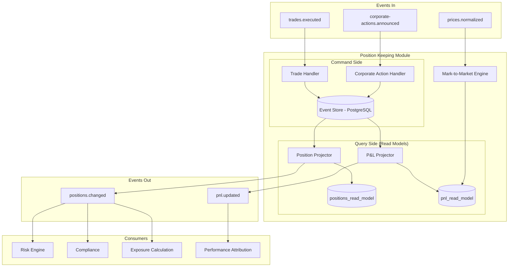

# Position Keeping Module

## Context & Problem

Position keeping is the heart of a hedge fund's operations. It answers the most fundamental question: **what do we own, and what is it worth?**

A position is the aggregate quantity of an instrument held in a portfolio. Positions change when trades execute, corporate actions occur (splits, dividends), or manual adjustments are made. The position's value changes continuously as market prices move.

Getting positions wrong means wrong P&L, wrong risk, wrong compliance checks, and wrong regulatory reports. This module must be correct above all else.

## Domain Concepts

| Concept | Definition |
|---|---|
| **Position** | The aggregate holding of an instrument in a portfolio (quantity + cost basis) |
| **Lot** | A specific acquisition of shares at a specific price and time (for cost basis tracking) |
| **Mark-to-Market** | Revaluing positions at current market prices |
| **Realized P&L** | Profit/loss from closed positions (sold shares) |
| **Unrealized P&L** | Profit/loss from open positions (current value - cost basis) |
| **Cost Basis** | The original acquisition cost, used for P&L calculation |
| **Average Cost** | Weighted average cost per share across all lots |
| **FIFO / LIFO** | Method for determining which lots are sold first |

## Architecture



## Design Decisions

### Event Sourcing for Positions

Positions are event-sourced. Instead of storing `quantity = 1500`, we store the events that produced it. This gives us:

- **Full audit trail** — every change is recorded
- **Point-in-time queries** — "what was the position at 2pm?"
- **Replayability** — rebuild positions from events to verify correctness
- **Corporate action handling** — replay with adjusted split ratios

### Interface Contract

```python
# interface.py

from typing import Protocol
from datetime import datetime, date
from decimal import Decimal
from uuid import UUID

from pydantic import BaseModel, ConfigDict


class Position(BaseModel):
    model_config = ConfigDict(frozen=True)

    portfolio_id: UUID
    instrument_id: str
    quantity: Decimal
    avg_cost: Decimal
    cost_basis: Decimal         # quantity * avg_cost
    market_price: Decimal
    market_value: Decimal       # quantity * market_price
    unrealized_pnl: Decimal     # market_value - cost_basis
    currency: str
    last_updated: datetime


class PositionLot(BaseModel):
    model_config = ConfigDict(frozen=True)

    id: UUID
    portfolio_id: UUID
    instrument_id: str
    quantity: Decimal           # remaining quantity in this lot
    original_quantity: Decimal
    price: Decimal              # acquisition price
    acquired_at: datetime
    trade_id: UUID


class PnLSummary(BaseModel):
    model_config = ConfigDict(frozen=True)

    portfolio_id: UUID
    date: date
    realized_pnl: Decimal
    unrealized_pnl: Decimal
    total_pnl: Decimal
    currency: str


class PositionReader(Protocol):
    """Read interface exposed to other modules."""

    async def get_position(
        self, portfolio_id: UUID, instrument_id: str,
    ) -> Position | None: ...

    async def get_portfolio_positions(
        self, portfolio_id: UUID,
    ) -> list[Position]: ...

    async def get_position_at(
        self, portfolio_id: UUID, instrument_id: str, timestamp: datetime,
    ) -> Position | None: ...

    async def get_portfolio_pnl(
        self, portfolio_id: UUID, date: date,
    ) -> PnLSummary: ...

    async def get_lots(
        self, portfolio_id: UUID, instrument_id: str,
    ) -> list[PositionLot]: ...
```

### Event Store Schema

```sql
-- Append-only event store for position events
CREATE TABLE positions.events (
    id              UUID PRIMARY KEY DEFAULT gen_random_uuid(),
    aggregate_id    VARCHAR(128) NOT NULL,  -- "portfolio_id:instrument_id"
    sequence_number BIGINT NOT NULL,
    event_type      VARCHAR(64) NOT NULL,
    event_data      JSONB NOT NULL,
    metadata        JSONB NOT NULL DEFAULT '{}',
    created_at      TIMESTAMPTZ NOT NULL DEFAULT NOW(),

    UNIQUE (aggregate_id, sequence_number)
);

CREATE INDEX ix_events_aggregate ON positions.events (aggregate_id, sequence_number);
CREATE INDEX ix_events_type ON positions.events (event_type);
CREATE INDEX ix_events_created ON positions.events (created_at);

-- Read model: current positions (denormalized for fast queries)
CREATE TABLE positions.current_positions (
    portfolio_id    UUID NOT NULL,
    instrument_id   VARCHAR(32) NOT NULL,
    quantity        NUMERIC(18,8) NOT NULL,
    avg_cost        NUMERIC(18,8) NOT NULL,
    cost_basis      NUMERIC(18,8) NOT NULL,
    market_price    NUMERIC(18,8) NOT NULL DEFAULT 0,
    market_value    NUMERIC(18,8) NOT NULL DEFAULT 0,
    unrealized_pnl  NUMERIC(18,8) NOT NULL DEFAULT 0,
    currency        VARCHAR(3) NOT NULL,
    last_updated    TIMESTAMPTZ NOT NULL DEFAULT NOW(),

    PRIMARY KEY (portfolio_id, instrument_id)
);

-- Read model: position lots (for cost basis tracking)
CREATE TABLE positions.lots (
    id                  UUID PRIMARY KEY DEFAULT gen_random_uuid(),
    portfolio_id        UUID NOT NULL,
    instrument_id       VARCHAR(32) NOT NULL,
    quantity            NUMERIC(18,8) NOT NULL,
    original_quantity   NUMERIC(18,8) NOT NULL,
    price               NUMERIC(18,8) NOT NULL,
    acquired_at         TIMESTAMPTZ NOT NULL,
    trade_id            UUID NOT NULL,

    -- Negative quantity represents a short lot
    CONSTRAINT valid_lot CHECK (quantity != 0)
);

CREATE INDEX ix_lots_position ON positions.lots (portfolio_id, instrument_id);

-- Read model: daily P&L snapshots
CREATE TABLE positions.daily_pnl (
    portfolio_id    UUID NOT NULL,
    date            DATE NOT NULL,
    realized_pnl    NUMERIC(18,8) NOT NULL DEFAULT 0,
    unrealized_pnl  NUMERIC(18,8) NOT NULL DEFAULT 0,
    total_pnl       NUMERIC(18,8) NOT NULL DEFAULT 0,
    currency        VARCHAR(3) NOT NULL,
    computed_at     TIMESTAMPTZ NOT NULL DEFAULT NOW(),

    PRIMARY KEY (portfolio_id, date)
);
```

### Position Aggregate (Event-Sourced)

```python
# aggregate.py

from decimal import Decimal
from uuid import UUID, uuid4
from datetime import datetime
from dataclasses import dataclass, field


@dataclass
class PositionLotState:
    lot_id: UUID
    quantity: Decimal
    original_quantity: Decimal
    price: Decimal
    acquired_at: datetime
    trade_id: UUID


@dataclass
class PositionAggregate:
    """Event-sourced position aggregate. State is derived from events."""

    portfolio_id: UUID
    instrument_id: str
    quantity: Decimal = Decimal(0)
    cost_basis: Decimal = Decimal(0)
    realized_pnl: Decimal = Decimal(0)
    lots: list[PositionLotState] = field(default_factory=list)
    version: int = 0

    @property
    def avg_cost(self) -> Decimal:
        if self.quantity == 0:
            return Decimal(0)
        return self.cost_basis / self.quantity

    def apply(self, event: dict) -> list[dict]:
        """Apply an event and return any new events to emit."""
        match event["event_type"]:
            case "trade.buy":
                return self._apply_buy(event)
            case "trade.sell":
                return self._apply_sell(event)
            case "corporate_action.split":
                return self._apply_split(event)
            case "corporate_action.dividend":
                return self._apply_dividend(event)
        self.version += 1
        return []

    def _apply_buy(self, event: dict) -> list[dict]:
        qty = Decimal(str(event["data"]["quantity"]))
        price = Decimal(str(event["data"]["price"]))
        trade_id = UUID(event["data"]["trade_id"])

        self.quantity += qty
        self.cost_basis += qty * price

        # Create a new lot
        self.lots.append(PositionLotState(
            lot_id=UUID(event["data"].get("lot_id", str(uuid4()))),
            quantity=qty,
            original_quantity=qty,
            price=price,
            acquired_at=datetime.fromisoformat(event["timestamp"]),
            trade_id=trade_id,
        ))

        self.version += 1
        return [self._position_changed_event()]

    def _apply_sell(self, event: dict) -> list[dict]:
        qty = Decimal(str(event["data"]["quantity"]))
        price = Decimal(str(event["data"]["price"]))
        trade_id = UUID(event["data"]["trade_id"])

        # FIFO lot matching against existing long lots
        remaining = qty
        realized = Decimal(0)

        for lot in sorted(self.lots, key=lambda l: l.acquired_at):
            if remaining <= 0 or lot.quantity <= 0:
                break
            sold_from_lot = min(remaining, lot.quantity)
            realized += sold_from_lot * (price - lot.price)
            lot.quantity -= sold_from_lot
            remaining -= sold_from_lot

        # Remove exhausted lots
        self.lots = [l for l in self.lots if l.quantity > 0]

        # Short selling: if selling more than held, the remainder opens a
        # short position. Short sales don't use FIFO — they create a new
        # "short lot" with negative quantity, tracked at the sale price.
        if remaining > 0:
            self.lots.append(PositionLotState(
                lot_id=UUID(event["data"].get("lot_id", str(uuid4()))),
                quantity=-remaining,
                original_quantity=-remaining,
                price=price,
                acquired_at=datetime.fromisoformat(event["timestamp"]),
                trade_id=trade_id,
            ))

        self.quantity -= qty
        self.cost_basis = sum(l.quantity * l.price for l in self.lots)
        self.realized_pnl += realized

        self.version += 1
        return [
            self._position_changed_event(),
            self._pnl_realized_event(realized, price),
        ]

    def _apply_split(self, event: dict) -> list[dict]:
        ratio = Decimal(str(event["data"]["ratio"]))

        self.quantity *= ratio
        # Cost basis unchanged — same total investment, more shares
        for lot in self.lots:
            lot.quantity *= ratio
            lot.original_quantity *= ratio
            lot.price /= ratio

        self.version += 1
        return [self._position_changed_event()]

    def _apply_dividend(self, event: dict) -> list[dict]:
        amount_per_share = Decimal(str(event["data"]["amount_per_share"]))
        total = self.quantity * amount_per_share
        self.realized_pnl += total

        self.version += 1
        return [self._pnl_realized_event(total, amount_per_share)]

    def _position_changed_event(self) -> dict:
        return {
            "event_type": "position.changed",
            "data": {
                "portfolio_id": str(self.portfolio_id),
                "instrument_id": self.instrument_id,
                "quantity": str(self.quantity),
                "avg_cost": str(self.avg_cost),
                "cost_basis": str(self.cost_basis),
            },
        }

    def _pnl_realized_event(self, amount: Decimal, price: Decimal) -> dict:
        return {
            "event_type": "pnl.realized",
            "data": {
                "portfolio_id": str(self.portfolio_id),
                "instrument_id": self.instrument_id,
                "realized_amount": str(amount),
                "price": str(price),
            },
        }

    @classmethod
    def from_events(
        cls,
        portfolio_id: UUID,
        instrument_id: str,
        events: list[dict],
    ) -> "PositionAggregate":
        aggregate = cls(portfolio_id=portfolio_id, instrument_id=instrument_id)
        for event in events:
            aggregate.apply(event)
        return aggregate
```

### Asset-Class Position Strategy

Different asset classes calculate position value, cost basis, and P&L differently. Rather than branching on `asset_class` throughout the aggregate, the position module delegates to a `PositionStrategy` protocol:

```python
# strategy.py

from typing import Protocol
from decimal import Decimal


class PositionStrategy(Protocol):
    """Asset-class-specific position calculation logic."""

    def market_value(self, quantity: Decimal, market_price: Decimal, **kwargs) -> Decimal:
        """Calculate the market value of a position."""
        ...

    def unrealized_pnl(
        self, quantity: Decimal, avg_cost: Decimal, market_price: Decimal, **kwargs,
    ) -> Decimal:
        """Calculate unrealized P&L."""
        ...

    def position_unit_label(self) -> str:
        """Human-readable label for the position unit (shares, contracts, notional)."""
        ...


class EquityPositionStrategy:
    """Equities: value = quantity × price."""

    def market_value(self, quantity: Decimal, market_price: Decimal, **kwargs) -> Decimal:
        return quantity * market_price

    def unrealized_pnl(
        self, quantity: Decimal, avg_cost: Decimal, market_price: Decimal, **kwargs,
    ) -> Decimal:
        return quantity * (market_price - avg_cost)

    def position_unit_label(self) -> str:
        return "shares"


class FixedIncomePositionStrategy:
    """Bonds: value = (par_held × clean_price / 100) + accrued_interest."""

    def market_value(self, quantity: Decimal, market_price: Decimal, **kwargs) -> Decimal:
        accrued = kwargs.get("accrued_interest", Decimal(0))
        return (quantity * market_price / Decimal(100)) + accrued

    def unrealized_pnl(
        self, quantity: Decimal, avg_cost: Decimal, market_price: Decimal, **kwargs,
    ) -> Decimal:
        accrued = kwargs.get("accrued_interest", Decimal(0))
        dirty_value = (quantity * market_price / Decimal(100)) + accrued
        cost_basis = quantity * avg_cost / Decimal(100)
        return dirty_value - cost_basis

    def position_unit_label(self) -> str:
        return "par_value"


class OptionPositionStrategy:
    """Options: value = contracts × premium × multiplier."""

    def market_value(self, quantity: Decimal, market_price: Decimal, **kwargs) -> Decimal:
        multiplier = kwargs.get("contract_multiplier", Decimal(100))
        return quantity * market_price * multiplier

    def unrealized_pnl(
        self, quantity: Decimal, avg_cost: Decimal, market_price: Decimal, **kwargs,
    ) -> Decimal:
        multiplier = kwargs.get("contract_multiplier", Decimal(100))
        return quantity * (market_price - avg_cost) * multiplier

    def position_unit_label(self) -> str:
        return "contracts"


class FuturePositionStrategy:
    """Futures: value based on tick value, P&L from daily settlement (variation margin)."""

    def market_value(self, quantity: Decimal, market_price: Decimal, **kwargs) -> Decimal:
        contract_size = kwargs.get("contract_size", Decimal(1))
        return quantity * market_price * contract_size

    def unrealized_pnl(
        self, quantity: Decimal, avg_cost: Decimal, market_price: Decimal, **kwargs,
    ) -> Decimal:
        contract_size = kwargs.get("contract_size", Decimal(1))
        return quantity * (market_price - avg_cost) * contract_size

    def position_unit_label(self) -> str:
        return "contracts"


# Strategy registry — maps asset class to strategy implementation
POSITION_STRATEGIES: dict[str, PositionStrategy] = {
    "equity": EquityPositionStrategy(),
    "etf": EquityPositionStrategy(),      # ETFs behave like equities
    "fixed_income": FixedIncomePositionStrategy(),
    "option": OptionPositionStrategy(),
    "future": FuturePositionStrategy(),
}
```

The `PositionAggregate` and `MarkToMarketEngine` use the strategy for value calculations. The aggregate itself (FIFO lot matching, event application) remains asset-class-agnostic — it operates on quantities and costs. Only the _interpretation_ of value differs per asset class.

Adding a new asset class requires: (1) an extension in the security master, (2) a `PositionStrategy` implementation, and (3) registration in `POSITION_STRATEGIES`. The aggregate, event store, and read models are untouched.

### Trade Event Handler

```python
# handlers.py

class TradeEventHandler:
    """Consumes trades.executed events and updates position state."""

    def __init__(
        self,
        event_store: EventStore,
        position_projector: PositionProjector,
        publisher: EventPublisher,
    ) -> None:
        self._event_store = event_store
        self._projector = position_projector
        self._publisher = publisher

    async def handle_trade_executed(self, event: dict) -> None:
        portfolio_id = UUID(event["data"]["portfolio_id"])
        instrument_id = event["data"]["instrument_id"]
        aggregate_id = f"{portfolio_id}:{instrument_id}"

        # Load current state from event store
        stored_events = await self._event_store.get_events(aggregate_id)
        position = PositionAggregate.from_events(
            portfolio_id, instrument_id, stored_events,
        )

        # Create position event from trade
        side = event["data"]["side"]
        position_event = {
            "event_type": f"trade.{side}",
            "timestamp": event["timestamp"],
            "data": event["data"],
        }

        # Apply and collect downstream events
        downstream_events = position.apply(position_event)

        # Persist to event store (optimistic concurrency via sequence_number)
        await self._event_store.append(
            aggregate_id=aggregate_id,
            event=position_event,
            expected_version=position.version - 1,
        )

        # Update read model
        await self._projector.project(position)

        # Publish downstream events
        for downstream in downstream_events:
            topic = "positions.changed" if "position" in downstream["event_type"] else "pnl.updated"
            await self._publisher.publish(
                topic=topic,
                key=aggregate_id,
                event=downstream,
            )
```

### Mark-to-Market Engine

```python
# mark_to_market.py

class MarkToMarketEngine:
    """Revalues all positions when prices update."""

    def __init__(
        self,
        position_repo: CurrentPositionRepository,
        publisher: EventPublisher,
    ) -> None:
        self._repo = position_repo
        self._publisher = publisher

    async def handle_price_update(self, event: dict) -> None:
        instrument_id = event["data"]["instrument_id"]
        new_price = Decimal(str(event["data"]["mid"]))

        # Update all positions holding this instrument
        positions = await self._repo.get_by_instrument(instrument_id)

        for position in positions:
            old_unrealized = position.unrealized_pnl
            new_market_value = position.quantity * new_price
            new_unrealized = new_market_value - position.cost_basis

            await self._repo.update_market_value(
                portfolio_id=position.portfolio_id,
                instrument_id=instrument_id,
                market_price=new_price,
                market_value=new_market_value,
                unrealized_pnl=new_unrealized,
            )

            # Suppress noise: skip if change < 0.01% of position market value
            pnl_change = new_unrealized - old_unrealized
            threshold = abs(new_market_value) * Decimal("0.0001")
            if abs(pnl_change) > threshold:
                await self._publisher.publish(
                    topic="pnl.updated",
                    key=f"{position.portfolio_id}:{instrument_id}",
                    event={
                        "event_type": "pnl.mark_to_market",
                        "data": {
                            "portfolio_id": str(position.portfolio_id),
                            "instrument_id": instrument_id,
                            "market_price": str(new_price),
                            "market_value": str(new_market_value),
                            "unrealized_pnl": str(new_unrealized),
                            "pnl_change": str(pnl_change),
                        },
                    },
                )
```

### Reconciliation

Positions must be reconciled against the prime broker's records daily. Discrepancies are flagged for investigation:

```python
class ReconciliationService:
    async def reconcile(
        self,
        portfolio_id: UUID,
        broker_positions: list[BrokerPosition],
    ) -> ReconciliationResult:
        internal = await self._repo.get_portfolio_positions(portfolio_id)
        internal_map = {p.instrument_id: p for p in internal}
        breaks = []

        for broker_pos in broker_positions:
            internal_pos = internal_map.get(broker_pos.instrument_id)
            if internal_pos is None:
                breaks.append(Break(
                    instrument_id=broker_pos.instrument_id,
                    type="missing_internal",
                    broker_qty=broker_pos.quantity,
                    internal_qty=Decimal(0),
                ))
            elif internal_pos.quantity != broker_pos.quantity:
                breaks.append(Break(
                    instrument_id=broker_pos.instrument_id,
                    type="quantity_mismatch",
                    broker_qty=broker_pos.quantity,
                    internal_qty=internal_pos.quantity,
                    difference=internal_pos.quantity - broker_pos.quantity,
                ))

        return ReconciliationResult(
            portfolio_id=portfolio_id,
            date=date.today(),
            total_positions=len(broker_positions),
            breaks=breaks,
            is_clean=len(breaks) == 0,
        )
```

## Kafka Events

| Direction | Topic | Event | Description |
|---|---|---|---|
| Consumed | `trades.executed` | `trade.executed` | Trade fills from OMS |
| Consumed | `corporate-actions.announced` | `corporate_action.split`, `corporate_action.dividend` | Corporate actions from security master |
| Consumed | `prices.normalized` | `price.updated` | Market prices for mark-to-market |
| Published | `positions.changed` | `position.changed` | Quantity/cost basis changed |
| Published | `pnl.updated` | `pnl.realized`, `pnl.mark_to_market` | P&L changes |

## Patterns Used

| Pattern | Document |
|---|---|
| Event sourcing for position state | [CQRS & Event Sourcing](../../principles/cqrs-event-sourcing.md) |
| CQRS with separate read models | [CQRS & Event Sourcing](../../principles/cqrs-event-sourcing.md) |
| Repository pattern for data access | [SQLAlchemy Repository](../../patterns/data-access/sqlalchemy-repository.md) |
| Protocol-based module interface | [Module Interfaces](../../patterns/modularity/module-interfaces.md) |
| Idempotent event processing | [Idempotency](../../patterns/resilience/idempotency.md) |
| Real-time materialized views | [Real-Time Materialized Views](../../data-strategies/real-time-materialized-views.md) |

## Failure Modes

| Failure | Cause | Impact | Mitigation |
|---|---|---|---|
| Duplicate trade event | Kafka at-least-once delivery | Position doubled | Idempotent handler (check event_id before processing) |
| Event ordering violation | Partition rebalance | Sell before buy → negative position | All events for same position use same partition key |
| Mark-to-market with stale price | Market data feed delayed | Incorrect P&L displayed | Track price staleness, display warning on dashboard |
| Reconciliation break | Internal vs broker mismatch | Regulatory risk | Daily reconciliation, alert on breaks, investigation workflow |
| Event store corruption | Bug in event handler | Position state incorrect | Rebuild from events (source of truth), compare with broker |
| Corporate action missed | Event not processed before market open | Positions incorrect post-split | Pre-market corporate action check, reconciliation catches mismatches |
| Concurrent writes | Two trades for same position simultaneously | Sequence number conflict | Optimistic concurrency in event store, retry on conflict |

## Performance Profile

| Metric | Target |
|---|---|
| Trade → position update | < 50ms |
| Price update → P&L recalculation | < 100ms |
| Position query (single) | < 5ms |
| Portfolio positions query (all) | < 20ms |
| Historical position query (point-in-time) | < 200ms (event replay) |
| Daily P&L query | < 10ms (read model) |

## Dependencies

```
position-keeping
  ├── depends on: shared kernel (types, events)
  ├── depends on: market-data (MarketDataReader — for mark-to-market prices)
  ├── consumes: trades.executed, corporate-actions.announced, prices.normalized
  ├── publishes: positions.changed, pnl.updated
  └── consumed by: risk, compliance, exposure, performance-attribution, cash-management
```

## Related Documents

- [Market Data Ingestion](market-data-ingestion.md) — provides prices for mark-to-market
- [Security Master](security-master.md) — provides corporate actions that affect positions
- [Order Management](order-management.md) — produces the trade events that drive position changes
- [Exposure Calculation](exposure-calculation.md) — consumes position changes
- [Risk Engine](risk-engine.md) — consumes position changes for risk calculation
- [System Overview — Multi-Asset Strategy](overview.md#multi-asset-class-strategy) — asset class phasing and extensibility pattern
