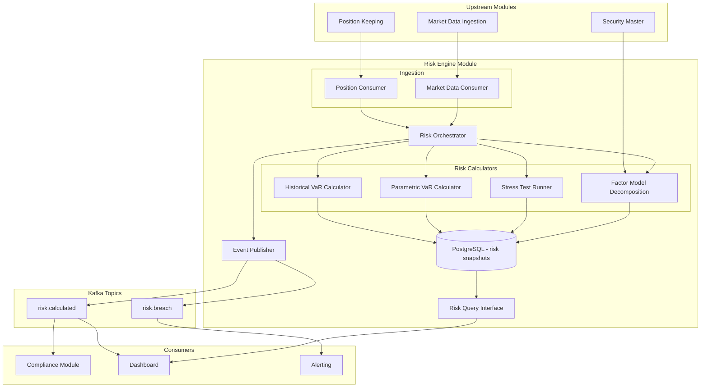

# Risk Engine Module

## Context & Problem

A portfolio manager needs to know how much they can lose before they actually lose it. Risk management is inherently forward-looking: given the current portfolio, what could go wrong tomorrow? Next week? In a crisis?

Without a centralized risk engine, PMs estimate risk informally, compliance cannot enforce limits programmatically, and the fund discovers concentration risk only after a drawdown. The risk engine must compute Value-at-Risk (VaR) at multiple confidence intervals, run stress tests against historical and hypothetical scenarios, and decompose portfolio risk into explainable factor exposures — all in near-real-time as positions change.

This module consumes positions from the position-keeping module and market data (prices, returns, correlations) from market data ingestion. It publishes `risk.calculated` events so that compliance, dashboards, and alerting can react to changing risk profiles.

## Domain Concepts

| Concept | Definition |
|---|---|
| **Value-at-Risk (VaR)** | The maximum expected loss over a holding period at a given confidence level (e.g., 95% VaR = "we expect to lose no more than $X on 95% of days") |
| **Historical Simulation** | VaR method that replays actual historical return scenarios against the current portfolio — no distributional assumptions |
| **Parametric VaR** | VaR method assuming returns are normally distributed, using portfolio variance derived from the covariance matrix |
| **Stress Test** | Applying a specific scenario (historical crisis or hypothetical shock) to the current portfolio to estimate losses |
| **Factor Model** | Decomposes portfolio risk into systematic factor exposures (market, size, value, momentum, volatility) plus idiosyncratic residual |
| **Factor Exposure** | The sensitivity (beta) of a position or portfolio to a specific risk factor |
| **Risk Snapshot** | A point-in-time record of all risk metrics for a portfolio, stored for audit and trending |
| **Holding Period** | The time horizon over which VaR is computed (typically 1 day or 10 days) |

## Architecture



## Design Decisions

### Dual VaR Methodology

Historical simulation is the primary VaR method because it captures fat tails and non-normal return distributions that parametric VaR misses. Parametric VaR is computed alongside as a fast cross-check — if the two diverge significantly, it signals that market conditions are non-normal and warrants attention.

### Factor Model Inspired by MSCI Barra

The factor decomposition uses five style factors (market beta, size, value, momentum, volatility) aligned with standard academic and industry models. This is not a full Barra model (which has 40+ factors and proprietary data), but it captures the dominant sources of systematic risk for an equity-focused portfolio. Factor returns are sourced from market data or computed from constituent returns.

### Position-Level and Portfolio-Level Metrics

Every risk metric is computed at the position level first, then aggregated to the portfolio level. This allows PMs to see which positions contribute most to total VaR (component VaR) and which stress scenarios hurt which holdings.

### Pluggable Risk Calculators Per Asset Class

Different asset classes contribute to portfolio risk differently. Equities are priced by market moves, bonds by yield curve shifts, options by Greeks (delta, gamma, vega), futures by underlying moves scaled by contract size. The risk engine uses a `RiskCalculator` protocol that asset-class-specific implementations satisfy:

```python
# calculators/protocol.py

from typing import Protocol
from decimal import Decimal
import numpy as np


class RiskCalculator(Protocol):
    """Asset-class-specific risk calculation logic."""

    def position_return(
        self, position: dict, scenario_return: Decimal, **kwargs,
    ) -> Decimal:
        """Estimate the position's P&L under a given market scenario."""
        ...

    def factor_sensitivity(
        self, position: dict, factor: str, **kwargs,
    ) -> Decimal:
        """Sensitivity of this position to a given risk factor."""
        ...


class EquityRiskCalculator:
    """Equities: P&L = quantity × price × return."""

    def position_return(self, position: dict, scenario_return: Decimal, **kwargs) -> Decimal:
        return Decimal(str(position["market_value"])) * scenario_return

    def factor_sensitivity(self, position: dict, factor: str, **kwargs) -> Decimal:
        betas = position.get("factor_betas", {})
        return Decimal(str(betas.get(factor, 0)))


class FixedIncomeRiskCalculator:
    """Bonds: P&L approximated by duration × yield change + convexity adjustment."""

    def position_return(self, position: dict, scenario_return: Decimal, **kwargs) -> Decimal:
        duration = Decimal(str(position.get("duration", 5)))
        convexity = Decimal(str(position.get("convexity", 50)))
        yield_change = kwargs.get("yield_change", scenario_return)
        mv = Decimal(str(position["market_value"]))
        # First-order: -D × Δy, second-order: +0.5 × C × Δy²
        return mv * (-duration * yield_change + Decimal("0.5") * convexity * yield_change ** 2)

    def factor_sensitivity(self, position: dict, factor: str, **kwargs) -> Decimal:
        if factor == "interest_rate":
            return -Decimal(str(position.get("duration", 5)))
        if factor == "credit_spread":
            return -Decimal(str(position.get("spread_duration", 3)))
        return Decimal("0")


class OptionRiskCalculator:
    """Options: P&L from delta + gamma + vega effects."""

    def position_return(self, position: dict, scenario_return: Decimal, **kwargs) -> Decimal:
        delta = Decimal(str(position.get("delta", 0)))
        gamma = Decimal(str(position.get("gamma", 0)))
        vega = Decimal(str(position.get("vega", 0)))
        multiplier = Decimal(str(position.get("contract_multiplier", 100)))
        qty = Decimal(str(position.get("quantity", 0)))
        underlying_price = Decimal(str(position.get("underlying_price", 0)))
        vol_change = kwargs.get("vol_change", Decimal("0"))

        price_move = underlying_price * scenario_return
        # Taylor expansion: delta × ΔS + 0.5 × gamma × ΔS² + vega × Δσ
        pnl_per_contract = (
            delta * price_move
            + Decimal("0.5") * gamma * price_move ** 2
            + vega * vol_change
        )
        return qty * multiplier * pnl_per_contract

    def factor_sensitivity(self, position: dict, factor: str, **kwargs) -> Decimal:
        if factor == "market_beta":
            return Decimal(str(position.get("delta", 0)))
        if factor == "volatility":
            return Decimal(str(position.get("vega", 0)))
        return Decimal("0")


RISK_CALCULATORS: dict[str, RiskCalculator] = {
    "equity": EquityRiskCalculator(),
    "etf": EquityRiskCalculator(),
    "fixed_income": FixedIncomeRiskCalculator(),
    "option": OptionRiskCalculator(),
    "future": EquityRiskCalculator(),  # linear like equities, scaled by contract size
}
```

The risk orchestrator selects the appropriate calculator based on each position's asset class. Adding a new asset class requires implementing the `RiskCalculator` protocol and registering it — existing calculators and VaR methodologies are untouched.

## Interface Contract

```python
# interface.py

from typing import Protocol
from datetime import date, datetime
from decimal import Decimal
from uuid import UUID
from enum import StrEnum

from pydantic import BaseModel, ConfigDict


class ConfidenceLevel(StrEnum):
    CL_95 = "95"
    CL_99 = "99"


class HoldingPeriod(StrEnum):
    ONE_DAY = "1d"
    TEN_DAY = "10d"


class VaRMethodology(StrEnum):
    HISTORICAL = "historical"
    PARAMETRIC = "parametric"


class VaRResult(BaseModel):
    model_config = ConfigDict(frozen=True)

    portfolio_id: UUID
    as_of_date: date
    methodology: VaRMethodology
    confidence_level: ConfidenceLevel
    holding_period: HoldingPeriod
    var_amount: Decimal          # absolute dollar VaR
    var_pct: Decimal             # VaR as percentage of portfolio NAV
    currency: str


class PositionVaRContribution(BaseModel):
    model_config = ConfigDict(frozen=True)

    instrument_id: str
    component_var: Decimal       # this position's contribution to portfolio VaR
    pct_of_total_var: Decimal
    standalone_var: Decimal      # VaR if this were the only position


class StressScenario(BaseModel):
    model_config = ConfigDict(frozen=True)

    scenario_id: str
    name: str                    # "2008 GFC", "COVID Mar 2020", "+200bps Rate Shock"
    description: str
    shocks: dict[str, Decimal]   # factor or asset → shock magnitude


class StressTestResult(BaseModel):
    model_config = ConfigDict(frozen=True)

    portfolio_id: UUID
    scenario_id: str
    scenario_name: str
    as_of_date: date
    portfolio_pnl: Decimal       # estimated P&L under scenario
    portfolio_pnl_pct: Decimal
    position_impacts: list["PositionStressImpact"]


class PositionStressImpact(BaseModel):
    model_config = ConfigDict(frozen=True)

    instrument_id: str
    pnl: Decimal
    pnl_pct: Decimal


class FactorExposure(BaseModel):
    model_config = ConfigDict(frozen=True)

    factor_name: str             # "market_beta", "size", "value", "momentum", "volatility"
    exposure: Decimal            # portfolio beta to this factor
    factor_var_contribution: Decimal
    pct_of_total_risk: Decimal


class RiskSnapshot(BaseModel):
    model_config = ConfigDict(frozen=True)

    portfolio_id: UUID
    as_of_date: date
    calculated_at: datetime
    nav: Decimal
    var_results: list[VaRResult]
    stress_results: list[StressTestResult]
    factor_exposures: list[FactorExposure]
    total_systematic_risk_pct: Decimal
    total_idiosyncratic_risk_pct: Decimal


class RiskEngineReader(Protocol):
    """Read interface exposed to other modules."""

    async def get_latest_snapshot(self, portfolio_id: UUID) -> RiskSnapshot: ...

    async def get_var(
        self,
        portfolio_id: UUID,
        methodology: VaRMethodology,
        confidence: ConfidenceLevel,
        holding_period: HoldingPeriod,
    ) -> VaRResult: ...

    async def get_var_contributions(
        self, portfolio_id: UUID,
    ) -> list[PositionVaRContribution]: ...

    async def run_stress_test(
        self, portfolio_id: UUID, scenario: StressScenario,
    ) -> StressTestResult: ...

    async def get_factor_exposures(
        self, portfolio_id: UUID,
    ) -> list[FactorExposure]: ...

    async def get_snapshot_history(
        self, portfolio_id: UUID, start: date, end: date,
    ) -> list[RiskSnapshot]: ...
```

## Code Skeleton

### Historical Simulation VaR

```python
# calculators/historical_var.py

import numpy as np
import pandas as pd
from decimal import Decimal
from datetime import date
from uuid import UUID

import structlog

logger = structlog.get_logger()


class HistoricalVaRCalculator:
    """
    Computes Value-at-Risk using historical simulation.

    Approach:
    1. Get the current portfolio weights (position market values / NAV).
    2. Pull a window of historical daily returns for each instrument.
    3. For each historical day, compute what the portfolio return would have been
       given today's weights and that day's returns.
    4. Sort the simulated portfolio returns. VaR at confidence level α is the
       (1 - α) quantile of the distribution.

    This method makes no distributional assumptions — it uses the actual empirical
    distribution of returns, capturing fat tails, skew, and non-linear dependencies.
    """

    def __init__(
        self,
        lookback_days: int = 504,  # ~2 years of trading days
    ) -> None:
        self._lookback_days = lookback_days

    def calculate(
        self,
        weights: dict[str, float],
        returns_matrix: np.ndarray,
        nav: Decimal,
        confidence_levels: list[float] = [0.95, 0.99],
        holding_period_days: int = 1,
    ) -> list[dict]:
        """
        Args:
            weights: {instrument_id: portfolio_weight} where weights sum to ~1.0
            returns_matrix: shape (n_days, n_instruments) — historical daily returns
                            columns aligned with weights dict key order
            nav: current portfolio net asset value
            confidence_levels: list of confidence levels (e.g., [0.95, 0.99])
            holding_period_days: 1 for daily VaR, 10 for 10-day VaR

        Returns:
            List of VaR results per confidence level.
        """
        instrument_ids = list(weights.keys())
        weight_vector = np.array([weights[iid] for iid in instrument_ids])

        if returns_matrix.shape[1] != len(instrument_ids):
            raise ValueError(
                f"Returns matrix has {returns_matrix.shape[1]} columns "
                f"but {len(instrument_ids)} instruments provided"
            )

        # Simulate portfolio returns: each row is one historical scenario
        portfolio_returns = returns_matrix @ weight_vector

        if holding_period_days > 1:
            # Use overlapping multi-day returns instead of sqrt(T) scaling.
            # sqrt(T) scaling assumes i.i.d. normal returns, which defeats
            # the purpose of historical simulation (capturing fat tails).
            portfolio_returns = pd.Series(portfolio_returns).rolling(
                window=holding_period_days
            ).sum().dropna().values

        # Sort returns ascending (worst losses first)
        sorted_returns = np.sort(portfolio_returns)

        results = []
        for cl in confidence_levels:
            # VaR is the loss at the (1 - confidence) percentile
            percentile_index = int((1 - cl) * len(sorted_returns))
            var_return = sorted_returns[percentile_index]
            var_amount = Decimal(str(abs(var_return))) * nav

            results.append({
                "confidence_level": str(int(cl * 100)),
                "var_pct": Decimal(str(abs(var_return))),
                "var_amount": var_amount,
            })

            logger.info(
                "var_calculated",
                methodology="historical",
                confidence=cl,
                holding_period=holding_period_days,
                var_pct=float(var_return),
                var_amount=float(var_amount),
                n_scenarios=len(sorted_returns),
            )

        return results

    def calculate_component_var(
        self,
        weights: dict[str, float],
        returns_matrix: np.ndarray,
        nav: Decimal,
        confidence_level: float = 0.95,
    ) -> dict[str, Decimal]:
        """
        Component VaR using Euler decomposition. Sum of components = total VaR.

        marginal_var_i = partial VaR / partial w_i
        component_var_i = w_i * marginal_var_i

        The Euler decomposition guarantees that component VaRs sum to total
        portfolio VaR, making it suitable for risk attribution.
        """
        instrument_ids = list(weights.keys())
        weight_vector = np.array([weights[iid] for iid in instrument_ids])

        portfolio_returns = returns_matrix @ weight_vector
        sorted_indices = np.argsort(portfolio_returns)
        percentile_index = int((1 - confidence_level) * len(portfolio_returns))
        var_index = sorted_indices[percentile_index]

        total_var = abs(portfolio_returns[var_index])

        # Marginal VaR: the return of each instrument on the VaR scenario day
        # Component VaR_i = w_i * R_i(t*) where t* is the VaR scenario
        var_scenario_returns = returns_matrix[var_index, :]

        contributions = {}
        for i, iid in enumerate(instrument_ids):
            component = abs(weight_vector[i] * var_scenario_returns[i]) * nav
            contributions[iid] = Decimal(str(round(float(component), 2)))

        return contributions

    def calculate_incremental_var(
        self,
        weights: dict[str, float],
        returns_matrix: np.ndarray,
        nav: Decimal,
        confidence_level: float = 0.95,
    ) -> list[dict]:
        """
        Incremental VaR: how much portfolio VaR changes if a position is removed.

        Unlike component VaR, incremental VaR does NOT sum to total VaR.
        It answers: "what would happen to my risk if I exited this position?"
        """
        instrument_ids = list(weights.keys())
        weight_vector = np.array([weights[iid] for iid in instrument_ids])

        portfolio_returns = returns_matrix @ weight_vector
        sorted_returns = np.sort(portfolio_returns)
        percentile_index = int((1 - confidence_level) * len(sorted_returns))
        total_var = abs(sorted_returns[percentile_index])

        contributions = []
        for i, iid in enumerate(instrument_ids):
            # Remove position i and recalculate
            reduced_weights = weight_vector.copy()
            reduced_weights[i] = 0.0
            # Renormalize remaining weights
            remaining_sum = reduced_weights.sum()
            if remaining_sum > 0:
                reduced_weights = reduced_weights / remaining_sum

            reduced_returns = returns_matrix @ reduced_weights
            reduced_sorted = np.sort(reduced_returns)
            reduced_var = abs(reduced_sorted[percentile_index])

            incremental = total_var - reduced_var
            contributions.append({
                "instrument_id": iid,
                "incremental_var": Decimal(str(abs(incremental))) * nav,
                "pct_of_total_var": Decimal(str(incremental / total_var)) if total_var > 0 else Decimal("0"),
                "standalone_var": Decimal(str(abs(
                    np.sort(returns_matrix[:, i] * weights[iid])[percentile_index]
                ))) * nav,
            })

        return contributions
```

### Parametric VaR

```python
# calculators/parametric_var.py

import numpy as np
from scipy import stats
from decimal import Decimal

import structlog

logger = structlog.get_logger()


class ParametricVaRCalculator:
    """
    Computes VaR assuming returns follow a multivariate normal distribution.

    VaR = z_α * σ_portfolio * NAV

    Where σ_portfolio = sqrt(w' * Σ * w), w is the weight vector,
    and Σ is the covariance matrix of returns.
    """

    def calculate(
        self,
        weights: dict[str, float],
        covariance_matrix: np.ndarray,
        nav: Decimal,
        confidence_levels: list[float] = [0.95, 0.99],
        holding_period_days: int = 1,
    ) -> list[dict]:
        weight_vector = np.array(list(weights.values()))

        # Portfolio variance: w' * Σ * w
        portfolio_variance = weight_vector @ covariance_matrix @ weight_vector
        portfolio_vol = np.sqrt(portfolio_variance)

        # Scale to holding period
        portfolio_vol *= np.sqrt(holding_period_days)

        results = []
        for cl in confidence_levels:
            z_score = stats.norm.ppf(cl)
            # VaR is reported as a positive number representing a loss,
            # consistent with historical VaR sign convention.
            var_pct = abs(z_score * portfolio_vol)
            var_amount = Decimal(str(var_pct)) * nav

            results.append({
                "confidence_level": str(int(cl * 100)),
                "var_pct": Decimal(str(var_pct)),
                "var_amount": var_amount,
            })

            logger.info(
                "var_calculated",
                methodology="parametric",
                confidence=cl,
                portfolio_vol=float(portfolio_vol),
                var_amount=float(var_amount),
            )

        return results
```

### Stress Test Runner

```python
# calculators/stress_test.py

from decimal import Decimal
from datetime import date
from uuid import UUID

import structlog

logger = structlog.get_logger()


# Predefined scenarios based on historical crises and hypothetical shocks.
# Shocks are expressed as percentage moves (e.g., -0.38 = -38%).
PREDEFINED_SCENARIOS: list[dict] = [
    {
        "scenario_id": "gfc_2008",
        "name": "2008 Global Financial Crisis",
        "description": "Peak-to-trough moves observed Sep-Nov 2008",
        "shocks": {
            "SPX": Decimal("-0.38"),
            "NDX": Decimal("-0.41"),
            "RTY": Decimal("-0.43"),        # Russell 2000
            "US_10Y": Decimal("-0.015"),     # -150bps yield (price up)
            "HY_SPREAD": Decimal("0.08"),    # +800bps spread widening
            "VIX": Decimal("2.50"),          # VIX to ~80
            "USD": Decimal("0.12"),          # USD strengthens 12%
            "OIL": Decimal("-0.55"),
        },
    },
    {
        "scenario_id": "covid_2020",
        "name": "COVID Crash March 2020",
        "description": "Market moves observed Feb 19 - Mar 23, 2020",
        "shocks": {
            "SPX": Decimal("-0.34"),
            "NDX": Decimal("-0.28"),
            "RTY": Decimal("-0.42"),
            "US_10Y": Decimal("-0.012"),     # -120bps yield
            "HY_SPREAD": Decimal("0.06"),    # +600bps
            "VIX": Decimal("3.00"),
            "OIL": Decimal("-0.65"),
        },
    },
    {
        "scenario_id": "rate_shock_200",
        "name": "+200bps Rate Shock",
        "description": "Parallel shift of +200bps across the yield curve",
        "shocks": {
            "US_2Y": Decimal("0.02"),
            "US_5Y": Decimal("0.02"),
            "US_10Y": Decimal("0.02"),
            "US_30Y": Decimal("0.02"),
            "SPX": Decimal("-0.08"),         # estimated equity impact
            "NDX": Decimal("-0.12"),         # growth/duration more sensitive
            "HY_SPREAD": Decimal("0.015"),   # mild spread widening
        },
    },
    {
        "scenario_id": "sector_rotation",
        "name": "Growth-to-Value Rotation",
        "description": "Sharp rotation from growth/tech to value/cyclicals",
        "shocks": {
            "NDX": Decimal("-0.15"),
            "RTY": Decimal("0.08"),
            "XLF": Decimal("0.10"),          # financials up
            "XLE": Decimal("0.12"),          # energy up
            "XLK": Decimal("-0.18"),         # tech down
            "US_10Y": Decimal("0.005"),      # mild rate rise
        },
    },
]


class StressTestRunner:
    """
    Applies stress scenarios to the current portfolio.

    For each position, the runner looks up the relevant shock factor
    (by sector, asset class, or direct instrument match) and computes
    the estimated P&L impact.
    """

    def __init__(self, scenario_library: list[dict] | None = None) -> None:
        self._scenarios = {
            s["scenario_id"]: s
            for s in (scenario_library or PREDEFINED_SCENARIOS)
        }

    def get_available_scenarios(self) -> list[dict]:
        return list(self._scenarios.values())

    def run_scenario(
        self,
        portfolio_id: UUID,
        scenario_id: str,
        positions: list[dict],
        nav: Decimal,
        as_of_date: date,
    ) -> dict:
        """
        Run a single stress scenario against the portfolio.

        Args:
            portfolio_id: portfolio identifier
            scenario_id: which scenario to run
            positions: list of dicts with keys:
                instrument_id, market_value, sector, asset_class, factor_mapping
            nav: portfolio net asset value
            as_of_date: valuation date

        Returns:
            StressTestResult as dict.
        """
        scenario = self._scenarios.get(scenario_id)
        if scenario is None:
            raise ValueError(f"Unknown scenario: {scenario_id}")

        position_impacts = []
        total_pnl = Decimal("0")

        for pos in positions:
            shock = self._resolve_shock(pos, scenario["shocks"])
            pnl = Decimal(str(pos["market_value"])) * shock
            total_pnl += pnl

            position_impacts.append({
                "instrument_id": pos["instrument_id"],
                "pnl": pnl,
                "pnl_pct": shock,
            })

        logger.info(
            "stress_test_completed",
            portfolio_id=str(portfolio_id),
            scenario=scenario_id,
            total_pnl=float(total_pnl),
            total_pnl_pct=float(total_pnl / nav) if nav else 0,
        )

        return {
            "portfolio_id": portfolio_id,
            "scenario_id": scenario_id,
            "scenario_name": scenario["name"],
            "as_of_date": as_of_date,
            "portfolio_pnl": total_pnl,
            "portfolio_pnl_pct": total_pnl / nav if nav else Decimal("0"),
            "position_impacts": position_impacts,
        }

    def run_custom_scenario(
        self,
        portfolio_id: UUID,
        name: str,
        shocks: dict[str, Decimal],
        positions: list[dict],
        nav: Decimal,
        as_of_date: date,
    ) -> dict:
        """Run an ad-hoc scenario defined by the PM."""
        custom = {
            "scenario_id": f"custom_{name.lower().replace(' ', '_')}",
            "name": name,
            "description": "Custom scenario",
            "shocks": shocks,
        }
        self._scenarios[custom["scenario_id"]] = custom
        return self.run_scenario(portfolio_id, custom["scenario_id"], positions, nav, as_of_date)

    def _resolve_shock(self, position: dict, shocks: dict[str, Decimal]) -> Decimal:
        """
        Determine which shock applies to a position.

        Resolution order:
        1. Direct instrument match (e.g., position is SPX index itself)
        2. Factor mapping (position has an explicit mapping to a shock key)
        3. Sector match (e.g., position in Technology → XLK shock)
        4. Broad market fallback (SPX)
        5. Zero if no match found
        """
        instrument_id = position["instrument_id"]
        factor_mapping = position.get("factor_mapping")
        sector = position.get("sector")

        # Direct match
        if instrument_id in shocks:
            return shocks[instrument_id]

        # Factor mapping
        if factor_mapping and factor_mapping in shocks:
            return shocks[factor_mapping]

        # Sector mapping
        sector_map = {
            "Technology": "XLK",
            "Financials": "XLF",
            "Energy": "XLE",
            "Healthcare": "XLV",
        }
        if sector and sector in sector_map and sector_map[sector] in shocks:
            return shocks[sector_map[sector]]

        # Broad market fallback
        if "SPX" in shocks:
            return shocks["SPX"]

        return Decimal("0")
```

### Factor Model Decomposition

```python
# calculators/factor_model.py

import numpy as np
from decimal import Decimal

import structlog

logger = structlog.get_logger()

# Standard style factors (inspired by MSCI Barra)
STYLE_FACTORS = [
    "market_beta",   # sensitivity to broad market
    "size",          # small vs large cap (log market cap)
    "value",         # book-to-price ratio
    "momentum",      # trailing 12-month return minus last month
    "volatility",    # realized volatility over trailing 60 days
]


class FactorModelCalculator:
    """
    Decomposes portfolio risk into factor exposures using a linear factor model.

    R_portfolio = Σ (β_k * F_k) + ε

    Where β_k is the portfolio's exposure to factor k, F_k is the factor return,
    and ε is the idiosyncratic (residual) component.
    """

    def calculate_exposures(
        self,
        position_weights: dict[str, float],
        position_betas: dict[str, dict[str, float]],
        factor_covariance: np.ndarray,
        residual_variances: dict[str, float],
    ) -> dict:
        """
        Args:
            position_weights: {instrument_id: weight}
            position_betas: {instrument_id: {factor_name: beta}} per position
            factor_covariance: (n_factors, n_factors) covariance matrix of factor returns
            residual_variances: {instrument_id: idiosyncratic_variance}

        Returns:
            Dict with factor exposures, systematic/idiosyncratic risk breakdown.
        """
        instrument_ids = list(position_weights.keys())
        weights = np.array([position_weights[iid] for iid in instrument_ids])

        # Build position-level beta matrix: (n_positions, n_factors)
        beta_matrix = np.array([
            [position_betas.get(iid, {}).get(f, 0.0) for f in STYLE_FACTORS]
            for iid in instrument_ids
        ])

        # Portfolio-level factor exposures: weighted average of position betas
        portfolio_betas = weights @ beta_matrix  # shape: (n_factors,)

        # Systematic risk: β' * Σ_factors * β
        systematic_variance = portfolio_betas @ factor_covariance @ portfolio_betas

        # Idiosyncratic risk: Σ w_i^2 * σ_ε_i^2
        residual_vars = np.array([
            residual_variances.get(iid, 0.0) for iid in instrument_ids
        ])
        idiosyncratic_variance = np.sum((weights ** 2) * residual_vars)

        total_variance = systematic_variance + idiosyncratic_variance
        total_vol = np.sqrt(total_variance) if total_variance > 0 else 0

        # Per-factor contribution to total risk
        factor_exposures = []
        for i, factor_name in enumerate(STYLE_FACTORS):
            # Factor's marginal contribution to variance
            factor_var_contribution = (
                portfolio_betas[i] ** 2 * factor_covariance[i, i]
            )
            pct = factor_var_contribution / total_variance if total_variance > 0 else 0

            factor_exposures.append({
                "factor_name": factor_name,
                "exposure": Decimal(str(round(portfolio_betas[i], 6))),
                "factor_var_contribution": Decimal(str(round(factor_var_contribution, 8))),
                "pct_of_total_risk": Decimal(str(round(pct, 4))),
            })

        systematic_pct = systematic_variance / total_variance if total_variance > 0 else 0
        idiosyncratic_pct = idiosyncratic_variance / total_variance if total_variance > 0 else 0

        logger.info(
            "factor_decomposition_completed",
            total_vol=float(total_vol),
            systematic_pct=round(systematic_pct, 4),
            idiosyncratic_pct=round(idiosyncratic_pct, 4),
            n_positions=len(instrument_ids),
        )

        return {
            "factor_exposures": factor_exposures,
            "total_systematic_risk_pct": Decimal(str(round(systematic_pct, 4))),
            "total_idiosyncratic_risk_pct": Decimal(str(round(idiosyncratic_pct, 4))),
            "total_volatility": Decimal(str(round(total_vol, 6))),
        }
```

### Risk Orchestrator

```python
# service.py

import numpy as np
from datetime import date, datetime, timezone
from decimal import Decimal
from uuid import UUID

import structlog

logger = structlog.get_logger()


class RiskOrchestrator:
    """
    Coordinates all risk calculations and produces a complete RiskSnapshot.

    Triggered by:
    - Position changes (position.updated event)
    - End-of-day batch job
    - On-demand API request
    """

    def __init__(
        self,
        historical_var: HistoricalVaRCalculator,
        parametric_var: ParametricVaRCalculator,
        stress_runner: StressTestRunner,
        factor_model: FactorModelCalculator,
        position_reader: PositionReader,
        market_data_reader: MarketDataReader,
        repository: RiskSnapshotRepository,
        publisher: EventPublisher,
    ) -> None:
        self._historical_var = historical_var
        self._parametric_var = parametric_var
        self._stress_runner = stress_runner
        self._factor_model = factor_model
        self._positions = position_reader
        self._market_data = market_data_reader
        self._repository = repository
        self._publisher = publisher

    async def calculate_full_snapshot(
        self, portfolio_id: UUID, as_of_date: date,
    ) -> RiskSnapshot:
        """Run all risk calculations and persist a snapshot."""
        # Fetch current positions and market data
        positions = await self._positions.get_positions(portfolio_id)
        nav = sum(p.market_value for p in positions)

        weights = {
            p.instrument_id: float(p.market_value / nav)
            for p in positions
            if nav > 0
        }

        instrument_ids = list(weights.keys())
        returns_matrix = await self._market_data.get_returns_matrix(
            instrument_ids, lookback_days=504,
        )
        cov_matrix = np.cov(returns_matrix, rowvar=False)

        # --- VaR calculations (historical + parametric) ---
        hist_var_results = self._historical_var.calculate(
            weights, returns_matrix, nav,
            confidence_levels=[0.95, 0.99],
            holding_period_days=1,
        )

        param_var_results = self._parametric_var.calculate(
            weights, cov_matrix, nav,
            confidence_levels=[0.95, 0.99],
            holding_period_days=1,
        )

        # --- Stress tests (all predefined scenarios) ---
        position_dicts = [
            {
                "instrument_id": p.instrument_id,
                "market_value": p.market_value,
                "sector": p.sector,
                "asset_class": p.asset_class,
                "factor_mapping": p.factor_mapping,
            }
            for p in positions
        ]

        stress_results = []
        for scenario_id in self._stress_runner.get_available_scenarios():
            result = self._stress_runner.run_scenario(
                portfolio_id, scenario_id["scenario_id"],
                position_dicts, nav, as_of_date,
            )
            stress_results.append(result)

        # --- Factor decomposition ---
        position_betas = await self._market_data.get_factor_betas(instrument_ids)
        factor_cov = await self._market_data.get_factor_covariance()
        residual_vars = await self._market_data.get_residual_variances(instrument_ids)

        factor_result = self._factor_model.calculate_exposures(
            weights, position_betas, factor_cov, residual_vars,
        )

        # --- Persist snapshot ---
        snapshot = RiskSnapshot(
            portfolio_id=portfolio_id,
            as_of_date=as_of_date,
            calculated_at=datetime.now(timezone.utc),
            nav=nav,
            var_results=hist_var_results + param_var_results,
            stress_results=stress_results,
            factor_exposures=factor_result["factor_exposures"],
            total_systematic_risk_pct=factor_result["total_systematic_risk_pct"],
            total_idiosyncratic_risk_pct=factor_result["total_idiosyncratic_risk_pct"],
        )

        await self._repository.save_snapshot(snapshot)

        # --- Publish event ---
        await self._publisher.publish(
            topic="risk.calculated",
            key=str(portfolio_id),
            event={
                "event_type": "risk.snapshot_calculated",
                "event_id": f"risk-{portfolio_id}-{as_of_date.isoformat()}",
                "timestamp": datetime.now(timezone.utc).isoformat(),
                "data": {
                    "portfolio_id": str(portfolio_id),
                    "as_of_date": as_of_date.isoformat(),
                    "var_95_hist": str(hist_var_results[0]["var_amount"]),
                    "var_99_hist": str(hist_var_results[1]["var_amount"]),
                    "var_95_param": str(param_var_results[0]["var_amount"]),
                    "worst_stress_scenario": min(
                        stress_results, key=lambda s: s["portfolio_pnl"]
                    )["scenario_name"] if stress_results else None,
                    "worst_stress_pnl": str(min(
                        (s["portfolio_pnl"] for s in stress_results), default=Decimal("0")
                    )),
                    "systematic_risk_pct": str(factor_result["total_systematic_risk_pct"]),
                },
            },
        )

        logger.info(
            "risk_snapshot_completed",
            portfolio_id=str(portfolio_id),
            as_of_date=as_of_date.isoformat(),
            var_95=float(hist_var_results[0]["var_amount"]),
            n_stress_scenarios=len(stress_results),
        )

        return snapshot
```

## Data Model

```sql
CREATE SCHEMA IF NOT EXISTS risk;

-- Point-in-time risk snapshots
CREATE TABLE risk.snapshots (
    id              UUID PRIMARY KEY DEFAULT gen_random_uuid(),
    portfolio_id    UUID NOT NULL,
    as_of_date      DATE NOT NULL,
    calculated_at   TIMESTAMPTZ NOT NULL DEFAULT NOW(),
    nav             NUMERIC(18,2) NOT NULL,
    systematic_risk_pct   NUMERIC(8,4),
    idiosyncratic_risk_pct NUMERIC(8,4),
    UNIQUE (portfolio_id, as_of_date, calculated_at)
);

CREATE INDEX ix_snapshots_portfolio_date ON risk.snapshots (portfolio_id, as_of_date DESC);

-- VaR results linked to a snapshot
CREATE TABLE risk.var_results (
    id              UUID PRIMARY KEY DEFAULT gen_random_uuid(),
    snapshot_id     UUID NOT NULL REFERENCES risk.snapshots(id) ON DELETE CASCADE,
    methodology     VARCHAR(16) NOT NULL,       -- 'historical', 'parametric'
    confidence_level VARCHAR(4) NOT NULL,        -- '95', '99'
    holding_period  VARCHAR(4) NOT NULL,         -- '1d', '10d'
    var_amount      NUMERIC(18,2) NOT NULL,
    var_pct         NUMERIC(10,6) NOT NULL,
    currency        VARCHAR(3) NOT NULL DEFAULT 'USD'
);

CREATE INDEX ix_var_snapshot ON risk.var_results (snapshot_id);

-- Position-level VaR contributions
CREATE TABLE risk.var_contributions (
    id              UUID PRIMARY KEY DEFAULT gen_random_uuid(),
    snapshot_id     UUID NOT NULL REFERENCES risk.snapshots(id) ON DELETE CASCADE,
    instrument_id   VARCHAR(32) NOT NULL,
    component_var   NUMERIC(18,2) NOT NULL,
    pct_of_total_var NUMERIC(8,4) NOT NULL,
    standalone_var  NUMERIC(18,2) NOT NULL
);

CREATE INDEX ix_var_contrib_snapshot ON risk.var_contributions (snapshot_id);

-- Stress test results
CREATE TABLE risk.stress_results (
    id              UUID PRIMARY KEY DEFAULT gen_random_uuid(),
    snapshot_id     UUID NOT NULL REFERENCES risk.snapshots(id) ON DELETE CASCADE,
    scenario_id     VARCHAR(64) NOT NULL,
    scenario_name   VARCHAR(255) NOT NULL,
    portfolio_pnl   NUMERIC(18,2) NOT NULL,
    portfolio_pnl_pct NUMERIC(10,6) NOT NULL
);

CREATE INDEX ix_stress_snapshot ON risk.stress_results (snapshot_id);

-- Position-level stress impacts
CREATE TABLE risk.stress_position_impacts (
    id              UUID PRIMARY KEY DEFAULT gen_random_uuid(),
    stress_result_id UUID NOT NULL REFERENCES risk.stress_results(id) ON DELETE CASCADE,
    instrument_id   VARCHAR(32) NOT NULL,
    pnl             NUMERIC(18,2) NOT NULL,
    pnl_pct         NUMERIC(10,6) NOT NULL
);

-- Factor exposures
CREATE TABLE risk.factor_exposures (
    id              UUID PRIMARY KEY DEFAULT gen_random_uuid(),
    snapshot_id     UUID NOT NULL REFERENCES risk.snapshots(id) ON DELETE CASCADE,
    factor_name     VARCHAR(32) NOT NULL,
    exposure        NUMERIC(10,6) NOT NULL,
    var_contribution NUMERIC(12,8) NOT NULL,
    pct_of_total_risk NUMERIC(8,4) NOT NULL
);

CREATE INDEX ix_factor_snapshot ON risk.factor_exposures (snapshot_id);
```

## Kafka Events Published

| Topic | Key | Event | Consumers |
|---|---|---|---|
| `risk.calculated` | `portfolio_id` | `risk.snapshot_calculated` — full snapshot with VaR, stress, factors | Compliance, Dashboard, Alerting |
| `risk.breach` | `portfolio_id` | `risk.limit_breached` — VaR exceeds predefined limit | Compliance, PM Notification, Alerting |

## Patterns Used

| Pattern | Document |
|---|---|
| Module interface via Protocol | [Module Interfaces](../../patterns/modularity/module-interfaces.md) |
| Event publishing for downstream consumers | [Event-Driven Architecture](../../principles/event-driven-architecture.md) |
| Repository pattern for snapshot persistence | [SQLAlchemy Repository](../../patterns/data-access/sqlalchemy-repository.md) |
| Schema validation on risk inputs | [Data Quality Validation](../../patterns/data-processing/data-quality-validation.md) |
| Structured logging for audit trail | [Structured Logging](../../patterns/observability/structured-logging.md) |
| Idempotent snapshot calculation | [Idempotency](../../patterns/resilience/idempotency.md) |
| Metrics on calculation latency | [Metrics Design](../../patterns/observability/metrics-design.md) |

## Failure Modes

| Failure | Cause | Impact | Mitigation |
|---|---|---|---|
| Stale positions | Position-keeping module delayed | VaR calculated on outdated portfolio, understating true risk | Check position freshness timestamp; refuse to publish if positions older than threshold; emit `risk.stale` warning event |
| Missing market data | Instrument has no return history (new listing, illiquid) | Cannot compute VaR for that position; overall VaR incomplete | Fall back to sector proxy returns; flag positions with insufficient history in the snapshot |
| Singular covariance matrix | Too few data points or perfectly correlated instruments | Parametric VaR calculation fails (matrix inversion) | Use pseudo-inverse; log warning; rely on historical simulation as primary |
| Stress scenario shock mismatch | Position in a sector not covered by scenario shocks | Position ignored in stress test, understating scenario loss | Broad market fallback (SPX); log unmapped positions per scenario |
| Calculation timeout | Large portfolio (>5000 positions) with full history | Risk snapshot not available for compliance checks | Set timeout budget; compute in parallel; degrade to top-200-positions fast estimate |
| Stale factor betas | Factor model not recalibrated recently | Factor decomposition drifts from reality | Recalibrate betas weekly; track calibration date in snapshot metadata |

## Performance Profile

| Metric | Target |
|---|---|
| Full snapshot calculation (500 positions, 504 days history) | < 10 seconds |
| Historical VaR only | < 3 seconds |
| Parametric VaR only | < 500ms |
| Single stress scenario | < 1 second |
| Factor decomposition | < 2 seconds |
| Snapshot query (latest, single portfolio) | < 10ms |
| Snapshot history query (30 days) | < 50ms |

## Dependencies

```
risk-engine
  ├── depends on: position-keeping (current positions, market values)
  ├── depends on: market-data-ingestion (price history, returns, correlations)
  ├── depends on: security-master (instrument metadata, sector, asset class)
  ├── depends on: shared kernel (types, events)
  ├── publishes: risk.calculated, risk.breach
  └── consumed by: compliance, dashboard, alerting, performance-attribution
```

## Related Documents

- [Market Data Ingestion](market-data-ingestion.md) — provides price history and return series consumed by VaR calculations
- [Security Master](security-master.md) — provides instrument metadata for factor mapping and sector classification
- [Performance Attribution](performance-attribution.md) — consumes risk snapshots for risk-based P&L attribution
- [Cash Management](cash-management.md) — risk events may trigger cash reserve adjustments
- [System Overview — Multi-Asset Strategy](overview.md#multi-asset-class-strategy) — asset class phasing and extensibility pattern
