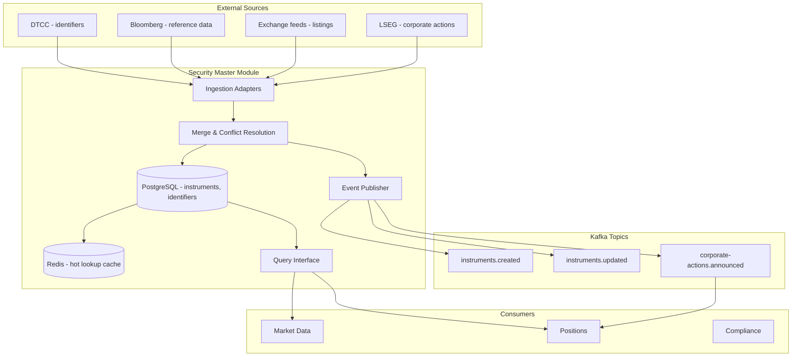

# Security Master Module

## Context & Problem

A "security" in financial systems is an instrument — a stock, bond, option, future, ETF. The security master is the authoritative source for instrument reference data: what does ticker "AAPL" mean? What exchange does it trade on? What currency? What sector? What is its ISIN?

Without a centralized security master, different modules store their own instrument metadata. Bloomberg uses "AAPL US Equity", the internal system uses "AAPL", and the accounting system uses ISIN "US0378331005". Mapping between these identifiers becomes a constant source of bugs.

The security master provides a single, canonical representation of every instrument and maps all external identifiers to internal IDs.

## Domain Concepts

| Concept | Definition |
|---|---|
| **Instrument** | A tradeable financial asset (equity, bond, option, ETF, future) |
| **Identifier** | A code that refers to an instrument (ticker, ISIN, CUSIP, SEDOL, FIGI) |
| **Identifier Mapping** | The relationship between external IDs and the internal canonical ID |
| **Corporate Action** | Event that changes an instrument's attributes (split changes shares outstanding, merger changes the instrument itself) |
| **Listing** | A specific instrument on a specific exchange (AAPL on NASDAQ vs AAPL on LSE) |

## Architecture



## Design Decisions

### Canonical Instrument Model

```python
# models.py

from datetime import date, datetime
from decimal import Decimal
from uuid import UUID, uuid4
from enum import StrEnum

from pydantic import BaseModel, ConfigDict


class AssetClass(StrEnum):
    EQUITY = "equity"
    FIXED_INCOME = "fixed_income"
    OPTION = "option"
    FUTURE = "future"
    ETF = "etf"
    FX = "fx"


class IdentifierType(StrEnum):
    TICKER = "ticker"
    ISIN = "isin"
    CUSIP = "cusip"
    SEDOL = "sedol"
    FIGI = "figi"
    BLOOMBERG = "bloomberg"
    REUTERS_RIC = "reuters_ric"
    INTERNAL = "internal"


class Instrument(BaseModel):
    model_config = ConfigDict(frozen=True)

    id: UUID
    name: str                       # "Apple Inc."
    asset_class: AssetClass
    currency: str                   # "USD"
    exchange: str                   # "NASDAQ"
    country: str                    # "US"
    sector: str | None = None       # "Technology"
    industry: str | None = None     # "Consumer Electronics"
    shares_outstanding: Decimal | None = None
    is_active: bool = True
    listed_date: date | None = None
    delisted_date: date | None = None


class InstrumentIdentifier(BaseModel):
    model_config = ConfigDict(frozen=True)

    instrument_id: UUID
    identifier_type: IdentifierType
    value: str                      # "AAPL", "US0378331005", "BBG000B9XRY4"
    is_primary: bool = False
    valid_from: date
    valid_to: date | None = None    # None = currently valid
```

### Identifier Resolution

The core capability: given any external identifier, resolve to the canonical instrument:

```python
# interface.py

from typing import Protocol
from uuid import UUID


class SecurityMasterReader(Protocol):
    """Read interface exposed to other modules."""

    async def resolve(self, identifier: str, id_type: IdentifierType | None = None) -> Instrument:
        """Resolve any identifier to the canonical instrument.
        
        resolve("AAPL") → Instrument(id=..., name="Apple Inc.", ...)
        resolve("US0378331005", IdentifierType.ISIN) → same Instrument
        resolve("BBG000B9XRY4", IdentifierType.FIGI) → same Instrument
        """
        ...

    async def get_by_id(self, instrument_id: UUID) -> Instrument: ...

    async def search(self, query: str, limit: int = 20) -> list[Instrument]: ...

    async def get_identifiers(self, instrument_id: UUID) -> list[InstrumentIdentifier]: ...

    async def get_all_active(self, asset_class: AssetClass | None = None) -> list[Instrument]: ...
```

### Resolution with Caching

```python
# service.py

class SecurityMasterService:
    def __init__(
        self,
        repository: InstrumentRepository,
        cache: InstrumentCache,
    ) -> None:
        self._repository = repository
        self._cache = cache

    async def resolve(
        self,
        identifier: str,
        id_type: IdentifierType | None = None,
    ) -> Instrument:
        # Check cache first
        cached = await self._cache.get_by_identifier(identifier, id_type)
        if cached:
            return cached

        # Query database
        instrument = await self._repository.resolve(identifier, id_type)
        if instrument is None:
            raise InstrumentNotFoundError(f"No instrument found for {identifier}")

        # Cache for fast subsequent lookups
        await self._cache.set(instrument)
        return instrument
```

### Data Model (PostgreSQL)

```sql
CREATE TABLE security_master.instruments (
    id                  UUID PRIMARY KEY DEFAULT gen_random_uuid(),
    name                VARCHAR(255) NOT NULL,
    asset_class         VARCHAR(32) NOT NULL,
    currency            VARCHAR(3) NOT NULL,
    exchange            VARCHAR(32) NOT NULL,
    country             VARCHAR(2) NOT NULL,
    sector              VARCHAR(128),
    industry            VARCHAR(128),
    shares_outstanding  NUMERIC(18,0),
    is_active           BOOLEAN NOT NULL DEFAULT TRUE,
    listed_date         DATE,
    delisted_date       DATE,
    created_at          TIMESTAMPTZ NOT NULL DEFAULT NOW(),
    updated_at          TIMESTAMPTZ NOT NULL DEFAULT NOW()
);

CREATE TABLE security_master.instrument_identifiers (
    id              UUID PRIMARY KEY DEFAULT gen_random_uuid(),
    instrument_id   UUID NOT NULL REFERENCES security_master.instruments(id),
    identifier_type VARCHAR(32) NOT NULL,
    value           VARCHAR(64) NOT NULL,
    is_primary      BOOLEAN NOT NULL DEFAULT FALSE,
    valid_from      DATE NOT NULL,
    valid_to        DATE,
    created_at      TIMESTAMPTZ NOT NULL DEFAULT NOW(),

    -- Fast lookups by identifier value
    UNIQUE (identifier_type, value, valid_from)
);

CREATE INDEX ix_sm_identifiers_value ON security_master.instrument_identifiers (value);
CREATE INDEX ix_sm_identifiers_instrument ON security_master.instrument_identifiers (instrument_id);

-- Full-text search on instrument name
CREATE INDEX ix_sm_instruments_name_search ON security_master.instruments
    USING gin (to_tsvector('english', name));
```

### Multi-Source Merge Strategy

Multiple vendors provide reference data for the same instrument. The merge strategy defines which source wins when data conflicts:

```python
# Source priority (highest first)
SOURCE_PRIORITY = {
    "exchange": 1,    # Exchange direct feed is most authoritative
    "dtcc": 2,        # DTCC for identifiers
    "bloomberg": 3,   # Bloomberg for fundamentals
    "reuters": 4,     # Reuters as fallback
    "manual": 5,      # Manual overrides (compliance, corrections)
}


class MergeService:
    async def merge_instrument(
        self,
        instrument_id: UUID,
        updates: list[SourceUpdate],
    ) -> Instrument:
        """Merge updates from multiple sources using priority rules."""
        current = await self._repository.get_by_id(instrument_id)
        merged = current.model_copy()

        # Sort by priority (lowest number = highest priority)
        sorted_updates = sorted(updates, key=lambda u: SOURCE_PRIORITY.get(u.source, 99))

        for update in sorted_updates:
            for field, value in update.fields.items():
                if value is not None:
                    # Higher priority source wins
                    merged = merged.model_copy(update={field: value})

        return merged
```

### Corporate Action Processing

```python
class CorporateActionProcessor:
    async def process_stock_split(
        self,
        instrument_id: UUID,
        ratio: Decimal,
        effective_date: date,
    ) -> None:
        """Process a stock split. Updates security master and notifies positions."""
        instrument = await self._repository.get_by_id(instrument_id)

        # Update shares outstanding
        if instrument.shares_outstanding:
            new_shares = instrument.shares_outstanding * ratio
            await self._repository.update(
                instrument_id,
                shares_outstanding=new_shares,
            )

        # Publish event for positions module to adjust quantities
        await self._publisher.publish(
            topic="corporate-actions.announced",
            key=str(instrument_id),
            event={
                "event_type": "corporate_action.split",
                "instrument_id": str(instrument_id),
                "ratio": str(ratio),
                "effective_date": effective_date.isoformat(),
            },
        )
```

## Patterns Used

| Pattern | Document |
|---|---|
| Anti-corruption layer per data source | [External API Adapters](../../patterns/api/external-api-adapters.md) |
| Cache-aside for identifier resolution | [Connection Pooling](../../patterns/data-access/connection-pooling.md) |
| Event publishing for downstream notification | [Event-Driven Architecture](../../principles/event-driven-architecture.md) |
| Canonical data model | [Data Normalization](../../patterns/data-processing/data-normalization.md) |

## Failure Modes

| Failure | Cause | Impact | Mitigation |
|---|---|---|---|
| Identifier conflict | Two sources map different instruments to same ID | Incorrect position attribution | Conflict detection, manual review queue |
| Stale reference data | Source feed delayed | Trades routed with wrong attributes | Freshness monitoring, dual-source validation |
| Corporate action missed | Split not processed before market open | Position quantities wrong, P&L incorrect | Pre-market corporate action check, reconciliation |
| Cache inconsistency | Instrument updated but cache not invalidated | Modules see stale data | Cache invalidation on update events, short TTL |

## Dependencies

```
security-master
  ├── depends on: shared kernel (types, events)
  ├── depends on: nothing else (leaf module)
  ├── publishes: instruments.created, instruments.updated, corporate-actions.announced
  └── consumed by: market-data-ingestion, positions, compliance, risk
```

## Related Documents

- [Market Data Ingestion](market-data-ingestion.md) — consumes instrument identifiers for price normalization
- [Position Keeping](position-keeping.md) — consumes corporate action events to adjust positions
