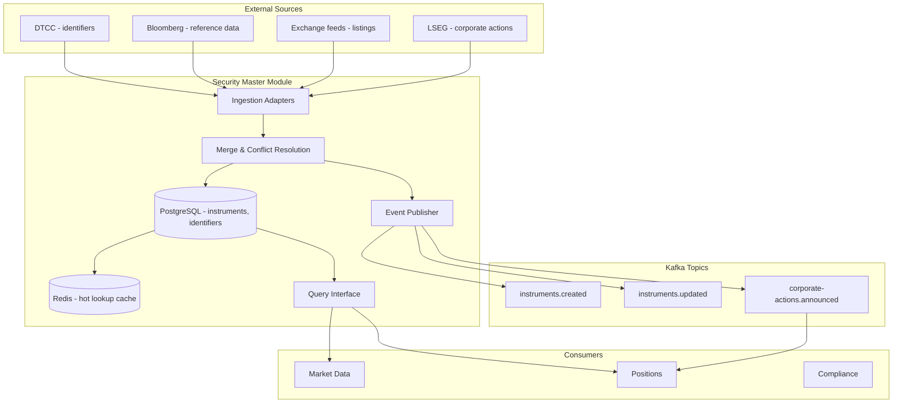

# Security Master Module

## Context & Problem

A "security" in financial systems is an instrument — a stock, bond, option, future, ETF. The security master is the authoritative source for instrument reference data: what does ticker "AAPL" mean? What exchange does it trade on? What currency? What sector? What is its ISIN?

Without a centralized security master, different modules store their own instrument metadata. Bloomberg uses "AAPL US Equity", the internal system uses "AAPL", and the accounting system uses ISIN "US0378331005". Mapping between these identifiers becomes a constant source of bugs.

The security master provides a single, canonical representation of every instrument and maps all external identifiers to internal IDs.

## Domain Concepts

| Concept | Definition |
|---|---|
| **Instrument** | A tradeable financial asset (equity, bond, option, ETF, future) |
| **Identifier** | A code that refers to an instrument (ticker, ISIN, CUSIP, SEDOL, FIGI) |
| **Identifier Mapping** | The relationship between external IDs and the internal canonical ID |
| **Corporate Action** | Event that changes an instrument's attributes (split changes shares outstanding, merger changes the instrument itself) |
| **Listing** | A specific instrument on a specific exchange (AAPL on NASDAQ vs AAPL on LSE) |

## Architecture



## Design Decisions

### Canonical Instrument Model

```python
# models.py

from datetime import date, datetime
from decimal import Decimal
from uuid import UUID, uuid4
from enum import StrEnum

from pydantic import BaseModel, ConfigDict


class AssetClass(StrEnum):
    EQUITY = "equity"
    FIXED_INCOME = "fixed_income"
    OPTION = "option"
    FUTURE = "future"
    ETF = "etf"
    FX = "fx"
    SWAP = "swap"
    PRIVATE = "private"


class IdentifierType(StrEnum):
    TICKER = "ticker"
    ISIN = "isin"
    CUSIP = "cusip"
    SEDOL = "sedol"
    FIGI = "figi"
    BLOOMBERG = "bloomberg"
    REUTERS_RIC = "reuters_ric"
    INTERNAL = "internal"


class Instrument(BaseModel):
    model_config = ConfigDict(frozen=True)

    id: UUID
    name: str                       # "Apple Inc."
    asset_class: AssetClass
    currency: str                   # "USD"
    exchange: str                   # "NASDAQ"
    country: str                    # "US"
    sector: str | None = None       # "Technology"
    industry: str | None = None     # "Consumer Electronics"
    shares_outstanding: Decimal | None = None
    is_active: bool = True
    listed_date: date | None = None
    delisted_date: date | None = None


class InstrumentIdentifier(BaseModel):
    model_config = ConfigDict(frozen=True)

    instrument_id: UUID
    identifier_type: IdentifierType
    value: str                      # "AAPL", "US0378331005", "BBG000B9XRY4"
    is_primary: bool = False
    valid_from: date
    valid_to: date | None = None    # None = currently valid
```

### Asset-Class Extensions (Base + Extension Pattern)

The `Instrument` model above captures common attributes shared by all asset classes. Asset-class-specific attributes live in extension models that reference the base instrument by ID. This avoids a monolithic model with dozens of nullable columns:

```python
# extensions.py

class EquityExtension(BaseModel):
    """Equity-specific attributes."""
    model_config = ConfigDict(frozen=True)

    instrument_id: UUID
    shares_outstanding: Decimal | None = None
    dividend_yield: Decimal | None = None
    market_cap: Decimal | None = None
    free_float_pct: Decimal | None = None


class FixedIncomeExtension(BaseModel):
    """Bond-specific attributes."""
    model_config = ConfigDict(frozen=True)

    instrument_id: UUID
    coupon_rate: Decimal
    coupon_frequency: int          # payments per year (1, 2, 4)
    maturity_date: date
    issue_date: date
    par_value: Decimal             # typically 1000
    day_count_convention: str      # "ACT/360", "30/360", "ACT/ACT"
    credit_rating: str | None = None  # "AAA", "BB+", etc.
    issuer: str | None = None
    callable: bool = False
    call_date: date | None = None


class OptionExtension(BaseModel):
    """Listed option-specific attributes."""
    model_config = ConfigDict(frozen=True)

    instrument_id: UUID
    underlying_id: UUID            # reference to the underlying instrument
    strike_price: Decimal
    expiry_date: date
    option_type: str               # "call" | "put"
    exercise_style: str            # "american" | "european"
    contract_multiplier: int       # typically 100 for equity options


class FutureExtension(BaseModel):
    """Futures contract-specific attributes."""
    model_config = ConfigDict(frozen=True)

    instrument_id: UUID
    underlying_id: UUID
    expiry_date: date
    contract_size: Decimal
    tick_size: Decimal
    tick_value: Decimal
    margin_initial: Decimal | None = None
    margin_maintenance: Decimal | None = None


class FXExtension(BaseModel):
    """FX pair-specific attributes."""
    model_config = ConfigDict(frozen=True)

    instrument_id: UUID
    base_currency: str             # "EUR" in EUR/USD
    quote_currency: str            # "USD" in EUR/USD
    settlement_days: int = 2       # T+2 for spot
    pip_size: Decimal              # 0.0001 for most, 0.01 for JPY pairs


class SwapExtension(BaseModel):
    """OTC swap-specific attributes (IRS, CDS, TRS)."""
    model_config = ConfigDict(frozen=True)

    instrument_id: UUID
    swap_type: str                 # "irs" | "cds" | "trs"
    notional: Decimal
    fixed_rate: Decimal | None = None
    floating_index: str | None = None  # "SOFR", "EURIBOR"
    maturity_date: date
    payment_frequency: int         # payments per year
    underlying_id: UUID | None = None  # for TRS: the reference asset
```

### Extension Resolution Protocol

Other modules need to access the full instrument (base + extension) without knowing which extension type to load. The security master exposes this through the reader interface:

```python
# interface.py (additions to SecurityMasterReader)

class InstrumentWithExtension(BaseModel):
    """Base instrument enriched with asset-class-specific attributes."""
    base: Instrument
    extension: (
        EquityExtension
        | FixedIncomeExtension
        | OptionExtension
        | FutureExtension
        | FXExtension
        | SwapExtension
        | None
    ) = None


class SecurityMasterReader(Protocol):
    # ... existing methods ...

    async def get_with_extension(self, instrument_id: UUID) -> InstrumentWithExtension:
        """Load instrument with its asset-class-specific extension."""
        ...

    async def get_underlying(self, instrument_id: UUID) -> Instrument | None:
        """For derivatives: resolve the underlying instrument."""
        ...
```

### Identifier Resolution

The core capability: given any external identifier, resolve to the canonical instrument:

```python
# interface.py

from typing import Protocol
from uuid import UUID


class SecurityMasterReader(Protocol):
    """Read interface exposed to other modules."""

    async def resolve(self, identifier: str, id_type: IdentifierType | None = None) -> Instrument:
        """Resolve any identifier to the canonical instrument.
        
        resolve("AAPL") → Instrument(id=..., name="Apple Inc.", ...)
        resolve("US0378331005", IdentifierType.ISIN) → same Instrument
        resolve("BBG000B9XRY4", IdentifierType.FIGI) → same Instrument
        """
        ...

    async def get_by_id(self, instrument_id: UUID) -> Instrument: ...

    async def search(self, query: str, limit: int = 20) -> list[Instrument]: ...

    async def get_identifiers(self, instrument_id: UUID) -> list[InstrumentIdentifier]: ...

    async def get_all_active(self, asset_class: AssetClass | None = None) -> list[Instrument]: ...
```

### Resolution with Caching

```python
# service.py

class SecurityMasterService:
    def __init__(
        self,
        repository: InstrumentRepository,
        cache: InstrumentCache,
    ) -> None:
        self._repository = repository
        self._cache = cache

    async def resolve(
        self,
        identifier: str,
        id_type: IdentifierType | None = None,
    ) -> Instrument:
        # Check cache first
        cached = await self._cache.get_by_identifier(identifier, id_type)
        if cached:
            return cached

        # Query database
        instrument = await self._repository.resolve(identifier, id_type)
        if instrument is None:
            raise InstrumentNotFoundError(f"No instrument found for {identifier}")

        # Cache for fast subsequent lookups
        await self._cache.set(instrument)
        return instrument
```

### Data Model (PostgreSQL)

```sql
CREATE TABLE security_master.instruments (
    id                  UUID PRIMARY KEY DEFAULT gen_random_uuid(),
    name                VARCHAR(255) NOT NULL,
    asset_class         VARCHAR(32) NOT NULL,
    currency            VARCHAR(3) NOT NULL,
    exchange            VARCHAR(32) NOT NULL,
    country             VARCHAR(2) NOT NULL,
    sector              VARCHAR(128),
    industry            VARCHAR(128),
    shares_outstanding  NUMERIC(18,0),
    is_active           BOOLEAN NOT NULL DEFAULT TRUE,
    listed_date         DATE,
    delisted_date       DATE,
    created_at          TIMESTAMPTZ NOT NULL DEFAULT NOW(),
    updated_at          TIMESTAMPTZ NOT NULL DEFAULT NOW()
);

CREATE TABLE security_master.instrument_identifiers (
    id              UUID PRIMARY KEY DEFAULT gen_random_uuid(),
    instrument_id   UUID NOT NULL REFERENCES security_master.instruments(id),
    identifier_type VARCHAR(32) NOT NULL,
    value           VARCHAR(64) NOT NULL,
    is_primary      BOOLEAN NOT NULL DEFAULT FALSE,
    valid_from      DATE NOT NULL,
    valid_to        DATE,
    created_at      TIMESTAMPTZ NOT NULL DEFAULT NOW(),

    -- Fast lookups by identifier value
    UNIQUE (identifier_type, value, valid_from)
);

CREATE INDEX ix_sm_identifiers_value ON security_master.instrument_identifiers (value);
CREATE INDEX ix_sm_identifiers_instrument ON security_master.instrument_identifiers (instrument_id);

-- Full-text search on instrument name
CREATE INDEX ix_sm_instruments_name_search ON security_master.instruments
    USING gin (to_tsvector('english', name));

-- Asset-class extension tables (one per asset class)
CREATE TABLE security_master.equity_extensions (
    instrument_id       UUID PRIMARY KEY REFERENCES security_master.instruments(id),
    shares_outstanding  NUMERIC(18,0),
    dividend_yield      NUMERIC(8,6),
    market_cap          NUMERIC(18,2),
    free_float_pct      NUMERIC(5,2)
);

CREATE TABLE security_master.fixed_income_extensions (
    instrument_id       UUID PRIMARY KEY REFERENCES security_master.instruments(id),
    coupon_rate         NUMERIC(8,6) NOT NULL,
    coupon_frequency    INTEGER NOT NULL,
    maturity_date       DATE NOT NULL,
    issue_date          DATE NOT NULL,
    par_value           NUMERIC(18,2) NOT NULL DEFAULT 1000,
    day_count_convention VARCHAR(16) NOT NULL,  -- "ACT/360", "30/360"
    credit_rating       VARCHAR(8),
    issuer              VARCHAR(255),
    callable            BOOLEAN NOT NULL DEFAULT FALSE,
    call_date           DATE
);

CREATE TABLE security_master.option_extensions (
    instrument_id       UUID PRIMARY KEY REFERENCES security_master.instruments(id),
    underlying_id       UUID NOT NULL REFERENCES security_master.instruments(id),
    strike_price        NUMERIC(18,8) NOT NULL,
    expiry_date         DATE NOT NULL,
    option_type         VARCHAR(4) NOT NULL,    -- "call" | "put"
    exercise_style      VARCHAR(10) NOT NULL,   -- "american" | "european"
    contract_multiplier INTEGER NOT NULL DEFAULT 100
);

CREATE TABLE security_master.future_extensions (
    instrument_id       UUID PRIMARY KEY REFERENCES security_master.instruments(id),
    underlying_id       UUID NOT NULL REFERENCES security_master.instruments(id),
    expiry_date         DATE NOT NULL,
    contract_size       NUMERIC(18,8) NOT NULL,
    tick_size           NUMERIC(18,8) NOT NULL,
    tick_value           NUMERIC(18,8) NOT NULL,
    margin_initial      NUMERIC(18,2),
    margin_maintenance  NUMERIC(18,2)
);

CREATE TABLE security_master.fx_extensions (
    instrument_id       UUID PRIMARY KEY REFERENCES security_master.instruments(id),
    base_currency       VARCHAR(3) NOT NULL,
    quote_currency      VARCHAR(3) NOT NULL,
    settlement_days     INTEGER NOT NULL DEFAULT 2,
    pip_size            NUMERIC(10,6) NOT NULL
);

CREATE TABLE security_master.swap_extensions (
    instrument_id       UUID PRIMARY KEY REFERENCES security_master.instruments(id),
    swap_type           VARCHAR(8) NOT NULL,    -- "irs" | "cds" | "trs"
    notional            NUMERIC(18,2) NOT NULL,
    fixed_rate          NUMERIC(8,6),
    floating_index      VARCHAR(32),            -- "SOFR", "EURIBOR"
    maturity_date       DATE NOT NULL,
    payment_frequency   INTEGER NOT NULL,
    underlying_id       UUID REFERENCES security_master.instruments(id)
);

CREATE INDEX ix_option_underlying ON security_master.option_extensions (underlying_id);
CREATE INDEX ix_future_underlying ON security_master.future_extensions (underlying_id);
CREATE INDEX ix_swap_underlying ON security_master.swap_extensions (underlying_id);
```

### Multi-Source Merge Strategy

Multiple vendors provide reference data for the same instrument. The merge strategy defines which source wins when data conflicts:

```python
# Source priority (highest first)
SOURCE_PRIORITY = {
    "exchange": 1,    # Exchange direct feed is most authoritative
    "dtcc": 2,        # DTCC for identifiers
    "bloomberg": 3,   # Bloomberg for fundamentals
    "reuters": 4,     # Reuters as fallback
    "manual": 5,      # Manual overrides (compliance, corrections)
}


class MergeService:
    async def merge_instrument(
        self,
        instrument_id: UUID,
        updates: list[SourceUpdate],
    ) -> Instrument:
        """Merge updates from multiple sources using priority rules."""
        current = await self._repository.get_by_id(instrument_id)
        merged = current.model_copy()

        # Sort by priority (lowest number = highest priority)
        sorted_updates = sorted(updates, key=lambda u: SOURCE_PRIORITY.get(u.source, 99))

        for update in sorted_updates:
            for field, value in update.fields.items():
                if value is not None:
                    # Higher priority source wins
                    merged = merged.model_copy(update={field: value})

        return merged
```

### Corporate Action Processing

```python
class CorporateActionProcessor:
    async def process_stock_split(
        self,
        instrument_id: UUID,
        ratio: Decimal,
        effective_date: date,
    ) -> None:
        """Process a stock split. Updates security master and notifies positions."""
        instrument = await self._repository.get_by_id(instrument_id)

        # Update shares outstanding
        if instrument.shares_outstanding:
            new_shares = instrument.shares_outstanding * ratio
            await self._repository.update(
                instrument_id,
                shares_outstanding=new_shares,
            )

        # Publish event for positions module to adjust quantities
        await self._publisher.publish(
            topic="corporate-actions.announced",
            key=str(instrument_id),
            event={
                "event_type": "corporate_action.split",
                "instrument_id": str(instrument_id),
                "ratio": str(ratio),
                "effective_date": effective_date.isoformat(),
            },
        )
```

## Patterns Used

| Pattern | Document |
|---|---|
| Anti-corruption layer per data source | [External API Adapters](../../patterns/api/external-api-adapters.md) |
| Cache-aside for identifier resolution | [Connection Pooling](../../patterns/data-access/connection-pooling.md) |
| Event publishing for downstream notification | [Event-Driven Architecture](../../principles/event-driven-architecture.md) |
| Canonical data model | [Data Normalization](../../patterns/data-processing/data-normalization.md) |

## Failure Modes

| Failure | Cause | Impact | Mitigation |
|---|---|---|---|
| Identifier conflict | Two sources map different instruments to same ID | Incorrect position attribution | Conflict detection, manual review queue |
| Stale reference data | Source feed delayed | Trades routed with wrong attributes | Freshness monitoring, dual-source validation |
| Corporate action missed | Split not processed before market open | Position quantities wrong, P&L incorrect | Pre-market corporate action check, reconciliation |
| Cache inconsistency | Instrument updated but cache not invalidated | Modules see stale data | Cache invalidation on update events, short TTL |
| Missing extension data | Instrument created without asset-class extension | Downstream modules fail on missing attributes | Enforce extension creation in same transaction as base instrument |
| Underlying not found | Derivative references non-existent underlying | Option/future pricing fails | Foreign key constraint, validate before insert |
| Extension type mismatch | Asset class changed but extension table not updated | Stale extension data returned | Immutable asset class — create new instrument instead of changing type |

## Dependencies

```
security-master
  ├── depends on: shared kernel (types, events)
  ├── depends on: nothing else (leaf module)
  ├── publishes: instruments.created, instruments.updated, corporate-actions.announced
  └── consumed by: market-data-ingestion, positions, compliance, risk
```

## Related Documents

- [Market Data Ingestion](market-data-ingestion.md) — consumes instrument identifiers for price normalization
- [Position Keeping](position-keeping.md) — consumes corporate action events to adjust positions
- [System Overview — Multi-Asset Strategy](overview.md#multi-asset-class-strategy) — phasing plan for asset class rollout
